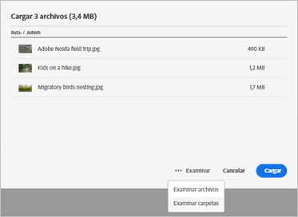
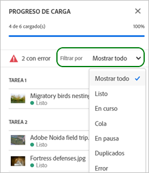
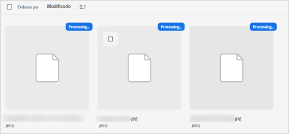
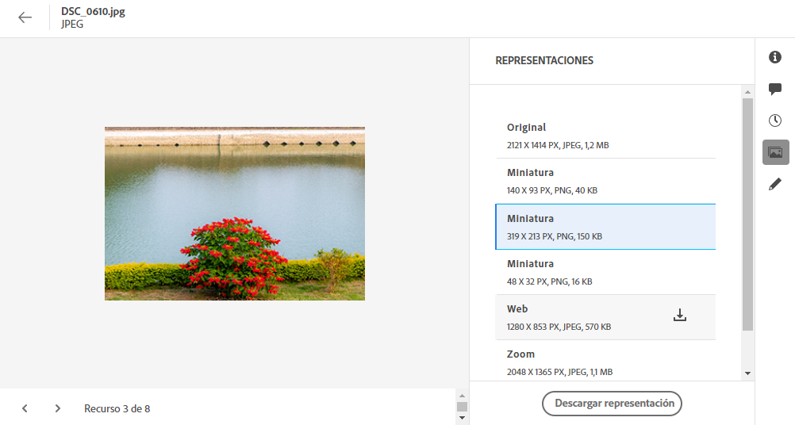
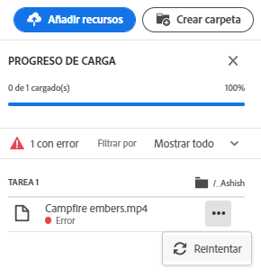
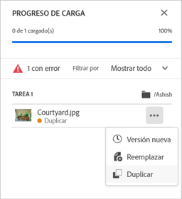
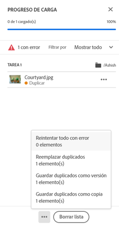
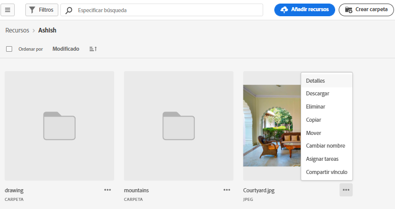

# Cargar recursos {#add-assets}

Para agregar nuevos recursos con los que trabajar, cargue algunos recursos desde el sistema de archivos local. <!-- TBD: Many of the [common file formats are supported](/help/supported-file-formats.md). -->

Puede utilizar los siguientes métodos para cargar uno o varios recursos o una carpeta que contenga recursos:

* Arrastre recursos o carpetas en la interfaz de usuario y siga las instrucciones que aparecen en la pantalla.
* Haga clic en **[!UICONTROL Agregar recursos]** de la barra de herramientas y añada algunos archivos al cuadro de diálogo de carga.

<!-- TBD: Update this GIF
 -->

Puede utilizar cualquiera de estos métodos para cargar recursos después de crear una carpeta. Para crear una carpeta vacía, haga clic en **[!UICONTROL Crear carpeta]** en la barra de herramientas. While [!DNL Assets Essentials] ofrece una potente funcionalidad de búsqueda de texto completo, pero también puede utilizar carpetas para organizar mejor los recursos.

Una vez seleccionados los archivos, aparece un cuadro de diálogo de confirmación para añadir más archivos o para eliminar los archivos ya seleccionados. Para añadir más archivos a una selección, haga clic en **[!UICONTROL Examinar]** y seleccione **[!UICONTROL Examinar archivos]** o **[!UICONTROL Examinar carpetas]**. Añada más archivos o carpetas de la misma carpeta o de otra carpeta.

Una vez que todos los archivos estén en cola, haga clic en **[!UICONTROL Cargar]**.

*Figura: Antes de cargar los recursos seleccionados, puede agregarlos o eliminarlos de la cola.*

>[!CAUTION]
>
>Utilice recursos que no tengan espacios en blanco en los nombres de archivo. Las respuestas a los comentarios no funcionan para estos activos.

## Ver el progreso y estado de la carga {#upload-progress}

Al cargar muchos recursos o carpetas anidadas en [!DNL Assets Essentials], algunos recursos pueden no cargarse debido a varios motivos, como problemas de red y recursos duplicados.

Para realizar un seguimiento del progreso de carga, haga clic en **[!UICONTROL Progreso de carga]** en la barra de herramientas. Un panel muestra el progreso de carga de todos los recursos.

Para ver un subconjunto de recursos en función del progreso o estado de carga, utilice el filtro de la sección **[!UICONTROL Progreso de carga]** barra lateral. Los distintos filtros muestran todos los recursos, las cargas completadas, las cargas en curso, los recursos en cola que se van a cargar, las cargas en pausa, los recursos duplicados y los recursos que no se han cargado.

*Figura: Filtre los recursos que ha intentado cargar en función de su estado de carga o del progreso de carga.*

Inmediatamente después de cargar los recursos, [!DNL Assets Essentials] procesa los recursos para generar miniaturas y procesar metadatos. Para muchos recursos, el procesamiento lleva algún tiempo. Si no ve una miniatura y ve un mensaje de procesamiento en la miniatura del marcador de posición, vuelva a comprobar la carpeta después de unos minutos. Durante el procesamiento, entre otras cosas, [!DNL Assets Essentials] genera las representaciones, agrega las etiquetas inteligentes e indexa los detalles del recurso para la búsqueda.

*Figura: Los recursos cargados muestran el procesamiento en el mosaico que se procesa.*

## Representaciones de recursos {#renditions}

[!DNL Assets Essentials] procesa los recursos cargados casi en tiempo real y, para muchos tipos de archivo admitidos, genera representaciones. Creadas para imágenes, las representaciones son versiones cambiadas de tamaño de la imagen cargada. Puede descargar no solo el recurso, sino también las representaciones para utilizar una versión adecuada. Puede ver todas las representaciones de un recurso al [vista previa de un recurso](/help/navigate-view.md#preview-assets).

*Figura: Vea y descargue las representaciones.*

## Administrar cargas fallidas {#resolve-upload-fails}

Si la carga de un recurso admitido falla por algún motivo, haga clic en **[!UICONTROL Reintentar]** de la variable [!UICONTROL Progreso de carga] panel.

*Figura: Vuelva a intentarlo si un archivo compatible no se puede cargar por algún motivo.*

Si intenta cargar recursos duplicados, estos no se cargarán hasta que confirme explícitamente la carga. Al principio, los recursos duplicados se marcan como cargas fallidas. Para resolverlo, simplemente puede crear una versión, eliminar y reemplazar los recursos existentes o crear una copia duplicada cambiando el nombre del recurso. Puede resolver estos errores de un recurso a la vez o hacerlo de forma masiva para todos los duplicados fallidos de una sola vez.

*Figura: Para los recursos duplicados que no se cargan de forma predeterminada, resuelva el problema de uno en uno.*

*Figura: Para los recursos duplicados que no se cargan de forma predeterminada, resuelva los problemas de todos los recursos a la vez.*

>[!TIP]
>
>Puede cargar recursos en el repositorio de DAM directamente desde su [!DNL Creative Cloud] aplicaciones de escritorio. Consulte cómo [[!DNL Assets Essentials] se integra con [!DNL Adobe Asset Link]](/help/integration.md).

## Eliminar recursos o carpetas {#delete-assets}

Los usuarios pueden eliminar recursos o carpetas individuales que ya no sean necesarios. Para eliminar un recurso o una carpeta, realice una de las siguientes acciones:

* Utilice la opción disponible en la miniatura de un recurso o de una carpeta.

   

   *Figura: Las acciones para archivos y carpetas están disponibles en el mosaico del recurso o de la carpeta.*

* Seleccione un recurso o una carpeta y haga clic en **[!UICONTROL Eliminar]**  en la barra de herramientas.
