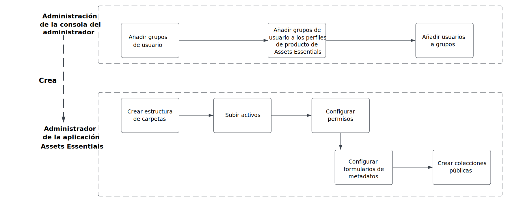
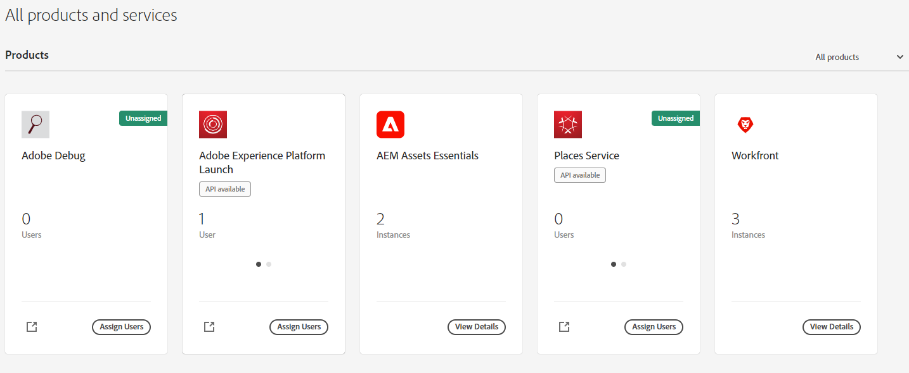
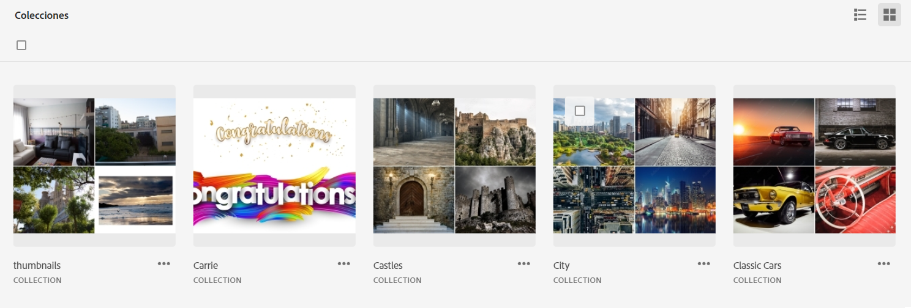

# Administración de [!DNL Assets Essentials] y adición de usuarios {#administer}

[!DNL Adobe Experience Manager Assets Essentials] está aprovisionado por Adobe para sus clientes. Como parte del aprovisionamiento, [!DNL Assets Essentials] se añade a la organización de un cliente en [!DNL Adobe Admin Console]. Los administradores utilizan [!DNL Admin Console] para administrar las autorizaciones de usuario para la solución [!DNL Assets Essentials] y asignar administradores de aplicaciones para configurar formularios de permisos y metadatos en [!DNL Assets Essentials].

El siguiente diagrama de flujo de datos ilustra la secuencia de tareas que un administrador debe llevar a cabo para configurar y administrar Assets Essentials:

## Acceso a Admin Console {#access-admin-console}

Una vez aprovisionada la solución de Assets Essentials, el administrador recibe un correo electrónico de Adobe. El correo electrónico contiene un mensaje de bienvenida y un vínculo para empezar. Además, Adobe inicia el proceso para implementar Assets Essentials automáticamente. El proceso de implementación tarda una hora en completarse.

Desde el vínculo del correo electrónico, acceda a [Admin Console](https://adminconsole.adobe.com) e inicie sesión. Si tiene acceso de administrador a más de una cuenta de organización, seleccione la adecuada o cambie a ella con el [selector de organización](https://helpx.adobe.com/es/enterprise/using/admin-console.html). Una vez completado el proceso de implementación automática, la tarjeta de producto de [!DNL AEM Assets Essentials] es visible en [!DNL Admin Console].

Realice las siguientes tareas de asignación de derechos de usuario mediante Admin Console:

* [Crear administrador de aplicaciones de Assets Essentials](#create-assets-essentials-administrator)

* [Adición de grupos de usuarios](#add-user-groups)

* [Agregar grupos de usuarios a perfiles de producto](#add-users-to-product-profiles)

### Crear administrador de aplicaciones de Assets Essentials {#create-assets-essentials-administrator}

Un administrador de Admin Console debe agregar un administrador de aplicaciones de Assets Essentials para administrar tareas como crear una estructura de carpetas, cargar recursos, configurar permisos, configurar formularios de metadatos y crear colecciones públicas. Para obtener información sobre cómo asignar un usuario o un grupo de usuarios a un perfil de administrador de aplicaciones de Assets Essentials, consulte [agregar usuarios a perfiles de producto](#add-users-to-product-profiles).

### Adición de grupos de usuarios {#add-user-groups}

Cree grupos de usuarios y luego asigne los usuarios a los grupos de usuarios. Estos grupos de usuarios estarán disponibles en la aplicación de Assets Essentials para establecer permisos en las carpetas.

Para obtener información sobre cómo administrar grupos de usuarios, consulte `Create user groups` y `Edit user groups`, disponibles en [Administración de grupos de usuarios](https://helpx.adobe.com/es/enterprise/using/user-groups.html).

>[!NOTE]
>
>Si Admin Console está configurada para aprovechar un sistema externo para administrar asignaciones de usuarios/grupos, como conectores de Azure o Google, la herramienta de sincronización de usuarios o la API de REST de User Management, los grupos y las asignaciones de usuarios se configuran automáticamente. Para obtener más información, consulte [Usuarios de Adobe Admin Console](https://helpx.adobe.com/es/enterprise/using/users.html).

Para obtener información sobre cómo administrar la adición de usuarios a grupos de usuarios, consulte `Add users to groups`, disponible en [Administración de grupos de usuarios](https://helpx.adobe.com/es/enterprise/using/user-groups.html#add-users-to-groups).

### Agregar grupos de usuarios a perfiles de producto {#add-users-to-product-profiles}

Agregue grupos de usuarios a perfiles de producto para que tengan acceso a la aplicación de Assets Essentials.

Para agregar grupos de usuarios a perfiles de producto, haga lo siguiente:

1. Acceda a la [Admin Console](https://adminconsole.adobe.com) para su organización, haga clic en **[!UICONTROL Productos]** en la barra superior, en **[!UICONTROL AEM Assets Essentials]** y, a continuación, en la instancia de [!DNL Assets Essentials]. El nombre de la instancia puede ser diferente al de la captura de pantalla siguiente.
   >[!NOTE]
   >
   >La instancia de [!DNL Cloud Manager] es solo para uso especial de los administradores, como comprobar el estado del servicio y obtener acceso a los registros del servicio, y no se puede utilizar para agregar usuarios al producto. 

   

   [!DNL Assets Essentials] tiene tres perfiles de producto que representan el acceso para los usuarios normales y consumidores y los administradores.

   * Los **[!DNL Assets Essentials] administradores**: tienen acceso administrativo a la aplicación. Además de todas las funcionalidades del usuario final, los administradores de aplicaciones de este grupo pueden administrar permisos para cualquier carpeta y grupo/usuario en todo el repositorio de aplicaciones.

   * Los **[!DNL Assets Essentials] usuarios**: tienen acceso a la interfaz de usuario completa. Estos usuarios pueden cargar, organizar, etiquetar y encontrar recursos digitales.

   * Los **[!DNL Assets Essentials] usuarios consumidores**: tienen acceso a la experiencia de selección de recursos incrustada en el editor de plantillas de correo electrónico de [!DNL Adobe Journey Optimizer]. Para obtener más información, consulte [Uso de [!DNL Assets Essentials] en [!DNL Journey Optimizer]](https://experienceleague.adobe.com/docs/journey-optimizer/using/create-messages/assets-essentials.html?lang=es).

   

1. Para agregar un grupo de usuarios al producto, haga clic en uno de los tres perfiles de producto de Assets Essentials, seleccione **[!UICONTROL Agregar usuario]**, proporcione los detalles del grupo de usuarios y haga clic en **[!UICONTROL Guardar]**.

   

   Cuando añade un usuario, este recibe una invitación por correo electrónico para comenzar. Puede desactivar las invitaciones por correo electrónico en la configuración del perfil de producto en [!DNL Admin Console].

   >[!NOTE]
   >
   >Debe añadir un usuario al perfil de producto de administrador de Assets Essentials en la Admin Console para que pueda llevar a cabo tareas administrativas en la aplicación de Assets Essentials. Estas tareas incluyen [Creación de estructura de carpetas](#create-folder-structure), [Administración de permisos para carpetas](#manage-permissions-for-folders) y [Configuración de formularios de metadatos](#metadata-forms).

## Acceso a la aplicación Assets Essentials {#access-assets-essentials-application}

Después de realizar las autorizaciones de usuario en Admin Console, puede acceder a la aplicación Assets Essentials para realizar las siguientes tareas:

* [Creación de estructura de carpetas](#create-folder-structure)

* [Carga de activos](#upload-assets)

* [Administración de permisos para carpetas](#manage-permissions-for-folders)

* [Configuración de formularios de metadatos](#metadata-forms)

* [Crear colecciones públicas](#create-public-collections)

### Creación de estructura de carpetas {#create-folder-structure}

Puede utilizar los siguientes métodos para crear una estructura de carpetas en el repositorio de Assets Essentials:

* Haga clic en la opción **[!UICONTROL Crear carpeta]**, disponible en la barra de herramientas, para crear una carpeta vacía.

* Haga clic en la opción **[!UICONTROL Añadir recursos]**, disponible en la barra de herramientas, para [cargar una estructura de carpetas disponible en el equipo local](add-delete.md).

Cree una estructura de carpetas que funcione bien con los objetivos empresariales de la organización. Si está cargando una estructura de carpetas existente en el repositorio de Assets Essentials, debe revisar la estructura. Para obtener más información, consulte [Prácticas recomendadas de estructura de carpetas para la administración eficaz de permisos](permission-management-best-practices.md##folder-structure-assets-essentials).

Existen varios tipos de estructura de carpetas que puede utilizar para su organización. A continuación, se muestran algunos ejemplos de estructuras de carpetas típicas:

>[!NOTE]
>
>Para poder administrar estas tareas, sobre todo la administración de permisos, el usuario debe tener derechos de administración de aplicaciones; debe agregarse al [Perfil de producto de administrador de Assets Essentials](#add-users-to-product-profiles).

### Carga de activos {#upload-assets}

Para agregar nuevos activos con los que trabajar, cargue algunos desde el sistema de archivos local. Puede arrastrar activos o carpetas en la interfaz de usuario y seguir las instrucciones que aparecen en la pantalla o hacer clic en **[!UICONTROL Agregar recursos]** en la barra de herramientas y añadir algunos archivos al cuadro de diálogo de carga. [!DNL Assets Essentials] ofrece una potente funcionalidad de búsqueda de texto completo, pero también puede utilizar carpetas para organizar mejor los activos. Para obtener más información, consulte [Carga de activos](add-delete.md).

### Administración de permisos para carpetas {#manage-permissions-for-folders}

Assets Essentials permite a los administradores administrar los niveles de acceso para las carpetas disponibles en el repositorio. Como administrador, puede crear grupos de usuarios y asignar permisos a esos grupos para administrar los niveles de acceso. También puede delegar los privilegios de administración de permisos a grupos de usuarios en el nivel de carpeta.

>[!VIDEO](https://video.tv.adobe.com/v/341104)

Para obtener más información, consulte [Administración de permisos para carpetas](manage-permissions.md).

### Configuración de formularios de metadatos (Opcional) {#metadata-forms}

Assets Essentials proporciona muchos campos de metadatos estándar de forma predeterminada. Las organizaciones tienen requisitos de metadatos adicionales y necesitan más campos para agregar los específicos de su empresa. Los formularios de metadatos permiten a las empresas añadir campos de metadatos personalizados a la página [!UICONTROL Detalles] de un recurso. Los metadatos específicos de la empresa mejoran el control y el descubrimiento de sus recursos. Puede crear formularios desde cero o reutilizar uno existente.

Puede configurar formularios de metadatos para diferentes tipos de recursos (diferentes tipos de MIME). Utilice el mismo nombre de formulario que el tipo MIME del archivo. Essentials hace coincidir automáticamente el tipo MIME de los recursos cargados con el nombre del formulario y actualiza los metadatos de los recursos cargados en función de los campos del formulario.

Por ejemplo, si existe un formulario de metadatos con el nombre `PDF` o `pdf`, los documentos PDF cargados contienen campos de metadatos tal como se definen en el formulario.

Para obtener más información, consulte [Formularios de metadatos](metadata.md#metadata-forms).

>[!VIDEO](https://video.tv.adobe.com/v/341275)

Para obtener más información sobre los Formularios de metadatos, consulte [Formularios de metadatos en Assets Essentials](metadata.md#metadata-forms).

### Creación de colecciones públicas (opcional) {#create-public-collections}

Una colección es un conjunto de recursos dentro de Experience Manager Assets Essentials. Utilice las colecciones para compartir recursos entre los usuarios.

A diferencia de las carpetas, una colección puede incluir recursos de distintas ubicaciones. Puede compartir varias colecciones con un usuario. Cada colección contiene referencias a recursos. La integridad referencial de los activos se mantiene entre colecciones. Para obtener más información, consulte [Administrar colecciones](manage-collections.md).

## Siguientes pasos {#next-steps}

* [Vea un vídeo para implementar Assets Essentials](https://experienceleague.adobe.com/docs/experience-manager-learn/assets-essentials/provisioning.html?lang=es)

* Proporcione comentarios de producto mediante la opción [!UICONTROL Comentarios] disponible en la interfaz de usuario de Assets Essentials

* Proporcione comentarios sobre la documentación usando [!UICONTROL Editar esta página]  o [!UICONTROL Registrar una incidencia] , disponibles en la barra lateral derecha

* Contacto con el [Servicio de atención al cliente](https://experienceleague.adobe.com/?support-solution=General&amp;lang=es#support)

>[!MORELIKETHIS]
>
>* Ayuda de [[!DNL Admin Console] ](https://helpx.adobe.com/es/enterprise/using/admin-console.html)
>* Ayuda de [[!DNL Cloud Manager] ](https://experienceleague.adobe.com/docs/experience-manager-cloud-manager/using/introduction-to-cloud-manager.html?lang=es)
>* [Documentación de Adobe Journey Optimizer](https://experienceleague.adobe.com/docs/journey-optimizer/using/ajo-home.html?lang=es)
>* [Notas de la versión](release-notes.md)
>* [Introducción a [!DNL Assets Essentials]](get-started.md)

