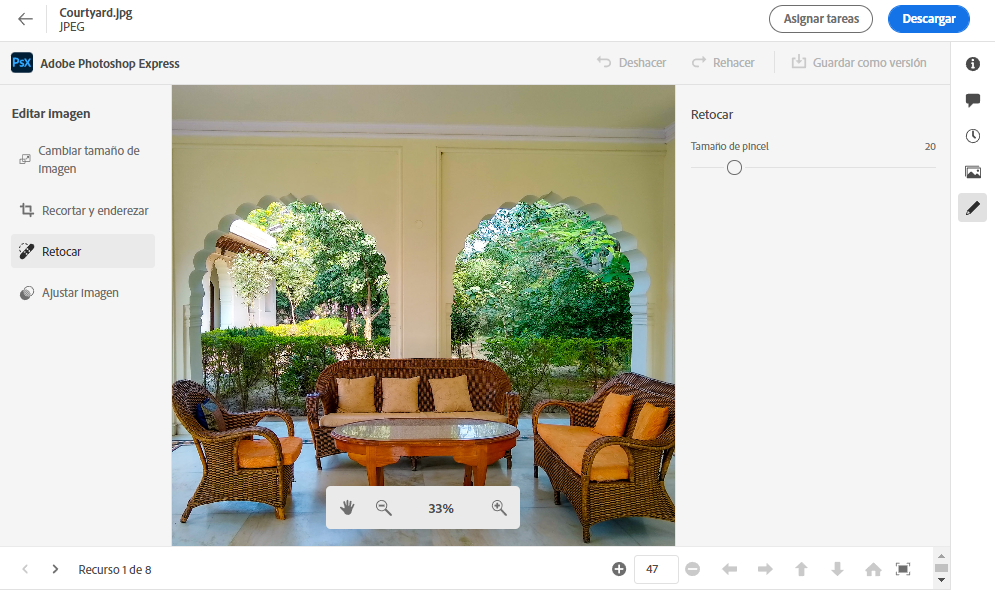
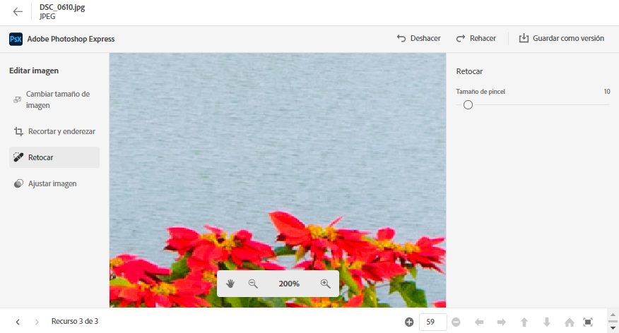
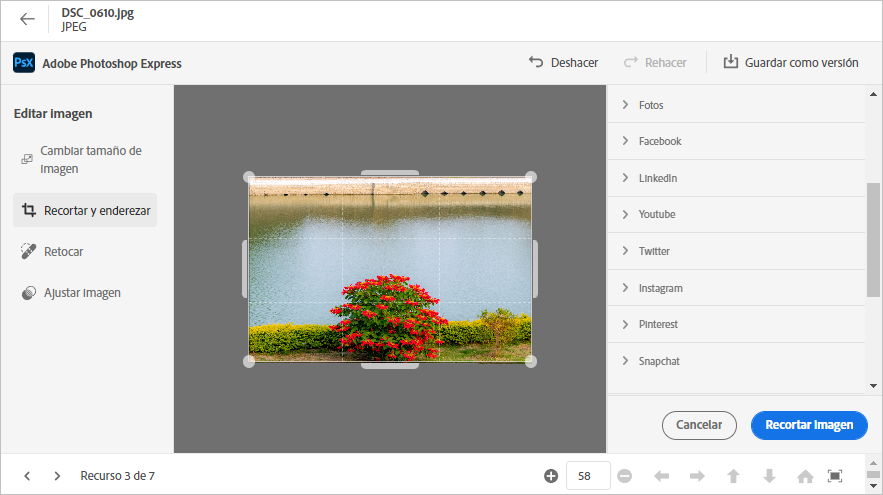
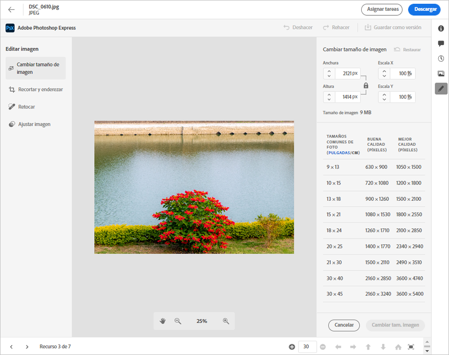

# Editar imágenes en [!DNL Assets Essentials] {#edit-images}

[!DNL Assets Essentials] proporciona opciones de edición fáciles de usar que utilizan  [!DNL Adobe Photoshop Express]. Las acciones de edición disponibles son Sanación puntual, Recortar y enderezar, Cambiar el tamaño de la imagen y Ajustar imagen.

Después de editar una imagen, puede guardar la nueva imagen como una nueva versión. El control de versiones le ayuda a volver al recurso original más adelante, si es necesario. Para editar una imagen, [abra su vista previa](/help/navigate-view.md#preview-assets) y haga clic en **[!UICONTROL Edit Image]**  desde el carril de la derecha.

*Figura: Las opciones para editar imágenes cuentan con tecnología de  [!DNL Adobe Photoshop Express].*

## Imágenes de sanación puntual {#spot-heal-images}

Si hay pequeñas manchas u objetos pequeños en una imagen, puede editar y eliminar las manchas con la función de curación puntual que proporciona Adobe Photoshop.

El pincel toma muestras del área retocada y hace que los píxeles reparados se fusionen sin problemas en el resto de la imagen. Utilice un tamaño de pincel que sea sólo ligeramente más grande que el lugar que desea corregir.

<!-- TBD: See if we should give backlinks to PS docs for these concepts.
For more information about how Spot Healing works in Photoshop, see [retouching and repairing photos](https://helpx.adobe.com/photoshop/using/retouching-repairing-images.html). -->

## Recortar y enderezar imágenes {#crop-straighten-images}

Con la opción recortar y enderezar puede realizar recortes básicos, girar la imagen, girarla horizontal o verticalmente y recortarla a dimensiones adecuadas para los sitios web de medios sociales más populares.

Para guardar las ediciones, haga clic en **[!UICONTROL Crop Image]**. Tras la edición, puede guardar la nueva imagen como una versión.

Muchas opciones predeterminadas permiten recortar la imagen a las mejores proporciones que se ajustan a varios perfiles y publicaciones de medios sociales.

## Cambiar el tamaño de la imagen {#resize-image}

Cambiar el tamaño de una imagen a un tamaño específico es un caso de uso popular. [!DNL Assets Essentials] le permite cambiar rápidamente el tamaño de la imagen para adaptarla a los tamaños de foto comunes, ya que proporciona nuevas resoluciones calculadas previamente para tamaños de foto específicos. Puede ver los tamaños de fotos comunes en centímetros o pulgadas para conocer las dimensiones. De forma predeterminada, el método de cambio de tamaño conserva la relación de aspecto. Para anular manualmente la relación de aspecto, haga clic en .

Introduzca las dimensiones y haga clic en **[!UICONTROL Resize Image]** para cambiar el tamaño de la imagen. Antes de guardar los cambios como una versión, puede deshacer todos los cambios realizados antes de guardarlos haciendo clic en [!UICONTROL Undo] o puede cambiar el paso específico del proceso de edición haciendo clic en [!UICONTROL Revert].

## Ajustar imagen {#adjust-image}

[!DNL Assets Essentials] permite ajustar el color, el tono, el contraste y mucho más con solo unos pocos clics. Haga clic **[!UICONTROL Adjust image]** en la ventana de edición. Las siguientes opciones están disponibles en la barra lateral derecha:

* **Popular**:  [!UICONTROL High Contrast & Detail],  [!UICONTROL Desaturated Contrast],  [!UICONTROL Aged Photo],  [!UICONTROL B&W Soft], y  [!UICONTROL B&W Sepia Tone].
* **Color**:  [!UICONTROL Natural],  [!UICONTROL Bright],  [!UICONTROL High Contrast],  [!UICONTROL High Contrast & Detail],  [!UICONTROL Vivid], y  [!UICONTROL Matte].
* **Creativo**:  [!UICONTROL Desaturated Contrast],  [!UICONTROL Cool Light],  [!UICONTROL Turquoise & Red],  [!UICONTROL Soft Mist],  [!UICONTROL Vintage Instant],  [!UICONTROL Warm Contrast],  [!UICONTROL Flat & Green],  [!UICONTROL Red Lift Matte],  [!UICONTROL Warm Shadows], y  [!UICONTROL Aged Photo].
* **B&amp;W**:  [!UICONTROL B&W Landscape],  [!UICONTROL B&W High Contrast],  [!UICONTROL B&W Punch],  [!UICONTROL B&W Low Contrast],  [!UICONTROL B&W Flat],  [!UICONTROL B&W Soft],  [!UICONTROL B&W Infrared],  [!UICONTROL B&W Selenium Tone],  [!UICONTROL B&W Sepia Tone], y  [!UICONTROL B&W Split Tone].
* **Viñeta**:  [!UICONTROL None],  [!UICONTROL Light],  [!UICONTROL Medium], y  [!UICONTROL Heavy].

<!--
TBD: Insert a video of the available social media options.
-->

>[!MORELIKETHIS]
>
>* [Ver el historial de versiones de un recurso](/help/navigate-view.md)

