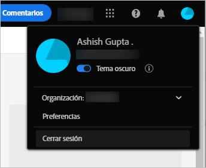
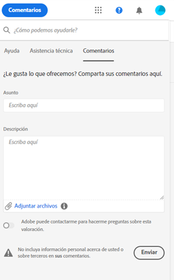

# Introducción a [!DNL Experience Manager Assets Essentials] {#assets-essentials-get-started}

<!-- TBD: Make links for these steps. -->

La administración de recursos digitales mediante [!DNL Assets Essentials] requiere solo tres pasos sencillos:

* **Paso 1**:   Cargar y   ver recursos.
* **Paso 2**:   Busque y   descargue recursos.
* **Paso 3**:  [Administre y ](/help/manage-organize.md) organice los recursos.

Para utilizar [!DNL Assets Essentials], inicie sesión en [https://experience.adobe.com/#/assets](https://experience.adobe.com/#/assets). Al iniciar sesión, seleccione `Company or School Account`. Para recibir acceso, póngase en contacto con el administrador de su organización.

Además, más información de referencia que puede ser útil es [comprensión de la interfaz de usuario](/help/navigate-view.md), [lista de casos de uso](#use-cases), <!-- TBD: [supported file types](/help/supported-file-formats.md), --> y [problemas conocidos](/help/release-notes.md#known-issues).

## Recibir acceso a [!DNL Assets Essentials] {#get-access}

Adobe proporciona la solución y añade la persona designada de su organización como administrador. Los administradores pueden proporcionar acceso a varios usuarios de la organización mediante [[!DNL Admin Console]](https://helpx.adobe.com/enterprise/admin-guide.html/enterprise/using/welcome.ug.html). Para solicitudes relacionadas con el acceso, póngase en contacto con el administrador de su organización.

## Configuración [!DNL Assets Essentials] {#configuration}

Para abrir las preferencias, haga clic en el avatar en la esquina superior derecha de la interfaz de usuario. Puede cambiar entre los temas de luz y oscuro en las preferencias de la solución.

Si forma parte de diferentes organizaciones, también puede cambiar la organización y acceder a sus cuentas en varias organizaciones.

Para cambiar el [!UICONTROL Experience Cloud preferences], haga clic en [!UICONTROL Preferences].

<!-- TBD: What can admins configure? What more can users configure? Any doc that describes Exp Cloud preferences? 
Metadata forms is out of the scope of 6/17 GA. When the functionality is added, link to it from here. It is about configuring metadata UI. -->

<!-- TBD: This section contains beta-specific video that will be updated post-GA.

## Login experience {#login-experience}

When logging in, after providing the credentials, you can be prompted to select an account. In this case, select `Company or School Account` to proceed.

-->

## [!DNL Assets Essentials] casos de uso {#use-cases}

A continuación se describen las distintas tareas de administración de recursos digitales (DAM) que puede realizar mediante [!DNL Assets Essentials].

| Tareas del usuario | Funcionalidad e información sobre procedimientos |
|-----|------|
| Examinar y ver recursos | <ul> <li>[Examinar el repositorio](/help/navigate-view.md#view-assets-and-details) </li> <li> [Vista previa de un recurso](/help/navigate-view.md#preview-assets) <li> [Ver representaciones de un recurso](/help/add-delete.md#renditions) </li> <li>[Ver versiones de un recurso](/help/manage-organize.md#view-versions)</li></ul> |
| Añadir nuevos recursos | <ul> <li>[Cargar nuevos recursos y carpetas](/help/add-delete.md#add-assets)</li> <li>[Supervisar el progreso de carga y administrar las cargas](/help/add-delete.md#upload-progress)</li> <li>[Resolver duplicados](/help/add-delete.md#resolve-upload-fails)</li> </ul> |
| Actualizar recursos o información relacionada | <ul> <li>[Editar imágenes](/help/edit-images.md)</li> <li>[Crear ](/help/manage-organize.md#create-versions) versiones y  [ver versiones](/help/manage-organize.md#view-versions)</li> <li>[Editar imágenes](/help/edit-images.md)</li> </ul> |
| Editar recursos | <ul> <li>[Ediciones en el navegador mediante Adobe Photoshop Express](/help/edit-images.md)</li> <li>[Recorte para un perfil de medios sociales](/help/edit-images.md#crop-straighten-images)</li> <li>[Ver y administrar versiones](/help/manage-organize.md#view-versions)</li> <li>[Uso [!DNL Adobe Asset Link]](/help/integration.md#integrations)</ul></ul> |
| Buscar recursos en el repositorio | <ul> <li>[Buscar dentro de una carpeta específica](/help/search.md#refine-search-results)</li> <li>[Búsquedas guardadas](/help/search.md#saved-search)</li> <li>[Buscar recursos visualizados recientemente](/help/search.md)</li> <li>[Búsqueda de texto completo](/help/search.md) |
| Descargar recursos | <ul> <li> [Previsualizar recurso](/help/navigate-view.md#preview-assets) </li> <li> [Descargar recursos](/help/manage-organize.md#download) <li> [Descargar representaciones](/help/add-delete.md#renditions) </li></ul> |
| Operaciones de metadatos | <ul> <li>[Ver metadatos detallados](/help/metadata.md) </li> <li> [Actualizar metadatos](/help/metadata.md#update-metadata)</li> <li> [Crear nuevo formulario de metadatos](/help/metadata.md#metadata-forms) </li> </ul> |
| Integración con otras soluciones | <ul> <li>[Uso del Selector de recursos en [!DNL Adobe Journey Optimizer]](/help/integration.md)</li> <li>[[!DNL Adobe Asset Link] para [!DNL Creative Cloud]](/help/integration.md)</li> <li>[Integración con [!DNL Adobe Workfront]](/help/integration.md)</li> </ul> |

<!--TBD: Merge the below rows in the table when the use cases are documented/available.

| How do I delete assets? | <ul> <li>[Delete assets](/help/manage-organize.md)</li> <li>Recover deleted assets</li> <li>Permanently delete assets</li> </ul> |
| How do I share assets or find shared assets? | <ul> <li>Shared by me</li> <li>Shared with me</li> <li>Share for comments and review</li> <li>Unshare assets</li> </ul> |
| How do I collaborate with others and get my assets reviewed | <ul> <li>Share for review</li> <li>Provide comments. Resolve and filter comments</li> <li>Annotations on images</li> <li>Assign tasks to specific users and prioritize</li> </ul> |

-->

##  Proporcionar comentarios sobre el producto {#provide-feedback}

El Adobe recibe con satisfacción los comentarios sobre la solución. Para proporcionar comentarios sin cambiar siquiera la aplicación en funcionamiento, utilice la opción [!UICONTROL Feedback] en la interfaz de usuario. También permite adjuntar archivos, como capturas de pantalla o grabación de vídeo de un problema.

Para proporcionar comentarios sobre la documentación, haga clic en [!UICONTROL Edit this page]  o [!UICONTROL Log an issue]  desde la barra lateral derecha. Puede realizar una de las siguientes acciones:

* Realice las actualizaciones de contenido y envíe una solicitud de extracción de GitHub.
* Cree un problema o un ticket en GitHub. Conservar el nombre del artículo que se rellena automáticamente al crear un problema.

>[!MORELIKETHIS]
>
>* [Comprender la interfaz de usuario](/help/navigate-view.md).
>* [Notas de la versión y problemas conocidos](/help/release-notes.md).

<!-- TBD: 
>* [Supported file types](/help/supported-file-formats.md).
-->
