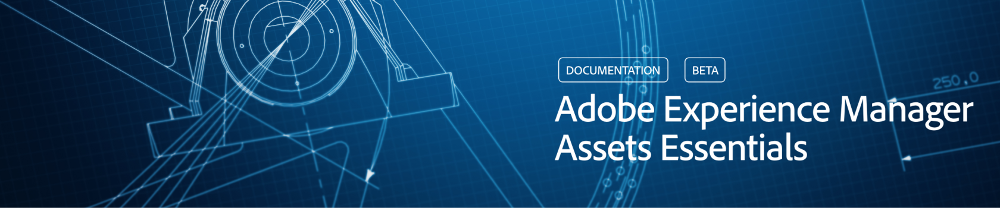

# Información general de [!DNL Adobe Experience Manager Assets Essentials] {#assets-essentials}

<!-- TBD: Update this banner to remove Beta label. 

-->

Adobe ofrece una solución sólida de administración de activos digitales (DAM) para que usted pueda sacar el máximo partido a sus recursos digitales. Como parte de la línea de productos de Adobe Experience Manager, Adobe proporciona una nueva solución SaaS para almacenar, administrar y descubrir recursos digitales, que también se integran de forma nativa con otras soluciones de Adobe.

[!DNL Experience Manager Assets Essentials] es una nueva edición ligera de [!DNL Adobe Experience Manager Assets]. [!DNL Assets Essentials] proporciona una colaboración y administración unificadas de recursos con una interfaz de usuario simplificada y coherente. La facilidad de uso permite que equipos más creativos y de marketing almacenen, descubran y distribuyan recursos digitales. En la actualidad, la experiencia de [!DNL Assets Essentials] incorporada puede integrarse con las siguientes soluciones:

* Creative Cloud para empresas

* Adobe Journey Optimizer

* Adobe Workfront

Para obtener más información, consulte [Integración con otras soluciones de Adobe](integration.md).

[!DNL Assets Essentials] se centra en la interfaz sencilla y en la búsqueda y el descubrimiento eficientes de recursos digitales, para garantizar la utilización de los recursos, el control y la uniformidad de la marca en todos los equipos. La experiencia del usuario final puede ser mediante una interfaz de usuario web independiente y una experiencia integrada en otras soluciones de Adobe.

Para los administradores, ofrece una configuración y administración más sencillas que llevan a un tiempo de respuesta más rápido. Los administradores obtienen acceso inmediato a la solución y pueden trabajar con funciones y autorizaciones de usuario familiares en [!DNL Adobe Admin Console]. Consulte [Implementación y administración](/help/deploy-administer.md).

Para los usuarios, administrar los recursos digitales con [!DNL Assets Essentials] es tan fácil como seguir estos 3 pasos. Consulte [Introducción a [!DNL Assets Essentials]](/help/get-started.md).

* **Paso 1**: cargar y ver recursos.
* **Paso 2**: buscar y descargar recursos.
* **Paso 3**: administrar y organizar los recursos.

>[!MORELIKETHIS]
>
>* Entrada de blog para anunciar el lanzamiento de [[!DNL Assets Essentials] ](https://blog.adobe.com/en/publish/2021/04/27/introducing-adobe-experience-manager-assets-essentials-to-simplify-collaboration-across-teams.html)

