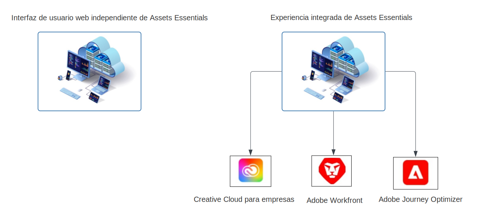

# Información general de [!DNL Adobe Experience Manager Assets Essentials] {#assets-essentials}

<!-- TBD: Update this banner to remove Beta label. 

-->

Adobe ofrece sólidas soluciones de administración de recursos digitales (DAM) para que usted pueda sacar el máximo partido de sus recursos digitales. Adobe Experience Manager Assets Essentials es la solución de administración de recursos ligera de Adobe para almacenar, administrar, descubrir y usar recursos digitales.

## ¿Qué es Assets Essentials? {#assets-essemtials-overview}

Experience Manager Assets Essentials es una edición ligera del Cloud Service de Adobe Experience Manager Assets. Assets Essentials proporciona colaboración y administración unificadas de recursos con una interfaz de usuario moderna y simplificada. La solución fácil de usar permite a equipos más creativos y de marketing almacenar, descubrir y distribuir recursos digitales.

Assets Essentials le permite:

* Administrar, organizar y administrar recursos en una ubicación central.

* Colaborar en el desarrollo de contenido entre equipos.

* Acceda, busque y encuentre los recursos aprobados finales.

* Comparta y descargue recursos para su envío descendente.

## ¿Cómo acceder a Assets Essentials? {#access-options}

Assets Essentials ofrece una interfaz de usuario web independiente para usuarios finales y administradores, lo que les permite acceder a todas las funcionalidades de la solución. Los usuarios de otras soluciones de Adobe también pueden acceder a los recursos de Assets Essentials y trabajar con ellos mediante una experiencia integrada que está disponible en Creative Cloud para aplicaciones empresariales, Adobe Journey Optimizer y Adobe Workfront.

## ¿Por qué Assets Essentials? {#assets-essentials-features}

Assets Essentials proporciona ventajas clave que le permiten:

* **Introducción rápidamente** con herramientas de administración de recursos integradas.

* Ampliar el acceso a los recursos a más equipos para ofrecer experiencias de cliente coherentes con **administración simplificada de activos**.

* Unifique el ciclo vital de contenido con nativo **integraciones en otras soluciones de Adobe**.

* Aproveche un **plataforma basada en la nube**, seguro y listo para escalar en cualquier momento y lugar.

* Comience con las funcionalidades esenciales de DAM y **aumentar** a DAM empresarial.

**Introducción rápidamente**

La solución Assets Essentials se proporciona a los clientes por Adobe y está disponible una vez finalizado el proceso de aprovisionamiento. Los administradores obtienen acceso al producto en Adobe Admin Console y pueden iniciar inmediatamente la configuración del sistema y la incorporación del usuario.

Más información sobre Assets Essentials [administración e incorporación de usuarios](deploy-administer.md).

**Administración simplificada de recursos**

La interfaz de usuario simplificada de Assets Essentials facilita la administración, la detección y la distribución de sus recursos digitales. Un amplio conjunto de usuarios de diferentes funciones, incluidos los equipos creativos, de marketing y de línea de negocios, pueden colaborar en los recursos y acceder a los recursos correctos y aprobados cuando y donde los necesiten.

Para obtener más información, consulte [Introducción a las necesidades de administración de recursos con Assets Essentials](get-started.md).

**Integración con otras aplicaciones de Adobe**

Assets Essentials se integra con las soluciones de Adobe compatibles y proporciona una experiencia integrada desde las interfaces de estas aplicaciones. Permite a los usuarios acceder fácilmente a los recursos que necesitan directamente en su aplicación. Todos los usuarios pueden trabajar con los mismos recursos administrados centralmente en sus herramientas y aplicaciones familiares.

La experiencia integrada de Assets Essentials está disponible para Creative Cloud para aplicaciones empresariales, Adobe Journey Optimizer y Adobe Workfront.

Para obtener más información, consulte [Integración con otras soluciones de Adobe](integration.md).

**Plataforma basada en la nube**

Assets Essentials, que se basa en la infraestructura de la nube de Adobe, permite a las organizaciones centrarse en sus necesidades comerciales en la creación, administración y distribución de recursos digitales. Además, el Adobe garantiza que la solución esté disponible, sea segura, escalable y esté siempre actualizada, con innovaciones de producto que se proporcionan a los usuarios sin problemas mediante actualizaciones frecuentes.

**Aumento de las capacidades**

Póngase en marcha con Assets Essentials rápidamente para beneficiarse de las funcionalidades clave de Digital Asset Management en varios equipos.

Cuando sus necesidades empresariales aumentan y necesita soporte para los requisitos avanzados de la administración de activos digitales, como personalizaciones, extensibilidad e integraciones, automatización, Dynamic Media y Brand Portal, Adobe también ofrece [Recursos Adobe Experience Manager as a Cloud Service](https://experienceleague.adobe.com/docs/experience-manager-cloud-service/content/assets/home.html?lang=en).

## Siguientes pasos {#next-steps}

* Proporcione comentarios de producto mediante [!UICONTROL Comentarios] opción disponible en la interfaz de usuario de Assets Essentials

* Proporcione comentarios sobre la documentación usando [!UICONTROL Editar esta página]  o [!UICONTROL Registrar un problema]  disponible en la barra lateral derecha

* Contacto [Servicio de atención al cliente](https://experienceleague.adobe.com/?support-solution=General#support)

>[!MORELIKETHIS]
>
>* [[!DNL Assets Essentials] página tutoriales](https://experienceleague.adobe.com/docs/experience-manager-learn/assets-essentials/overview.html?lang=en)

