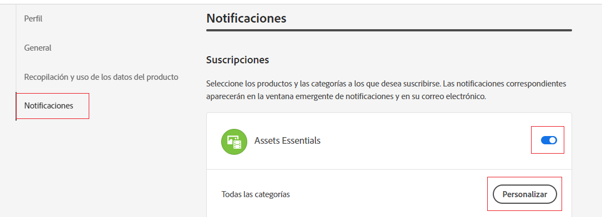
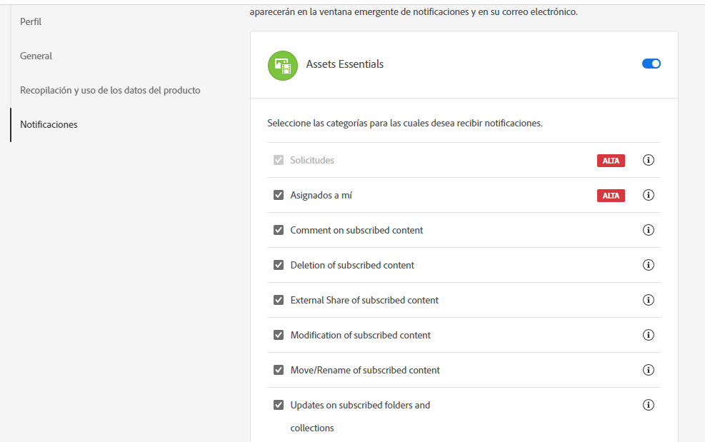
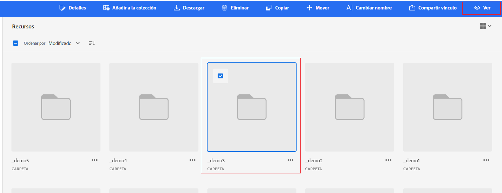

# Administrar notificaciones {#manage-notifications}

Las notificaciones de Assets Essentials permiten supervisar las operaciones realizadas en los recursos o carpetas disponibles en el repositorio. Debe seleccionar y suscribirse al contenido para el que se le envían las notificaciones. También puede configurar las categorías a las que se envían las notificaciones.

## Suscripción a las categorías de notificación {#subscribe-to-notification-categories}

Puede elegir y suscribirse a una lista de categorías para recibir notificaciones. Assets Essentials le envía las notificaciones únicamente para las categorías que seleccione entre las opciones disponibles:

<table>
    <tbody>
     <tr>
      <th><strong>Categoría de notificación</strong></th>
      <th><strong>Descripción</strong></th>
     </tr>
     <tr>
      <td>Solicitudes</td>
      <td>Cuando asigna una tarea a un usuario, recibe notificaciones cuando ese usuario realiza acciones en esa tarea.</td>
     </tr>
     <tr>
      <td>Asignado a mí</td>
      <td>Recibirá una notificación cuando haya una tarea asignada de otro usuario.</td>
     </tr>
     <tr>
      <td>Comentario sobre el contenido suscrito</td>
      <td>Recibe una notificación cuando un usuario comenta sobre su recurso suscrito.</td>
     </tr>
     <tr>
      <td>Eliminación del contenido suscrito</td>
      <td>Recibirá una notificación cuando un usuario elimine su carpeta o recurso suscrito.</td>
     </tr>
     <tr>
      <td>Participación externa del contenido suscrito</td>
      <td>Recibirá una notificación cuando un usuario genere un vínculo público para el recurso o la carpeta suscritos.</td>
     </tr>
     <tr>
      <td>Modificación del contenido suscrito</td>
      <td>Recibirá una notificación cuando un usuario cree una nueva versión para el recurso suscrito.</td>
     </tr>
     <tr>
      <td>Mover/cambiar el nombre del contenido suscrito</td>
      <td>Recibirá una notificación cuando un usuario mueva o cambie el nombre del recurso o la carpeta suscritos.</td>
     </tr>
     <tr>
      <td>Actualizaciones en carpetas y colecciones suscritas</td>
      <td>Recibirá una notificación cuando un usuario agregue o elimine un recurso de una carpeta suscrita.</td>
     </tr>    
    </tbody>
   </table>

Para suscribirse a las categorías de notificación:

1. Haga clic en  en el extremo derecho de la barra de menús de la interfaz de usuario de Assets Essentials.

1. Haga clic en  para ver el [!UICONTROL preferencias del Experience Cloud] página.

1. Haga clic en el **[!UICONTROL Notificaciones]** disponible en el panel izquierdo.

1. En el **[!UICONTROL Notificaciones]** , vaya a la sección [!UICONTROL Assets Essentials] y asegúrese de que la opción de alternancia pasa al estado ON.

   

1. Haga clic en **[!UICONTROL Personalizar]** para ver las categorías de notificación.
   

1. Seleccione las categorías de notificación para las que debe recibir notificaciones.

## Ver y desver carpetas o recursos {#watch-unwatch-assets}

Después [suscripción a las categorías de notificación](#subscribe-to-notification-categories), debe suscribirse al contenido para comenzar a recibir notificaciones.

>[!NOTE]
>
>Para **[!UICONTROL Solicitudes]** y **[!UICONTROL Asignado a mí]** categorías de notificación, no es necesario suscribirse al contenido después de suscribirse a las categorías de notificación. Las notificaciones se envían automáticamente para las solicitudes creadas por usted y cuando se le asigna una tarea.

Para suscribirse al contenido, seleccione la carpeta o el recurso al que debe suscribirse y haga clic en **[!UICONTROL Watch]**.

Assets Essentials muestra un mensaje de éxito. Puede hacer clic en **[!UICONTROL Ir a las preferencias de notificación]** disponible en el mensaje de éxito para editar su [suscripción a categorías de notificación](#subscribe-to-notification-categories).

Assets Essentials ahora envía notificaciones para las categorías suscritas. También puede seleccionar varios recursos o carpetas y hacer clic en **[!UICONTROL Watch]** para ahorrar tiempo. Sin embargo, si selecciona varias entidades de las cuales algunas de ellas ya están suscritas, la variable **[!UICONTROL Watch]** no se muestra.

Del mismo modo, para cancelar la suscripción, seleccione el recurso o la carpeta que ha suscrito y haga clic en **[!UICONTROL Unwatch]**.

## Ver notificaciones {#view-notifications}

Las notificaciones aparecen en el extremo derecho de la barra de menús de la interfaz de usuario de Assets Essentials.

Al hacer clic en una notificación, Assets Essentials lo desplaza hasta el recurso o la carpeta correspondientes a los que se hace referencia en la notificación.

