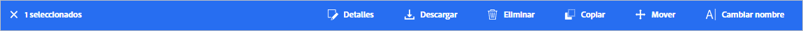
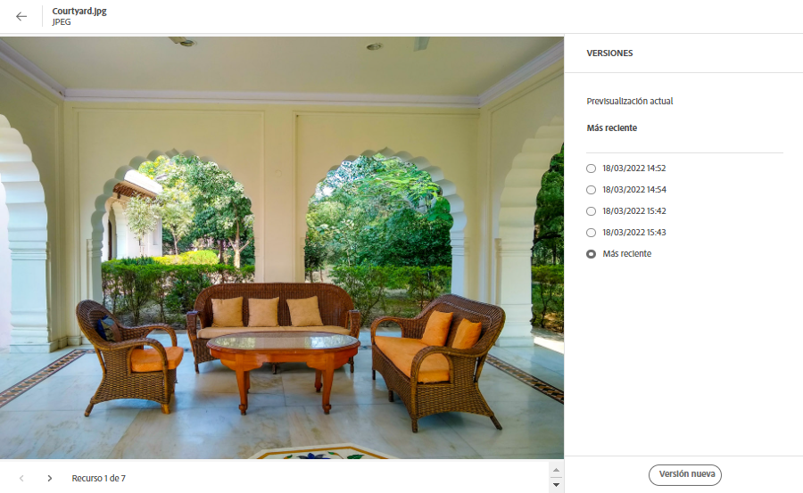
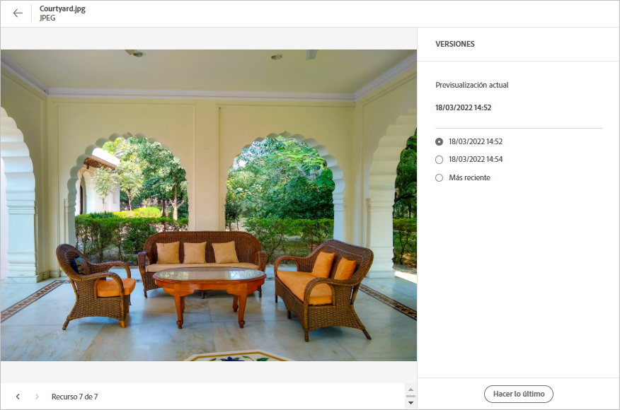

# Administración de recursos {#manage-assets}

Puede realizar varias tareas de administración de activos digitales (DAM) fácilmente mediante la interfaz de usuario sencilla de usar de [!DNL Assets Essentials]. Una vez añadidos los recursos, puede buscarlos, descargarlos, moverlos, copiarlos, cambiarles el nombre, eliminarlos, actualizarlos y editarlos.

Use [!DNL Assets Essentials] para llevar a cabo las siguientes tareas de administración de recursos. Al seleccionar un recurso, aparecen las siguientes opciones en la barra de herramientas de la parte superior.

*Imagen: opciones disponibles en la barra de herramientas de una imagen seleccionada.*

*  Anule la selección.
*  Haga clic para previsualizar un recurso y ver los metadatos detallados. Al previsualizar, puede ver las versiones y editar una imagen.
*  Descargue el recurso seleccionado en el sistema de archivos local.
*  Elimine el recurso o la carpeta seleccionados.
*  Cierre el recurso seleccionado.
*  Copie el archivo o la carpeta seleccionados.
*  Mueva el recurso o la carpeta seleccionados a una ubicación diferente en la jerarquía del repositorio.
*  Cambie el nombre del recurso o la carpeta seleccionados. Utilice un nombre único, si no, el cambio de nombre producirá un error con una advertencia. Puede intentarlo de nuevo con un nombre nuevo.
*  Asigne tareas a otros usuarios para colaborar en un recurso.

Puede ver las mismas opciones en las miniaturas de recursos.

[!DNL Assets Essentials] muestra únicamente las opciones relevantes de la barra de herramientas que dependen del tipo de recurso seleccionado.

*Imagen: opciones disponibles en la barra de herramientas de una carpeta seleccionada.*

*Imagen: opciones disponibles en la barra de herramientas de un archivo PDF seleccionado.*

## Descarga y distribución de recursos {#download}

Puede seleccionar uno o varios recursos, carpetas o una combinación de ambos y descargar la selección en el sistema de archivos local. Puede editar los recursos y volver a cargarlos o distribuirlos fuera de [!DNL Assets Essentials]. Además, puede [descargar las representaciones](/help/add-delete.md#renditions) de un recurso.

## Creación de versiones de recursos {#versions-of-assets}

<!-- 
TBD: query for engineering: How many versions are maintained. What happens when we reach that limit? Are old versions automatically removed? -->

[!DNL Assets Essentials] crea versiones de los recursos cuando se cargan de nuevo y se actualizan o editan. Puede ver el historial de versiones actuales y anteriores, así como restaurar una versión anterior de los recursos como la última versión, que se revierte a una anterior si es necesario. Las versiones de los recursos se crean en los siguientes casos:

* Cargue un nuevo recurso con el mismo nombre de archivo que uno existente y en la misma carpeta que este. [!DNL Assets Essentials] le solicita que sobrescriba el recurso anterior o que guarde el nuevo como una versión. Consulte [Carga de recursos duplicados](/help/add-delete.md#resolve-upload-fails).

   

   *Imagen: al cargar un recurso con el mismo nombre que uno existente, puede crear una versión de este.*

* Edite una imagen y haga clic en **[!UICONTROL Guardar como versión]**. Consulte [Edición de imágenes](/help/edit-images.md).

   

   *Imagen: guardar imagen editada como versión.*

* Abra las versiones de un recurso existente. Haga clic en **[!UICONTROL Nueva versión]** y cargue una versión más reciente del recurso en el repositorio.

   

### Visualización de versiones de un recurso {#view-versions}

Al cargar una copia duplicada o modificada de un recurso, puede crear sus versiones. Las versiones le permiten revisar los recursos históricos y revertirlos a una versión anterior si es necesario.

Para ver las versiones, abra la previsualización de un recurso y haga clic en **[!UICONTROL Versiones]**  en la barra lateral derecha. Para previsualizar una versión específica, selecciónela. Para volver a ella, haga clic en **[!UICONTROL Crear más reciente]**.

También puede crear versiones a partir de la cronología de las versiones. Seleccione la última versión, haga clic en **[!UICONTROL Nueva versión]** y cargue una copia nueva del recurso desde el sistema de archivos local.

*Imagen: visualización de versiones de un recurso, reversión a una versión anterior o carga de otra versión nueva.*
