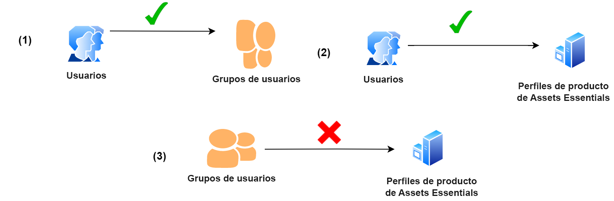
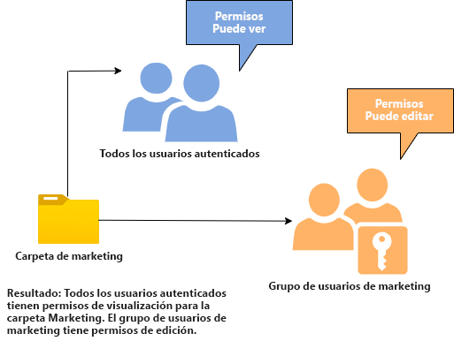
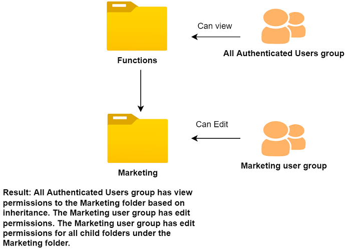
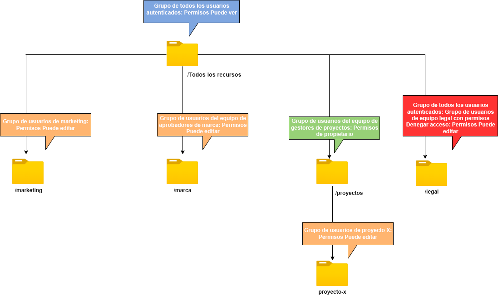

# Administrar permisos para carpetas

Assets Essentials permite a los administradores administrar los niveles de acceso para las carpetas disponibles en el repositorio. Como administrador, puede crear grupos de usuarios y asignar permisos a esos grupos para administrar los niveles de acceso. También puede delegar los privilegios de administración de permisos a grupos de usuarios en el nivel de carpeta.

El diagrama de flujo de datos siguiente ilustra la secuencia de tareas que se realizan para configurar y administrar los permisos de las carpetas disponibles en el repositorio de Assets Essentials:

## Antes de administrar permisos para carpetas {#before-managing-permissions}

Antes de empezar a administrar permisos para carpetas en el repositorio de Assets Essentials, debe realizar determinadas tareas, como agregar administradores que puedan crear una estructura de carpetas lógica, crear grupos de usuarios y administrar permisos de carpetas para varios grupos de usuarios.

### Agregar administradores {#add-admin-users}

Agregue administradores a la aplicación Assets Essentials para que puedan administrar permisos de carpeta para otros grupos de usuarios.

Para agregar administradores:

1. Acceso [Admin Console](https://adminconsole.adobe.com) para su organización, haga clic en **[!UICONTROL Productos]** en la barra superior, haga clic en **[!UICONTROL AEM Assets Essentials]** y, a continuación, haga clic en [!DNL Assets Essentials] entorno. [!DNL Assets Essentials] tiene tres perfiles de producto que representan el acceso para administradores, usuarios normales y consumidores.

   

1. Para agregar un usuario a un grupo, haga clic en el grupo Administradores de Assets Essentials y seleccione **[!UICONTROL Agregar usuario]**, proporcione los detalles del usuario y haga clic en **[!UICONTROL Guardar]**.

   

   Cuando agrega un usuario, el usuario recibe una invitación por correo electrónico para comenzar. Puede desactivar las invitaciones por correo electrónico en la configuración del perfil del producto en [!DNL Admin Console].

1. Para quitar un usuario de un grupo, haga clic en el grupo, seleccione un usuario existente y seleccione **[!UICONTROL Eliminar usuario]**.

### Agregar grupos de usuarios {#add-user-groups}

Cree grupos de usuarios y asigne permisos a esos grupos para administrar los niveles de acceso a carpetas en el repositorio de Assets Essentials. A continuación, puede asignar los usuarios a los grupos de usuarios.

Puede agregar usuarios a grupos de usuarios (1) y [usuarios con perfiles de producto de Assets Essentials (2)](#add-admin-users). Sin embargo, no puede agregar grupos de usuarios directamente a Perfiles de producto de Assets Essentials (3).

Para obtener información sobre cómo administrar grupos de usuarios, consulte `Create user groups` y `Edit user groups` disponible en [Administrar grupos de usuarios](https://helpx.adobe.com/enterprise/using/user-groups.html).

>[!NOTE]
>
>Si el Admin Console está configurado para aprovechar un sistema externo para administrar asignaciones de usuarios/grupos, como conectores de Azure o Google, la herramienta de sincronización de usuarios o la API de descanso de administración de usuarios, los grupos y las asignaciones de usuarios se configuran automáticamente. Para obtener más información, consulte [Usuarios de Adobe Admin Console](https://helpx.adobe.com/enterprise/using/users.html).

### Agregar usuarios a grupos {#add-users-to-uesr-groups}

Después de crear grupos de usuarios, puede empezar a agregar usuarios a los grupos de usuarios.

Para obtener información sobre cómo administrar la adición de usuarios a grupos de usuarios, consulte `Add users to groups` disponible en [Administrar grupos de usuarios](https://helpx.adobe.com/in/enterprise/using/user-groups.html#add-users-to-groups).

### Crear estructura de carpetas {#create-folder-structure}

Puede utilizar los siguientes métodos para crear una estructura de carpetas en el repositorio de Assets Essentials:

* Haga clic en el **[!UICONTROL Crear carpeta]** disponible en la barra de herramientas para crear una carpeta vacía.

* Haga clic en **[!UICONTROL Agregar recursos]** opción disponible en la barra de herramientas para [cargar una estructura de carpetas disponible en el equipo local](add-delete.md).

Cree una estructura de carpetas que funcione bien con los objetivos empresariales de la organización. Si está cargando una estructura de carpetas existente en el repositorio de Assets Essentials, debe revisar la estructura. Para obtener más información, consulte [Prácticas recomendadas para la administración eficaz de permisos](permission-management-best-practices.md).

## Administrar permisos en carpetas {#manage-permissions-folders}

Puede asignar los siguientes permisos a los grupos de usuarios o a los usuarios. Adobe no recomienda asignar permisos a los usuarios.

| Nombre del permiso | Descripción |
|-----|------|
| Puede ver | <ul><li>Acceso de lectura para ver y navegar por carpetas </li><li>Vista previa de recursos</li><li>Descargar recursos</li><li>Copiar recursos</li><li>Compartir vínculos con recursos</li><ul> |
| Puede editar | <ul><li>Todos los privilegios disponibles para los permisos de Puede View </li><li>Crear carpetas</li><li>Eliminar carpetas</li><li>Cambiar el nombre de las carpetas</li><li>Crear recursos</li><li>Actualizar recursos</li><li>Eliminación de recursos</li><li>Mover recursos</li><li>Cambiar el nombre de los recursos</li><ul> |
| Propietario | <ul><li>Todos los privilegios disponibles para los permisos Puede editar</li><li>Administrar permisos en una carpeta y sus subcarpetas</li>Este permiso permite a los administradores delegar los privilegios de administrador en otros para una carpeta y sus subcarpetas.<ul> |
| Denegar acceso | Eliminar los permisos de Puede Ver, Puede Editar y Propietario para una carpeta y sus subcarpetas. |

**Permisos predeterminados**

Todos los usuarios autenticados y que pueden iniciar sesión en la aplicación Assets Essentials tienen `Can Edit` permisos iniciales para el repositorio de Assets Essentials. El administrador puede ajustar el cambio de los permisos predeterminados de [editar permisos para todo el repositorio de Assets Essentials](#edit-permissions-entire-repository).

**Secuencia para asignar permisos de carpeta a grupos de usuarios**

Cree reglas para asignar permisos de carpeta a grupos de usuarios. La secuencia que utilice para asignar permisos a una carpeta es importante y decide el acceso disponible para los grupos de usuarios y, finalmente, para los usuarios.

Por ejemplo, si asigna la variable `Can View` permisos para una carpeta para un supergrupo y, a continuación, asignar `Can Edit` permisos para su subgrupo, solo los miembros del subgrupo tienen permisos de edición para la carpeta. Los usuarios del supergrupo tienen acceso de vista a la carpeta.

Si necesita proporcionar permisos de edición al `Marketing` carpeta solo para el departamento de marketing de su organización y vea los permisos para otras personas. asigne `Can View` permisos para supergrupo `All Authenticated Users` y `Can Edit` permisos para su subgrupo `Marketing`.

**Herencia de permisos**

Assets Essentials utiliza la herencia de permisos, que le permite heredar los permisos establecidos para la carpeta principal en la carpeta secundaria. Por ejemplo, si la carpeta principal tiene `Can View` permisos para `All Authenticated Users` grupo y la carpeta secundaria tiene `Can Edit` permisos para `Marketing` grupo de usuarios, permite que todos los usuarios autenticados tengan permisos de visualización para la carpeta secundaria y la `Marketing` grupo de usuarios con permisos de edición para la carpeta secundaria. La variable `Marketing` grupo de usuarios tiene permisos de edición para niveles adicionales de carpetas en la carpeta secundaria (Marketing).

>[!NOTE]
>
> Configuración de una `Deny Access` permisos para un grupo en una carpeta de nivel superior y restauración del acceso (`Can view`, `Can edit` o `Owner`) para ese grupo o su miembro no es compatible. Uso `Deny Access` con moderación.

### Agregar permisos a grupos de usuarios {#add-permissions}

Para asignar permisos de grupo en carpetas:

1. Seleccione la carpeta y haga clic en **[!UICONTROL Administrar permisos]**.

1. En el **[!UICONTROL Administrar permisos]** , especifique el nombre del grupo o de un usuario en el **[!UICONTROL Grupos y usuarios]** campo .

1. Seleccione el [nivel de acceso](#manage-permissions-folders) de la variable **[!UICONTROL Acceso]** lista desplegable.

1. Haga clic en **[!UICONTROL Agregar]** para realizar un cambio inmediato en los permisos del usuario o grupo de usuarios.

1. Repita los pasos del 1 al 3 para agregar más reglas al **[!UICONTROL Administrar permisos]** diálogo.

   

   >[!NOTE]
   >
   > El orden que utilice para asignar permisos a una carpeta es importante y decide el acceso disponible para los grupos de usuarios y, finalmente, los usuarios agregados a los grupos.

   Si está administrando permisos para varias carpetas, también puede seleccionar cualquier otra carpeta del panel izquierdo y empezar a administrar permisos para esa carpeta.

1. Haga clic en **[!UICONTROL Cerrar]**.

>[!CAUTION]
>
> Se recomienda administrar permisos para grupos de usuarios en lugar de para usuarios individuales. Configuración de la variable `Deny access` solo se admite para grupos de usuarios, pero no para usuarios individuales.

### Editar permisos asignados a grupos de usuarios {#edit-permissions}

Para editar permisos asignados a grupos de usuarios en carpetas:

1. Seleccione la carpeta y haga clic en **[!UICONTROL Administrar permisos]**.

1. En el **[!UICONTROL Administrar permisos]** , edite el [nivel de acceso](#manage-permissions-folders) de la variable **[!UICONTROL Acceso]** lista desplegable.

1. [Agregar más grupos de usuarios o usuarios](#add-permissions) a las reglas de permisos existentes, si es necesario.

1. Haga clic en X para eliminar los permisos asignados a un grupo de usuarios.

### Editar permisos para todo el repositorio de Assets Essentials {#edit-permissions-entire-repository}

Un administrador de aplicaciones puede editar permisos para todo el repositorio de Assets Essentials desde un `Can Edit` a cualquier otro nivel de acceso.

Para editar permisos para todo el repositorio de Assets Essentials:

1. Seleccione cualquier carpeta y haga clic en **[!UICONTROL Administrar permisos]**.

1. En el **[!UICONTROL Administrar permisos]** cuadro de diálogo, haga clic en **[!UICONTROL Todos los recursos]** en el carril izquierdo.

1. [Editar los permisos](#edit-permissions) y cierre el cuadro de diálogo.

>[!NOTE]
>
>Un administrador no puede seleccionar la variable `Deny Access` nivel de permiso para todo el repositorio de Assets Essentials para garantizar que los usuarios tengan al menos acceso de lectura a la aplicación. Del mismo modo, `All Authenticated Users` tienen al menos permisos de lectura en el repositorio, incluso si el administrador elimina explícitamente el `Can Edit` los permisos de [!UICONTROL Administrar permisos] diálogo.

## Ejemplos de administración eficaz de permisos {#example-permission-management}

**Caso práctico**

* Todos los grupos de usuarios autenticados tienen acceso de vista al repositorio.
* Los grupos de usuarios específicos del equipo tienen permisos de edición en su propia carpeta específica de funciones.
* La carpeta legal no está disponible para su visualización por ningún usuario autenticado excepto el equipo legal.

Cree los siguientes grupos de usuarios en Admin Console:

* Equipo de marketing

* Equipo de aprobadores de marca

* Equipo de gestores de proyectos

* Equipo del proyecto X

* Equipo legal

El diagrama siguiente ilustra la jerarquía de carpetas y los permisos asignados a cada grupo de usuarios:

Los siguientes son los niveles de acceso para todos los grupos de usuarios en la jerarquía de carpetas:

* /Todos los recursos: El administrador modifica los permisos en el nivel raíz del valor predeterminado `Can Edit` a `Can View`. Todos los usuarios pueden ver carpetas y recursos, pero no pueden editarlos.

* /marketing: Todos los usuarios pueden ver las carpetas y sus subcarpetas en función de la herencia de permisos. Sin embargo, el grupo de usuarios del equipo de marketing tiene permisos de edición en la carpeta.

* /brand: Todos los usuarios pueden ver las carpetas y sus subcarpetas en función de la herencia de permisos. Sin embargo, el grupo de usuarios Equipo de aprobadores de marcas tiene permisos de edición en la carpeta.

* /proyectos: Todos los usuarios pueden ver las carpetas y sus subcarpetas en función de la herencia de permisos. El grupo de usuarios de equipo de jefes de proyecto tiene:

   * Editar permisos

   * Permisos de propietario: Administre permisos en una carpeta y sus subcarpetas.

* /projects/project-x: Todos los usuarios pueden ver las carpetas y sus subcarpetas. Gestores de proyectos El grupo de usuarios Equipo tiene permisos de edición y puede administrar permisos en una carpeta y sus subcarpetas (permisos de propietario). El grupo de usuarios del equipo del proyecto X tiene permisos de edición.

* /legal: Ninguno de los usuarios puede acceder a la carpeta en función de la variable `Deny Access` permisos para `All Authenticated Users` grupo. El grupo de usuarios Equipo legal tiene permisos de edición.
