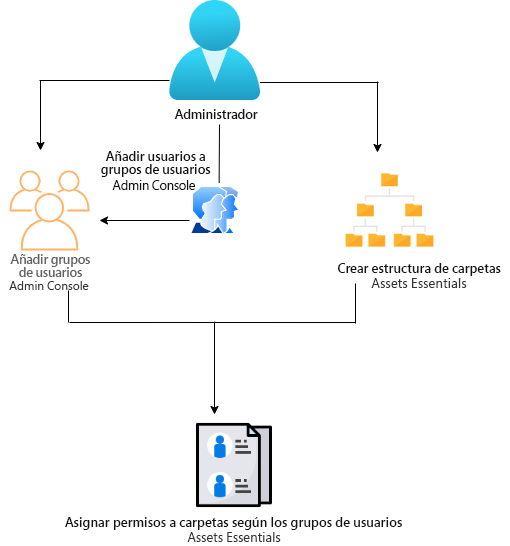
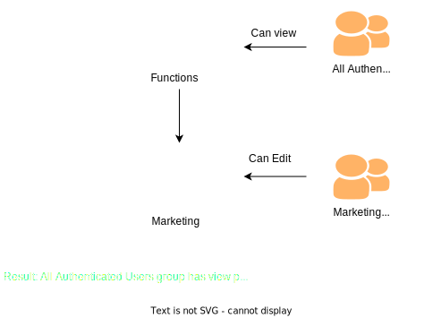
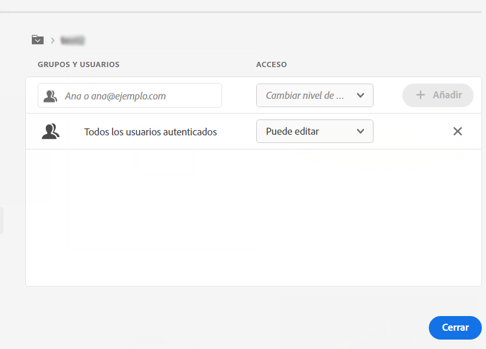
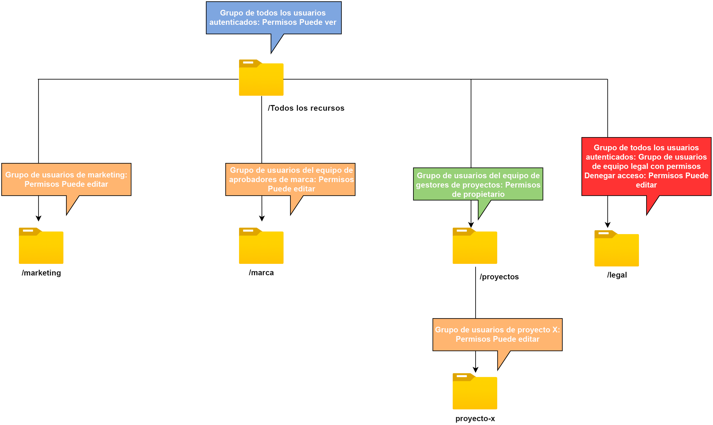

# Administración de permisos para carpetas {#manage-permissions}

>[!CONTEXTUALHELP]
>id="assets_workspace"
>title="Administrar permisos"
>abstract="[!DNL Assets Essentials] permite a los administradores gestionar los niveles de acceso para las carpetas disponibles en el repositorio. Como administrador, puede crear grupos de usuarios y asignar permisos a esos grupos para administrar los niveles de acceso. También puede delegar los privilegios de administración de permisos a grupos de usuarios en el nivel de carpeta."

Assets Essentials permite a los administradores administrar los niveles de acceso para las carpetas disponibles en el repositorio. Como administrador, puede crear grupos de usuarios y asignar permisos a esos grupos para administrar los niveles de acceso. También puede delegar los privilegios de administración de permisos a grupos de usuarios en el nivel de carpeta.

El diagrama de flujo de datos siguiente ilustra la secuencia de tareas que se realizan para configurar y administrar los permisos de las carpetas disponibles en el repositorio de Assets Essentials:

## Antes de administrar permisos para carpetas {#before-managing-permissions}

Antes de empezar a administrar permisos para carpetas en el repositorio de Assets Essentials, debe realizar determinadas tareas, como añadir administradores que puedan crear una estructura de carpetas lógica, crear grupos de usuarios y administrar permisos de carpetas para varios grupos de usuarios.

### Adición de administradores {#add-admin-users}

Añada administradores a la aplicación Assets Essentials para que puedan administrar permisos de carpeta para otros grupos de usuarios.

Para agregar administradores, haga lo siguiente:

1. Acceda a la [Admin Console](https://adminconsole.adobe.com) para su organización, haga clic en **[!UICONTROL Productos]** en la barra superior, en **[!UICONTROL AEM Assets Essentials]** y, a continuación, en entorno de [!DNL Assets Essentials]. [!DNL Assets Essentials] tiene tres perfiles de producto que representan el acceso para los usuarios normales y consumidores y los administradores.

   

1. Para añadir un usuario a un grupo, haga clic en el grupo de administradores de Assets Essentials y seleccione **[!UICONTROL Añadir usuario]**, proporcione sus detalles y haga clic en **[!UICONTROL Guardar]**.

   

   Cuando añade un usuario, este recibe una invitación por correo electrónico para comenzar. Puede desactivar las invitaciones por correo electrónico en la configuración del perfil de producto en [!DNL Admin Console].

1. Para quitar un usuario de un grupo, haga clic en el grupo, seleccione un usuario existente y seleccione **[!UICONTROL Eliminar usuario]**.

### Adición de grupos de usuarios {#add-user-groups}

Cree grupos de usuarios y asígneles permisos para administrar los niveles de acceso a carpetas en el repositorio de Assets Essentials. A continuación, puede asignar los usuarios a los grupos de usuarios.

Puede añadir usuarios a grupos de usuarios (1) y [a perfiles de producto de Assets Essentials (2)](#add-admin-users). Sin embargo, no puede agregar grupos de usuarios directamente a los perfiles de producto de Assets Essentials (3).

Para obtener información sobre cómo administrar grupos de usuarios, consulte `Create user groups` y `Edit user groups`, disponibles en [Administración de grupos de usuarios](https://helpx.adobe.com/es/enterprise/using/user-groups.html).

>[!NOTE]
>
>Si Admin Console está configurada para aprovechar un sistema externo para administrar asignaciones de usuarios/grupos, como conectores de Azure o Google, la herramienta de sincronización de usuarios o la API de REST de User Management, los grupos y las asignaciones de usuarios se configuran automáticamente. Para obtener más información, consulte [Usuarios de Adobe Admin Console](https://helpx.adobe.com/es/enterprise/using/users.html).

### Adición de usuarios a grupos {#add-users-to-uesr-groups}

Después de crear grupos de usuarios, puede empezar a añadirles usuarios.

Para obtener información sobre cómo administrar la adición de usuarios a grupos de usuarios, consulte `Add users to groups`, disponible en [Administración de grupos de usuarios](https://helpx.adobe.com/es/enterprise/using/user-groups.html#add-users-to-groups).

### Creación de estructura de carpetas {#create-folder-structure}

Puede utilizar los siguientes métodos para crear una estructura de carpetas en el repositorio de Assets Essentials:

* Haga clic en la opción **[!UICONTROL Crear carpeta]**, disponible en la barra de herramientas, para crear una carpeta vacía.

* Haga clic en la opción **[!UICONTROL Añadir recursos]**, disponible en la barra de herramientas, para [cargar una estructura de carpetas disponible en el equipo local](add-delete.md).

Cree una estructura de carpetas que funcione bien con los objetivos empresariales de la organización. Si está cargando una estructura de carpetas existente en el repositorio de Assets Essentials, debe revisar la estructura. Para obtener más información, consulte [Prácticas recomendadas para la administración eficaz de permisos](permission-management-best-practices.md).

## Administración de permisos en carpetas {#manage-permissions-on-folders}

Puede asignar los siguientes permisos a los grupos de usuarios o a los usuarios. Adobe no recomienda asignar permisos a los usuarios.

| Nombre del permiso | Descripción |
|-----|------|
| Puede ver | <ul><li>Acceso de lectura para ver y navegar por carpetas </li><li>Previsualización de recursos</li><li>Descarga de recursos</li><li>Copiar recursos</li><li>Compartir vínculos con recursos</li><ul> |
| Puede editar | <ul><li>Todos los privilegios disponibles para los permisos de Puede ver </li><li>Crear carpetas</li><li>Eliminar carpetas</li><li>Cambiar el nombre de las carpetas</li><li>Crear recursos</li><li>Actualizar recursos</li><li>Eliminar recursos</li><li>Mover recursos</li><li>Cambiar el nombre de los recursos</li><ul> |
| Propietario | <ul><li>Todos los privilegios disponibles para los permisos de Puede editar</li><li>Administrar permisos en una carpeta y sus subcarpetas</li>Este permiso permite a los administradores delegar los privilegios de administrador en otros para una carpeta y sus subcarpetas.<ul> |
| Denegar acceso | Eliminar los permisos de Puede Ver, Puede Editar y Propietario para una carpeta y sus subcarpetas. |

**Permisos predeterminados**

Todos los usuarios autenticados y que pueden iniciar sesión en la aplicación Assets Essentials tienen permisos de `Can Edit` iniciales para el repositorio de Assets Essentials. El administrador puede ajustar el cambio de los permisos predeterminados de [editar permisos para todo el repositorio de Assets Essentials](#edit-permissions-entire-repository).

**Secuencia para asignar permisos de carpeta a grupos de usuarios**

Cree reglas para asignar permisos de carpeta a grupos de usuarios. La secuencia que utilice para asignar permisos a una carpeta es importante y decide el acceso disponible para los grupos de usuarios y, finalmente, para los usuarios.

Por ejemplo, si asigna permisos de `Can View` para una carpeta a un supergrupo y, a continuación, asigna permisos de `Can Edit` para su subgrupo, solo los miembros del subgrupo tienen permisos de edición para la carpeta. Los usuarios del supergrupo tienen acceso de visualización a la carpeta.

Si necesita proporcionar permisos de edición a la carpeta `Marketing` solo para el departamento de marketing de su organización y permisos de visualización a otras personas, asigne permisos de `Can View` al supergrupo `All Authenticated Users` y de `Can Edit` a su subgrupo `Marketing`.

**Herencia de permisos**

Assets Essentials utiliza la herencia de permisos, que le permite heredar los permisos establecidos para la carpeta principal en la carpeta secundaria. Por ejemplo, si la carpeta principal tiene permisos de `Can View` para el grupo `All Authenticated Users` y la carpeta secundaria tiene permisos de `Can Edit` para el grupo de usuarios `Marketing`, permite que todos los usuarios autenticados tengan permisos de visualización para la carpeta secundaria. Además, de que el grupo de usuarios `Marketing` tenga permisos de edición para la carpeta secundaria. El grupo de usuarios `Marketing` tiene permisos de edición para niveles adicionales de carpetas en la carpeta secundaria (Marketing).

>[!NOTE]
>
> No se admite la configuración de permisos de `Deny Access` para un grupo en una carpeta de nivel superior y, posteriormente, la restauración del acceso (`Can view`, `Can edit` o `Owner`) para ese grupo o sus miembros. Use `Deny Access` con moderación.

### Adición de permisos a los grupos de usuarios {#add-permissions}

Para asignar permisos de grupo en las carpetas:

1. Seleccione la carpeta y haga clic en **[!UICONTROL Administrar permisos]**.

1. En el cuadro de diálogo **[!UICONTROL Administrar permisos]**, especifique el nombre del grupo o de un usuario en el campo **[!UICONTROL Grupos y usuarios]**.

1. Seleccione el [nivel de acceso](#manage-permissions-folders) en la lista desplegable **[!UICONTROL Acceso]**.

1. Haga clic en **[!UICONTROL Añadir]** para realizar un cambio inmediato en los permisos del usuario o grupo de usuarios.

1. Repita los pasos del 1 al 3 para agregar más reglas al cuadro de diálogo **[!UICONTROL Administrar permisos]**.

   

   >[!NOTE]
   >
   > El orden que utilice para asignar permisos a una carpeta es importante y decide el acceso disponible para los grupos de usuarios y, finalmente, los usuarios añadidos a los grupos.

   Si está administrando permisos para varias carpetas, también puede seleccionar cualquier otra carpeta del panel izquierdo y empezar a administrar permisos para esa carpeta.

1. Haga clic en **[!UICONTROL Cerrar]**.

>[!CAUTION]
>
> Se recomienda administrar permisos para grupos de usuarios en lugar de para usuarios individuales. La configuración del permiso de `Deny access` solo se admite para grupos de usuarios, no para usuarios individuales.

### Edición de permisos asignados a grupos de usuarios {#edit-permissions}

Para editar permisos asignados a grupos de usuarios en carpetas:

1. Seleccione la carpeta y haga clic en **[!UICONTROL Administrar permisos]**.

1. En el cuadro de diálogo **[!UICONTROL Administrar permisos]**, edite el [nivel de acceso](#manage-permissions-folders) en la lista desplegable **[!UICONTROL Acceso]**.

1. [Añada más grupos de usuarios o usuarios](#add-permissions) a las reglas de permisos existentes, si es necesario.

1. Haga clic en la X para eliminar los permisos asignados a un grupo de usuarios.

### Edición de permisos para todo el repositorio de Assets Essentials {#edit-permissions-entire-repository}

Un administrador de aplicaciones puede editar permisos para todo el repositorio de Assets Essentials desde un permiso de `Can Edit` predeterminado a cualquier otro nivel de acceso.

Para editar permisos para todo el repositorio de Assets Essentials, haga lo siguiente:

1. Seleccione cualquier carpeta y haga clic en **[!UICONTROL Administrar permisos]**.

1. En el cuadro de diálogo **[!UICONTROL Administrar permisos]**, haga clic en **[!UICONTROL Todos los recursos]** en el carril izquierdo.

1. [Edite los permisos](#edit-permissions) y cierre el cuadro de diálogo.

>[!NOTE]
>
>Un administrador no puede seleccionar el nivel de permiso `Deny Access` para todo el repositorio de Assets Essentials, de modo que se garantiza que los usuarios tengan al menos acceso de lectura a la aplicación. Del mismo modo, `All Authenticated Users` tiene al menos permisos de lectura en el repositorio, incluso si el administrador elimina explícitamente los permisos de `Can Edit` en el cuadro de diálogo [!UICONTROL Administrar permisos].

## Ejemplos de administración eficaz de permisos {#example-permission-management}

**Caso práctico**

* Todos los grupos de usuarios autenticados tienen acceso de visualización al repositorio.
* Los grupos de usuarios específicos del equipo tienen permisos de edición en su propia carpeta específica de funciones.
* La carpeta Legal no está disponible para su visualización por ningún usuario autenticado, excepto para el equipo legal.

Cree los siguientes grupos de usuarios en Admin Console:

* Equipo de marketing

* Equipo de aprobadores de marca

* Equipo de gestores de proyectos

* Equipo del proyecto X

* Equipo legal

El diagrama siguiente ilustra la jerarquía de carpetas y los permisos asignados a cada grupo de usuarios:

Los siguientes son los niveles de acceso para todos los grupos de usuarios en la jerarquía de carpetas:

* /Todos los recursos: el administrador modifica los permisos en el nivel raíz del valor predeterminado `Can Edit` a `Can View`. Todos los usuarios pueden ver carpetas y recursos, pero no pueden editarlos.

* /marketing: todos los usuarios pueden ver las carpetas y sus subcarpetas en función de la herencia de permisos. Sin embargo, el grupo de usuarios del equipo de marketing tiene permisos de edición en la carpeta.

* /marca: todos los usuarios pueden ver las carpetas y sus subcarpetas en función de la herencia de permisos. Sin embargo, el grupo de usuarios Equipo de aprobadores de marcas tiene permisos de edición en la carpeta.

* /proyectos: todos los usuarios pueden ver las carpetas y sus subcarpetas en función de la herencia de permisos. El grupo de usuarios Equipo de gestores de proyectos tiene lo siguiente:

   * Edición de permisos

   * Permisos de propietario: administre permisos en una carpeta y sus subcarpetas.

* /proyectos/proyecto-x: todos los usuarios pueden ver las carpetas y sus subcarpetas. El grupo de usuarios Equipo de gestores de proyectos tiene permisos de edición y puede administrar permisos en una carpeta y sus subcarpetas (permisos de propietario). El grupo de usuarios Equipo del proyecto X tiene permisos de edición.

* /legal: ninguno de los usuarios puede acceder a la carpeta en función de los permisos de `Deny Access` para el grupo `All Authenticated Users`. El grupo de usuarios Equipo legal tiene permisos de edición.

## Siguientes pasos {#next-steps}

* [Vea un vídeo para administrar permisos en Assets Essentials](https://experienceleague.adobe.com/docs/experience-manager-learn/assets-essentials/configuring/permissions-management.html?lang=es)

* Proporcione comentarios de producto mediante la opción [!UICONTROL Comentarios] disponible en la interfaz de usuario de Assets Essentials

* Proporcione comentarios sobre la documentación usando [!UICONTROL Editar esta página]  o [!UICONTROL Registrar una incidencia] , disponibles en la barra lateral derecha

* Contacto con el [Servicio de atención al cliente](https://experienceleague.adobe.com/?support-solution=General&amp;lang=es#support)
