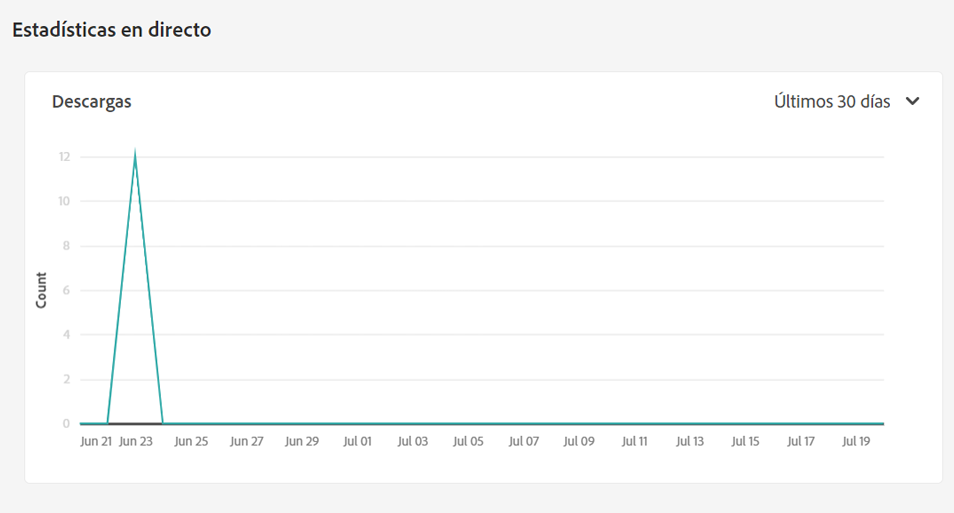
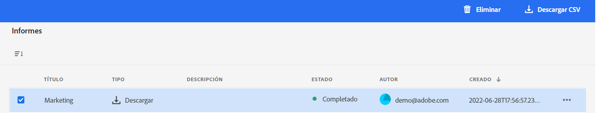

# Administrar informes {#manage-reports}

Los informes de recursos permiten a los administradores evaluar la utilidad de la implementación de Adobe Experience Manager Assets Essentials. Los informes proporcionan información útil sobre cómo los usuarios interactúan con los recursos disponibles en la implementación.

Utilice la información de los informes para derivar métricas de éxito clave para medir la adopción de Recursos en su empresa y por parte de los clientes.

## Informes de acceso {#access-reports}

Todos los usuarios asignados al [Perfil de producto de los administradores de Assets Essentials](deploy-administer.md) puede acceder a las estadísticas e informes activos en Assets Essentials.

## Ver estadísticas de lanzamiento {#view-live-statistics}

Assets Essentials le permite ver los datos de descarga generados automáticamente para su implementación de Assets Essentials. Puede seleccionar esta opción para ver el número de descargas de recursos realizadas durante los últimos 30 días o durante los últimos 12 meses.

Vaya a **[!UICONTROL Configuración]** > **[!UICONTROL Estadísticas en directo]** para ver los datos de descarga generados automáticamente.

## Crear un informe {#create-report}

Para crear un informe:

1. Vaya a **[!UICONTROL Configuración]** > **[!UICONTROL Informes]** y haga clic en **[!UICONTROL Crear informe]**.

1. En el [!UICONTROL Configuración] , especifique un título y una descripción opcional para el informe.

1. Seleccione la ruta de la carpeta, que comprende los recursos en los que se ejecutará el informe, utilizando la variable **[!UICONTROL Seleccionar ruta de carpeta]** campo .

1. Seleccione el intervalo de fecha para el informe.

1. En el [!UICONTROL Columnas] , seleccione los nombres de columna que debe mostrar en el informe.

1. Haga clic en **[!UICONTROL Crear]**.

   

En la tabla siguiente se explica el uso de todas las columnas que se pueden agregar al informe:

<table>
    <tbody>
     <tr>
      <th><strong>Nombre de columna</strong></th>
      <th><strong>Descripción</strong></th>
     </tr>
     <tr>
      <td>Título</td>
      <td>Título del recurso.</td>
     </tr>
     <tr>
      <td>Ruta</td>
      <td>Ruta de la carpeta en la que el recurso está disponible en Assets Essentials.</td>
     </tr>
     <tr>
      <td>Tipo</td>
      <td>Tipo MIME del recurso.</td>
     </tr>
     <tr>
      <td>Tamaño</td>
      <td>El tamaño del recurso.</td>
     </tr>
     <tr>
      <td>Descargado por</td>
      <td>ID de correo electrónico del usuario que descargó el recurso.</td>
     </tr>
     <tr>
      <td>Fecha de descarga</td>
      <td>La fecha en la que se realiza la acción de descarga de recursos.</td>
     </tr>
     <tr>
      <td>Autor</td>
      <td>El autor del recurso.</td>
     </tr>
     <tr>
      <td>Fecha de creación</td>
      <td>La fecha en la que el recurso se carga en Assets Essentials.</td>
     </tr>
     <tr>
      <td>Fecha de modificación</td>
      <td>La fecha de la última modificación del recurso.</td>
     </tr>
     <tr>
      <td>Caducado</td>
      <td>Estado de caducidad del recurso.</td>
     </tr>
     <tr>
      <td>Descargado por nombre de usuario</td>
      <td>Nombre del usuario que descargó el recurso.</td>
     </tr>           
    </tbody>
   </table>

## Ver la lista de informes {#view-report-list}

Después [creación del informe](#create-report), puede ver la lista de informes y seleccionar para descargarlos en formato CSV o eliminarlos.

Para ver la lista de informes, vaya a **[!UICONTROL Configuración]** > **[!UICONTROL Informes]**.

Para cada informe, puede ver el título del informe, el tipo de informe, la descripción especificada al crear el informe, el estado del informe, el ID de correo electrónico del autor que lo creó y la fecha de creación del informe.

`Completed ` el estado del informe indica que el informe está listo para descargarse.

## Descargar un informe CSV {#download-csv-report}

Para descargar un informe en formato CSV:

1. Vaya a **[!UICONTROL Configuración]** > **[!UICONTROL Informes]**.

1. Seleccione un informe y haga clic en **[!UICONTROL Descargar CSV]**.

El informe seleccionado se descarga en formato CSV. Las columnas que se muestran en el informe CSV dependen de las columnas que seleccione al [creación del informe](#create-report).

## Eliminar un informe {#delete-report}

Para eliminar un informe:

1. Vaya a **[!UICONTROL Configuración]** > **[!UICONTROL Informes]**.

1. Seleccione un informe y haga clic en **[!UICONTROL Eliminar]**.
