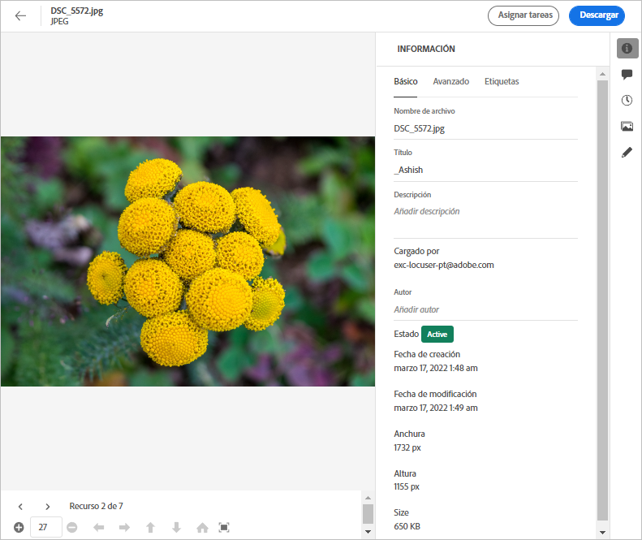
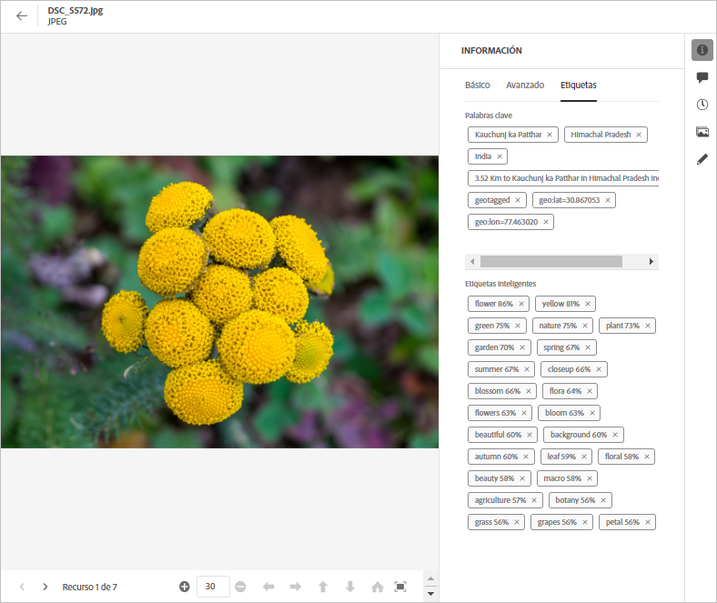

# Metadatos en [!DNL Assets Essentials] {#metadata}

Metadatos significa datos o descripción de los datos. Por ejemplo, las imágenes como un recurso pueden contener información sobre la cámara en la que se hizo clic o cualquier información de copyright. Esta información son metadatos de la imagen. Los metadatos son esenciales para una administración eficiente de los recursos. Los metadatos son la recopilación de todos los datos disponibles para un recurso, pero es posible que no estén necesariamente contenidos en ese recurso.

Los metadatos le ayudan a categorizar los recursos y son útiles a medida que aumenta la cantidad de información digital. Es posible administrar algunos cientos de archivos basados únicamente en los nombres de archivo, miniaturas y memoria. Sin embargo, este enfoque no es escalable. Se queda corto cuando aumenta el número de personas involucradas y el número de activos administrados.

Con la adición de metadatos, el valor de un recurso digital aumenta, ya que el recurso se convierte en,

* Más accesible: los sistemas y usuarios pueden encontrarlo fácilmente.
* Más fácil de administrar: puede encontrar recursos con el mismo conjunto de propiedades más fácilmente y aplicarles cambios.
* Completado : el recurso conlleva más información y contexto con más metadatos.

Por estos motivos, Assets le proporciona los medios adecuados para crear, administrar e intercambiar metadatos para sus recursos digitales.

## Ver los metadatos {#view-metadata}

Para ver los metadatos de un recurso, navegue hasta él o busque el recurso, selecciónelo y haga clic en **[!UICONTROL Details]** en la barra de herramientas.

*Figura: Para ver un recurso y sus metadatos, haga clic en **[!UICONTROL Details]**desde la barra de herramientas o haga doble clic en el recurso.*

Los metadatos básicos como título, descripción y fecha de carga están disponibles en la pestaña [!UICONTROL Basic]. La pestaña [!UICONTROL Advanced] contiene metadatos más avanzados, como el modelo de cámara, detalles de objetivos y geotags. La pestaña [!UICONTROL Tags] contiene etiquetas aplicadas automáticamente en función del contenido de la imagen.

## Actualizar metadatos {#update-metadata}

Puede actualizar algunos campos de metadatos manualmente. Los campos incluyen [!UICONTROL Title], [!UICONTROL Description], [!UICONTROL Author] y [!UICONTROL Keywords].

## Etiquetas {#tags}

[!DNL Assets Essentials] utiliza la inteligencia artificial proporcionada por  [Adobe ](https://www.adobe.com/sensei.html) Senseito para aplicar automáticamente las etiquetas relevantes a todos los recursos cargados. Estas etiquetas, con el nombre adecuado Etiquetas inteligentes, aumentan la velocidad de contenido de los proyectos al ayudarle a encontrar recursos relevantes rápidamente. Las etiquetas inteligentes son un ejemplo de metadatos que no están contenidos en la imagen.

Las etiquetas inteligentes se aplican en tiempo casi real y se generan en función del contenido de la imagen. Al cargar un recurso, la interfaz de usuario muestra [!UICONTROL Processing] en la miniatura del recurso durante algún tiempo. Una vez completado el procesamiento, puede [ver los metadatos](#view-metadata) y las etiquetas inteligentes.

*Figura: Para ver las etiquetas inteligentes de un recurso, haga clic en **[!UICONTROL Details]**en la barra de herramientas o haga doble clic en el recurso.*

Las etiquetas inteligentes también contienen una puntuación de confianza como porcentaje. Indica la confianza asociada a la etiqueta aplicada. Puede moderar las etiquetas inteligentes aplicadas automáticamente.

## Agregar o actualizar etiquetas {#manually-tag}

Puede agregar más etiquetas a los recursos, además de las etiquetas inteligentes que se agregan automáticamente mediante el servicio inteligente [!DNL Adobe Sensei] . Abra un recurso para su vista previa, haga clic en [!UICONTROL Tags] y escriba las palabras clave que desee en el campo [!UICONTROL Keywords]. Para añadir la etiqueta, pulse Retorno. [!DNL Assets Essentials] indexa la palabra clave casi en tiempo real y su equipo puede buscar rápidamente los recursos actualizados con las nuevas palabras clave.

También puede eliminar etiquetas de la sección [!UICONTROL Smart Tags] que [!DNL Assets Essentials] agrega automáticamente a todos los recursos cargados.

<!-- TBD: Queries for PM and engg.

Can we edit the existing metadata in any form?

How to moderate smart tags?

Allow or deny list for smart tags?

What about Tags displayed just above Smart Tags in the UI?

Is there a detailed metadata tab. Where do the other details of an asset go?

How can one search based strictly on the metadata. Similar to AEM Assets GQL queries.
-->

<!-- TBD: Link to related articles if any.

>[!MORELIKETHIS]
>
>* [Search assets](search.md).
-->
