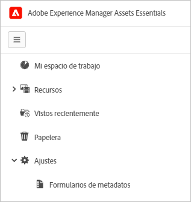
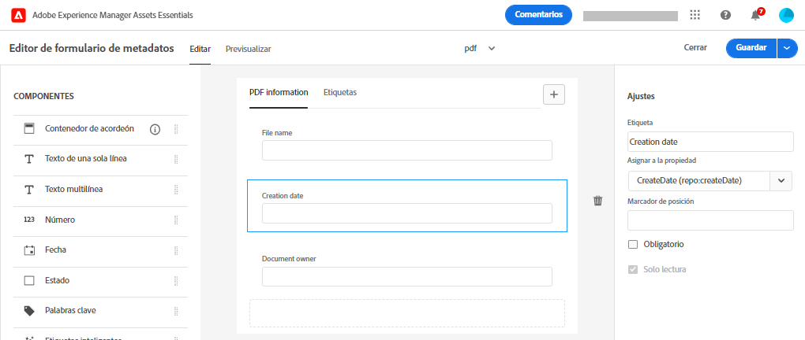

# Metadatos de [!DNL Assets Essentials] {#metadata}

Metadatos significa datos o descripción de los datos. Por ejemplo, las imágenes como un recurso pueden contener información sobre la cámara en la que se hizo clic o cualquier información de copyright. Esta información son metadatos de la imagen. Los metadatos son esenciales para una administración eficiente de los recursos. Los metadatos son la recopilación de todos los datos disponibles para un recurso, pero es posible que no estén necesariamente contenidos en ese recurso.

Los metadatos le ayudan a categorizar los recursos y son útiles a medida que aumenta la cantidad de información digital. Es posible administrar algunos cientos de archivos basados únicamente en los nombres de archivo, miniaturas y memoria. Sin embargo, este enfoque no es escalable. Se queda corto cuando aumenta el número de personas involucradas y el número de activos administrados.

Con la adición de metadatos, el valor de un recurso digital aumenta, ya que el recurso se convierte en,

* Más accesible: los sistemas y usuarios pueden encontrarlo fácilmente.
* Más fácil de administrar: puede encontrar recursos con el mismo conjunto de propiedades más fácilmente y aplicarles cambios.
* Completado : el recurso conlleva más información y contexto con más metadatos.

Por estos motivos, Assets le proporciona los medios adecuados para crear, administrar e intercambiar metadatos para sus recursos digitales.

## Ver los metadatos {#view-metadata}

Para ver los metadatos de un recurso, navegue hasta él o busque el recurso, selecciónelo y haga clic en **[!UICONTROL Detalles]** en la barra de herramientas.

*Figura: Para ver un recurso y sus metadatos, haga clic en **[!UICONTROL Detalles]**en la barra de herramientas o haga doble clic en el recurso.*

Los metadatos básicos, como título, descripción y fecha de carga, están disponibles en la [!UICONTROL Básico] pestaña . La variable [!UICONTROL Avanzadas] contiene metadatos más avanzados, como el modelo de cámara, detalles de objetivo y geotags. La variable [!UICONTROL Etiquetas] contiene etiquetas aplicadas automáticamente en función del contenido de la imagen.

## Actualizar metadatos {#update-metadata}

Puede actualizar algunos campos de metadatos manualmente. Los campos incluyen [!UICONTROL Título], [!UICONTROL Descripción], [!UICONTROL Autor]y [!UICONTROL Palabras clave].

## Etiquetas {#tags}

[!DNL Assets Essentials] utiliza inteligencia artificial proporcionada por [Adobe Sensei](https://www.adobe.com/sensei.html) para aplicar automáticamente las etiquetas relevantes a todos los recursos cargados. Estas etiquetas, con el nombre adecuado Etiquetas inteligentes, aumentan la velocidad de contenido de los proyectos al ayudarle a encontrar recursos relevantes rápidamente. Las etiquetas inteligentes son un ejemplo de metadatos que no están contenidos en la imagen.

Las etiquetas inteligentes se aplican en tiempo casi real y se generan en función del contenido de la imagen. Al cargar un recurso, se muestra la interfaz de usuario [!UICONTROL Procesamiento] en la miniatura del recurso durante un tiempo. Una vez completado el procesamiento, puede [ver los metadatos](#view-metadata) y las etiquetas inteligentes.

*Figura: Para ver las etiquetas inteligentes de un recurso, haga clic en **[!UICONTROL Detalles]**en la barra de herramientas o haga doble clic en el recurso.*

Las etiquetas inteligentes también contienen una puntuación de confianza como porcentaje. Indica la confianza asociada a la etiqueta aplicada. Puede moderar las etiquetas inteligentes aplicadas automáticamente.

## Agregar o actualizar etiquetas {#manually-tag}

Puede agregar más etiquetas a los recursos, además de las etiquetas inteligentes que se agregan automáticamente usando la variable [!DNL Adobe Sensei] servicio inteligente. Abra un recurso para obtener una vista previa, haga clic en [!UICONTROL Etiquetas]y escriba las palabras clave que desee en la [!UICONTROL Palabras clave] campo . Para añadir la etiqueta, pulse Retorno. [!DNL Assets Essentials] indexa la palabra clave casi en tiempo real y su equipo puede buscar rápidamente los recursos actualizados con las nuevas palabras clave.

También puede quitar etiquetas de [!UICONTROL Etiquetas inteligentes] que agrega automáticamente el [!DNL Assets Essentials] a todos los recursos cargados.

## Formularios de metadatos {#metadata-forms}

Assets Essentials proporciona muchos campos de metadatos estándar de forma predeterminada. Las organizaciones tienen necesidades de metadatos adicionales y necesitan más campos de metadatos para agregar metadatos específicos de la empresa. Los formularios de metadatos permiten a las empresas agregar campos de metadatos personalizados a los [!UICONTROL Detalles] página. Los metadatos específicos del negocio mejoran el control y el descubrimiento de sus activos.

Puede configurar formularios de metadatos para diferentes tipos de recursos (diferentes tipos de MIME). Utilice el mismo nombre de formulario que el tipo MIME del archivo. Essentials hace coincidir automáticamente los recursos cargados con el nombre del formulario. Por ejemplo, si un formulario de metadatos por el nombre `PDF` o `pdf` existe, los documentos de PDF cargados contienen campos de metadatos tal como se definen en el formulario. Puede crear formularios desde cero o cambiar el propósito de un formulario existente.

>[!IMPORTANT]
>
>El nuevo formulario de metadatos para un tipo de archivo específico reemplaza completamente el formulario de metadatos predeterminado que [!DNL Assets Essentials] proporciona. Si elimina o cambia el nombre de un formulario de metadatos, los campos de metadatos predeterminados volverán a estar disponibles para los nuevos recursos.

Para crear un formulario de metadatos, siga estos pasos:

1. En el carril izquierdo, haga clic en **[!UICONTROL Configuración]** > **[!UICONTROL Forms de metadatos]**.

   

1. Haga clic en **[!UICONTROL Crear]**, en el área superior derecha de la interfaz de usuario.
1. Proporcione un nombre al formulario y haga clic en **[!UICONTROL Crear]**.
1. Proporcione un nombre para la pestaña en **[!UICONTROL Configuración]** en el carril derecho.
1. En el **[!UICONTROL Componentes]** disponible en el carril izquierdo, arrastre los componentes necesarios en una ficha del formulario. Arrastre los componentes en la secuencia deseada.

   

   *Figura: Interfaz de creación de formularios de metadatos con opciones para agregar componentes y opción para previsualizar el formulario.*

1. Para cada componente, proporcione un nombre en la variable **[!UICONTROL Configuración]** en el carril derecho, proporcione una asignación con las propiedades admitidas.
1. De forma opcional, para un componente, seleccione **[!UICONTROL Requerido]** para hacer que el campo de metadatos sea obligatorio y seleccione **[!UICONTROL Solo lectura]** hacer que el campo no se pueda editar en el recurso [!UICONTROL Detalles] página.
1. Si lo desea, haga clic en **[!UICONTROL Vista previa]** para obtener una vista previa del formulario que está creando.
1. Opcionalmente, puede agregar más fichas y los componentes necesarios en cada pestaña.
1. Haga clic en **[!UICONTROL Guardar]** cuando se complete el formulario.

Una vez creado un formulario, se aplica automáticamente cuando los usuarios cargan un recurso del tipo MIME correspondiente.

Para volver a utilizar un formulario existente para crear un nuevo formulario, seleccione un formulario de metadatos, haga clic en **[!UICONTROL Copiar]** en la barra de herramientas, proporcione un nombre y haga clic en **[!UICONTROL Confirmar]**. Puede editar un formulario de metadatos para cambiarlo. Al cambiar un formulario, se utiliza para los recursos cargados después del cambio. No cambia los recursos existentes.

<!-- TBD: Cannot create a form using the second option. Documenting only the first option for now.
To reuse an existing form to create a new form, do one of these:

* Select a metadata form and click **[!UICONTROL Copy]** from the toolbar, provide a name, and click **[!UICONTROL Confirm]**.

* Click **[!UICONTROL Create]**, select **[!UICONTROL Use existing form structure as template]** option, and select an existing form. 
-->

<!-- TBD: Queries for PM and engg.

Can we edit the existing metadata in any form?

How to moderate smart tags?

Allow or deny list for smart tags?

What about Tags displayed just above Smart Tags in the UI?

Is there a detailed metadata tab. Where do the other details of an asset go?

How can one search based strictly on the metadata. Similar to AEM Assets GQL queries.
-->

<!-- TBD: Link to related articles if any.

>[!MORELIKETHIS]
>
>* [Search assets](search.md).
-->
