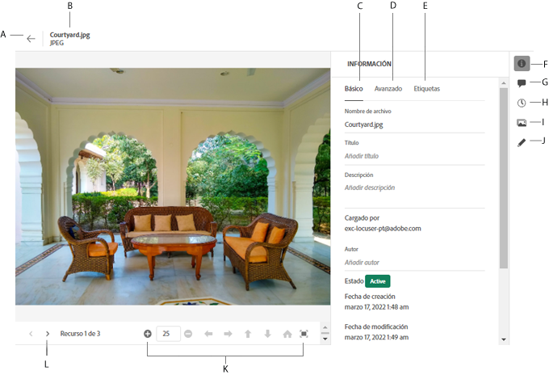

# Vaya a archivos y carpetas y vea los recursos {#view-assets-and-details}

<!-- TBD: Give screenshots of all views with many assets. Zoom out to showcase how the thumbnails/tiles flow on the UI in different views. -->

<!-- TBD: The options in left sidebar may change. Shared with me and Shared by me are missing for now. Update this section as UI is updated. -->

## Comprender el [!DNL Assets Essentials] interfaz de usuario {#understand-interface-navigation}

[!DNL Assets Essentials] ofrece una interfaz de usuario intuitiva y fácil de usar. La interfaz limpia facilita la búsqueda y el recuerdo de los recursos y la información relacionada.

Al iniciar sesión [!DNL Assets Essentials], verá la siguiente interfaz.

<!-- TBD: Update this screenshot. Remove top bar. Remove 2 labels from top bar. -->

![[!DNL Assets Essentials] interfaz de usuario](assets/essentials-interface1.png)

*Figura: Primera pantalla tras el inicio de sesión y la ubicación de las funciones más destacadas.*
    *A: Barra lateral izquierda para examinar el repositorio y proporciona acceso a otras opciones.*
    *B: Muestre o contraiga la barra lateral izquierda para aumentar el área de visualización de recursos.*
    *C: Filtrar los resultados de la búsqueda.*
    *D: Cuadro de búsqueda.*
    *E: Opciones para ordenar los recursos.*
    *F: Proporcione comentarios sobre el producto.*
    *G: Edite sus preferencias de usuario o cierre la sesión.*
    *H: Cambiar entre diferentes vistas.*

<!-- TBD: Need an embedded video here with narration. It has to be hosted on MPC to be embeddable. -->

## Examinar y ver recursos y carpetas {#browse-repository}

Puede examinar las carpetas desde la interfaz de usuario principal o desde la barra lateral izquierda. Al navegar, puede utilizar la interfaz para ver las miniaturas de los recursos para examinar visualmente el repositorio o ver los detalles de los recursos para encontrar rápidamente el recurso que desee. Las opciones disponibles en la barra lateral izquierda son:

* **Recursos**: Lista de todas las carpetas de una vista de árbol a las que tiene acceso.
* **Vistos recientemente**: Lista de recursos de los que ha realizado una vista previa recientemente. [!DNL Assets Essentials] muestra solo los recursos de los que obtiene una vista previa. No muestra los recursos que se desplazan más allá al examinar los archivos o carpetas del repositorio.
* **Papelera**:

<!-- TBD: Not sure if we want to publish these right now. CC Libs are beta as per Greg.
* **Libraries**: Access to [!DNL Adobe Creative Cloud Team] (CCT) Libraries view. This view is visible only if the user is entitled to CCT Libraries.
-->

<!-- TBD: My Work Space shows task inbox and it is not visible on AEM Cloud Demos as of now. It is the source of truth server hence not documenting My Work Space option for now.
-->

Puede abrir o contraer la barra lateral izquierda para aumentar el área de visualización de recursos disponible.

En [!DNL Assets Essentials], puede ver recursos, carpetas y resultados de búsqueda en cuatro tipos diferentes de diseños.

*  [!UICONTROL List View]
*  [!UICONTROL Grid View]
*  [!UICONTROL Gallery View]
*  [!UICONTROL Waterfall View]

Para localizar un recurso, puede ordenar los recursos en orden ascendente o descendente de `Name`, `Relevancy`, `Size`, `Modified`y `Created`.

Para desplazarse a una carpeta, haga doble clic en las miniaturas de la carpeta o seleccione la carpeta en la barra lateral izquierda. Para ver los detalles de una carpeta, selecciónela y haga clic en Detalles en la barra de herramientas de la parte superior. Para desplazarse hacia arriba y abajo en la jerarquía, utilice la barra lateral izquierda o utilice las rutas de exploración en la parte superior.

*Figura: Para examinar la jerarquía, utilice las rutas de exploración en la parte superior o en la barra lateral izquierda.*

## Vista previa de recursos {#preview-assets}

Antes de usar, compartir o descargar un recurso, puede verlo más de cerca. La función de vista previa permite ver no solo las imágenes, sino también algunos otros tipos de recursos admitidos.

Para obtener una vista previa de un recurso, selecciónelo y haga clic en [!UICONTROL Details]  en la barra de herramientas de la parte superior. No solo puede ver el recurso, sino también ver sus metadatos detallados y realizar otras acciones.

*A: Vuelva a la carpeta actual o al resultado de búsqueda actual en el repositorio.*
*B: Nombre y formato del archivo que está previsualizando.*
*C: Metadatos básicos.*
*D: Metadatos avanzados.*
*E: Palabras clave y etiquetas inteligentes.*
*F: Previsualice el recurso y consulte la información de metadatos.*
*G: Comente y anote.*
*H: Ver y administrar versiones.*
*I: Ver representaciones de la imagen.*
*J: Edite la imagen.*
*K: Previsualice más de cerca. Zoom, pantalla completa y otras opciones.*
*L: Continúe con el recurso anterior o siguiente de la carpeta actual sin volver a la carpeta .*

También puede obtener una vista previa de los vídeos.

Si obtiene una vista previa explícita de un recurso, [!DNL Assets Essentials] lo muestra como un recurso visualizado recientemente.

<!-- TBD: Describe the options.

Explicitly previewed assets are displayed as recently viewed assets. Give screenshot of this.
Other use cases after previewing.
-->

>[!MORELIKETHIS]
>
>* [Ver versiones de un recurso](/help/manage-organize.md#view-versions).

