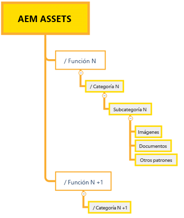
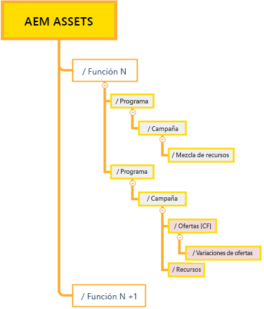
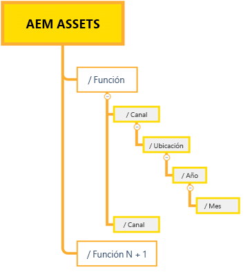

# Prácticas recomendadas para la administración eficaz de permisos {#best-practices-permissions-management}

Como administrador, antes de empezar a administrar los permisos de carpeta para el repositorio de Assets Essentials, existen varias prácticas recomendadas que puede implementar para hacer que la infraestructura sea intuitiva para los administradores y los usuarios finales más adelante mientras gestiona las operaciones.

Puede incorporar estas prácticas recomendadas mientras hace lo siguiente:

* [Creación de grupos de usuarios en Admin Console](#admin-console-best-practices)

* [Creación de una estructura de carpetas en el repositorio de Assets Essentials](#folder-structure-assets-essentials)

* [Administración de permisos en el repositorio de Assets Essentials](#folder-permissions)

## Admin Console {#admin-console-best-practices}

Identifique las necesidades de acceso en función de los grupos de usuarios de su organización. Planifique y cree grupos de usuarios para su organización y añádales usuarios. Es más fácil administrar permisos de carpeta en función de grupos de usuarios y no de usuarios individuales.

## Estructura de carpetas para el repositorio de Assets Essentials {#folder-structure-assets-essentials}

Tenga en cuenta los siguientes puntos cuando empiece a planificar la creación de una estructura de carpetas en el repositorio de Assets Essentials:

* Gobernanza futura: las carpetas controladas por los administradores y las [delegadas con permisos a otros usuarios como propietarios](manage-permissions.md##manage-permissions-folders).

* Escalable: la estructura de carpetas debe ajustarse a las necesidades futuras de su organización y ser fácilmente escalable.

* Tamaño: una carpeta no debe contener demasiados recursos. Esto puede conllevar problemas de uso y puede resultar difícil de administrar.

* Intuitiva: la estructura de carpetas debería ser fácil de examinar e intuitiva para los usuarios finales. Los usuarios deben poder identificar con facilidad dónde cargar un nuevo recurso en la estructura de carpetas.

Existen varios tipos de estructura de carpetas que puede utilizar para su organización. A continuación, se muestran algunos ejemplos de estructuras de carpetas típicas:

* Basada en funciones y categorías

   

* Basada en campañas

   

* Basada en la ubicación (o el canal) de la oferta

   

## Permisos de carpeta {#folder-permissions}

Después de crear grupos de usuarios para su organización, añadir usuarios a esos grupos y seleccionar y crear una estructura de carpetas en el repositorio de Assets Essentials que se adapte a las necesidades de su organización, puede empezar a administrar permisos de carpeta para su organización. Tenga en cuenta los siguientes puntos cuando empiece a administrar permisos de carpeta:

* Aplique permisos para grupos de usuarios, no para usuarios individuales. Esto resulta en una estructura de permisos más sencilla y eficaz.

* Mantenga la estructura de permisos tan simple como sea posible para lograr un funcionamiento eficiente.

* Utilice Denegar permisos de acceso con cuidado y priorice aplicar permisos positivos (Puede editar, Puede ver, Propietario) a la estructura de carpetas.

Para obtener ejemplos sobre cómo lograr una estructura de carpetas sencilla y eficaz, consulte [Administración de permisos en carpetas](manage-permissions.md##manage-permissions-folders).

## Siguientes pasos {#next-steps}

* Proporcione comentarios de producto mediante [!UICONTROL Comentarios] opción disponible en la interfaz de usuario de Assets Essentials

* Proporcione comentarios sobre la documentación usando [!UICONTROL Editar esta página]  o [!UICONTROL Registrar un problema]  disponible en la barra lateral derecha

* Contacto [Servicio de atención al cliente](https://experienceleague.adobe.com/?support-solution=General#support)
