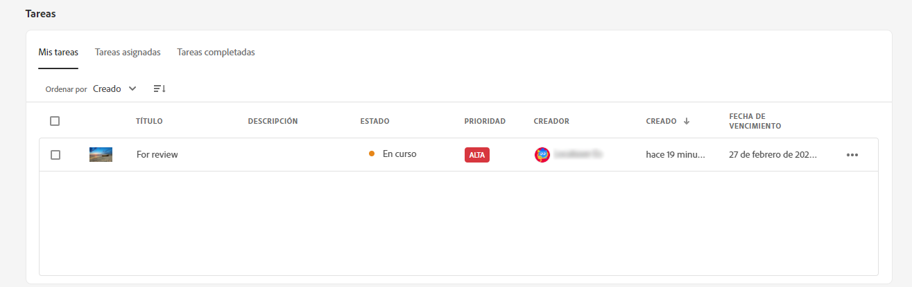
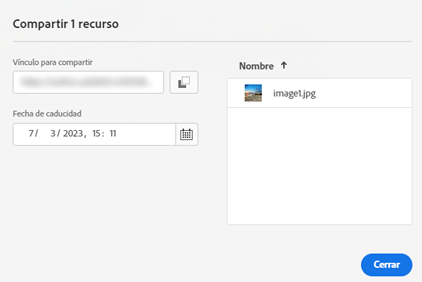

# Notas de la versión de [!DNL Assets Essentials] {#release-notes}

La versión actual de Assets Essentials se publicó el 24 de mayo de 2023.

La lista de funciones agregadas recientemente incluye las siguientes:

**Principales recursos descargados**

Mi espacio de trabajo ahora muestra los diez recursos más descargados para su entorno de Assets Essentials en la [!UICONTROL Contenido] sección. También puede ver el tipo de formato y el número de descargas de cada recurso de la lista.

**Actualizaciones masivas en los metadatos de recursos**

Las actualizaciones de metadatos masivas le permiten ejecutar simultáneamente actualizaciones de metadatos comunes en varios recursos. No es necesario actualizar los registros individualmente y puede aplicar rápidamente propiedades a los recursos o carpetas a los que se accede mediante la búsqueda.

**Mi espacio de trabajo con widgets configurables**

Assets ahora proporciona un espacio de trabajo personalizado, que sirve como solución integral para proporcionar un acceso práctico a las áreas clave de la interfaz de usuario de Assets y a la información más relevante para usted. Un acceso más rápido a estas opciones aumenta la velocidad de contenido y la eficacia de sus proyectos.

Mi espacio de trabajo incluye widgets para información, tareas y contenido. Puede configurar cómo se muestran estos widgets en el espacio de trabajo en función de sus preferencias.

**IU de administración de tareas dedicadas**

Assets Essentials ahora le permite administrar la lista de tareas que tiene asignadas, que ha creado y completado en una ubicación centralizada, utilizando la nueva opción **[!UICONTROL Tareas]** disponible en el panel de navegación izquierdo. También puede realizar las acciones adecuadas seleccionando una tarea para aprobarla o rechazarla, o abriendo los detalles de la tarea para aprobarla, rechazarla, editarla o eliminarla.

**Vínculos generados automáticamente para compartir archivos**

Assets Essentials ahora genera un vínculo automáticamente en cuanto elige compartir un recurso mediante la interfaz de usuario de Assets Essentials. El vínculo generado sigue siendo válido incluso si se cambia la fecha de caducidad.

**Mejoras basadas en los comentarios de los clientes**

Mejoras y correcciones de errores basadas en los comentarios de los clientes.

## Problemas conocidos {#known-issues}

La lista de problemas conocidos de la oferta de [!DNL Assets Essentials] se revisa y actualiza de forma continua:

<!--

* Assets Essentials does not support creating Private collections.

-->

* Las colecciones privadas están disponibles para el creador y los usuarios con privilegios de administrador. Como administrador, no puede delegar los permisos para acceder a la colección a otros usuarios.

* Como administrador, no puede delegar los permisos para acceder a la colección a otros usuarios.

Si encuentra algún problema o incluso si tiene solicitudes de mejora, [proporcione comentarios](#provide-feedback) al equipo.

## Versiones anteriores {#past-releases}

### 2022.11.0 {#november-2022}

La versión de noviembre de [!DNL Assets Essentials] se publicó el 17 de noviembre de 2022.

Esta versión proporciona lo siguiente:

**Vista previa de documentos con el visualizador Document Cloud**

Assets Essentials ahora le permite cargar documentos en otros tipos de formato compatibles y previsualizarlos con el visualizador incluido en Document Cloud. Los tipos de formato compatibles son TXT, RTF, DOC, DOCX, PPT, PPTX, XLS y XLSX.

<!--

**View Smart Tags moderation reports**

Asset reporting now provides administrators with visibility into the Smart Tags promoted or deleted for an asset. You can specify a folder path and the report lists the Smart Tags promoted or deleted for all assets available at the folder path.

-->

<!--
**Read-only access to large number of users**

Assets Essentials allows administrators to provide read-only access to a large number of users for selected assets or folders in the repository. 
You can easily synchronize the user groups available on the external identity management of an organization with Adobe Admin Console and then manage permissions in Admin Console and Assets Essentials to provide the users with read-only access for selected assets or folders.

-->

**Nueva opción de guardado de metadatos**

Ahora hay disponible una nueva opción para guardar metadatos en la interfaz de usuario de Assets Essentials, para mejorar el control de los metadatos.

**Mejoras basadas en los comentarios de los clientes**

Mejoras y correcciones de errores basadas en los comentarios de los clientes.

**Adobe Asset Link, versión 3.3**

La versión 3.3 de [Adobe Asset Link](https://helpx.adobe.com/es/enterprise/using/adobe-asset-link.html) se publicó el 13 de diciembre de 2022 con las siguientes funciones:

* Compatibilidad con [Creative Cloud para equipos](https://www.adobe.com/es/creativecloud/business/teams.html) además de [Creative Cloud para empresas](https://www.adobe.com/es/creativecloud/business/enterprise.html) antes.

* Compatibilidad con las últimas aplicaciones de Adobe InDesign, Photoshop e Illustrator 2023.

* Compatibilidad para utilizar el complemento CEP de Adobe Asset Link en entornos con servidores proxy.

### 2022.8.0 {#august-2022}

La versión de [!DNL Assets Essentials] de agosto de se publicó el 22 de agosto de 2022.

Esta versión proporciona lo siguiente:

**Notificaciones para colecciones**

Las notificaciones de Assets Essentials ahora permiten supervisar las operaciones realizadas en los recursos, colecciones o carpetas disponibles en el repositorio. Debe seleccionar y suscribirse a las colecciones para las que se le envían las notificaciones. También puede configurar las operaciones para las que se le envían las notificaciones, como las de eliminación, uso compartido de vínculos, movimiento, cambio de nombre y actualización ejecutadas en las colecciones.

**Editar colecciones inteligentes**

Assets Essentials ahora también permite editar los criterios de búsqueda utilizados al crear una colección inteligente.  Guarde los nuevos criterios de búsqueda para actualizar el contenido de la colección de forma dinámica.

**Ver estadísticas activas de la cuenta de almacenamiento**

Assets Essentials ahora también le permite ver datos de la cuenta de almacenamiento en tiempo real de su entorno de Assets Essentials con el tablero Estadísticas activas. Puede ver las métricas de eventos en tiempo real durante los últimos 30 días o 12 meses.

**Ver informes de carga**

La creación de informes de activos ahora proporcionan a los administradores visibilidad de los activos cargados en la implementación de Adobe Experience Manager Assets Essentials. Los administradores ya tienen la capacidad de generar informes para los activos descargados de la implementación de Assets Essentials. Estos datos proporcionan información útil sobre cómo los usuarios interactúan con el contenido y el producto.

**Mejoras basadas en los comentarios de los clientes**

Mejoras y correcciones de errores basadas en los comentarios de los clientes.

### 2022.6.0 {#june-2022}

La versión de junio de [!DNL Assets Essentials] se publicó el 14 de julio de 2022.

Esta versión proporciona lo siguiente:

**Colecciones inteligentes**

Guarde los resultados de búsqueda como una colección inteligente para actualizar dinámicamente el contenido de la colección. Si hay recursos agregados al repositorio de Assets Essentials que se ajustan a los criterios de búsqueda definidos al [crear la colección inteligente](manage-collections.md#create-smart-collection), el contenido de la colección inteligente se actualiza automáticamente.

**Notificaciones**

Las notificaciones de Assets Essentials permiten [supervisar las operaciones realizadas en los recursos o carpetas disponibles en el repositorio](manage-notifications.md). Debe seleccionar y suscribirse al contenido para el que se le envían las notificaciones. También puede configurar las categorías a las que se envían las notificaciones.

**Creación de informes**

La creación de informes de recursos permiten a los administradores evaluar la actividad del usuario dentro de Adobe Experience Manager Assets Essentials. Los informes y el tablero de estadísticas activas proporcionan información útil sobre cómo los usuarios interactúan con los recursos disponibles en la implementación. [Utilice la información de los informes](manage-reports.md) para derivar métricas de éxito clave para medir la adopción de Recursos en su empresa y por parte de los clientes.

Vea los informes de descarga de recursos y el módulo del tablero de estadísticas activas para ver qué recursos se descargan y la frecuencia de las descargas.

### 2022.5.0 {#may-2022}

La versión de mayo de [!DNL Assets Essentials] se publicó el 16 de junio de 2022.

Esta versión proporciona lo siguiente:

**Mejoras en el estado de los activos**

* Assets Essentials ahora le permite [establecer una fecha de caducidad para un recurso](manage-organize.md#set-asset-status). Además, puede [filtrar recursos](search.md#refine-search-results) en función del `Expired` estado del activo y un intervalo de fechas de caducidad.

* Ahora puede ver el indicador de estado de los activos para todos los recursos disponibles en Papelera. Como resultado, puede tomar la decisión de restaurar un recurso en función de su estado.

**Mejoras en los filtros de búsqueda**

* Assets Essentials ahora le permite [filtrar recursos](search.md#refine-search-results) usando el `No Status` estado del activo.

<!--

* Assets Essentials now supports [using a wildcard operator (*) while using custom filters](search.md#custom-filters) to enable Assets Essentials to display assets in the results that partially match the search criteria.

-->

**Mejoras en las colecciones**

<!--

* Assets Essentials now enables you to [create Private collections](manage-collections.md#create-collection).

-->

* Assets Essentials ahora es compatible con la [descarga de una colección](manage-collections.md).

* Ahora puede editar el campo Metadatos de descripción de una colección.

**Mejoras en la documentación**

* Una nueva versión de [Documentación general de Assets Essentials](introduction.md) ya está disponible.

**Mejoras basadas en los comentarios de los clientes**

* Mejoras y correcciones de errores basadas en los comentarios de los clientes.

### 2022.4.0 {#april-2022}

La versión actual de [!DNL Assets Essentials] se publicó el 12 de mayo de 2022. Esta versión proporciona lo siguiente:

* [!DNL Assets Essentials] ahora admite la [creación de colecciones](manage-collections.md). Una colección es un conjunto de recursos dentro de Experience Manager Assets Essentials. Utilice las colecciones para compartir recursos entre los usuarios. A diferencia de las carpetas, una colección puede incluir recursos de distintas ubicaciones.

* Assets Essentials ahora también le permite [añadir filtros personalizados](search.md#custom-filters) a la interfaz de usuario. A continuación, puede aplicar esos filtros personalizados además de los filtros estándar para restringir los resultados de búsqueda.

* Assets Essentials ahora le permite [establecer el estado](manage-organize.md#set-asset-status) en los recursos disponibles en el repositorio. Establezca un estado de recurso para gobernar y administrar mejor el consumo descendente de recursos digitales.

* Mejoras y correcciones de errores basadas en los comentarios de los clientes.

#### Modo incógnito en Chrome {#incognito-mode}

Con esta versión, estamos optimizando el rendimiento del envío de la interfaz de usuario y de las funciones específicas de Assets Essentials (comentar sobre los recursos y la edición de imágenes) depende de que se habiliten el almacenamiento local del explorador y las cookies de terceros. El modo incógnito del explorador web Chrome bloquea las cookies de terceros de forma predeterminada: los usuarios tienen varias opciones para seguir accediendo a todas las funciones:

* Utilice los perfiles de Chrome en lugar del modo Incognito, cuando el usuario necesita separar las sesiones del navegador

* Desactive el `Block third-party cookies` en la pantalla del modo Incognito en Chrome

### 2022.2.0 {#march-2022}

[!DNL Assets Essentials] se publicó el 9 de marzo de 2022, con las siguientes actualizaciones:

* [!DNL Assets Essentials] ahora le permite [generar un vínculo y compartir recursos con partes interesadas externas](share-links-for-assets.md), que no tienen acceso a la aplicación [!DNL Assets Essentials]. Puede definir una fecha de caducidad para el vínculo y luego compartirlo con otras personas mediante el método de comunicación que prefiera, como el correo electrónico o los servicios de mensajería. Los destinatarios del vínculo pueden obtener una vista previa de los recursos y descargarlos.

* [!DNL Assets Essentials] ahora incluye [un perfil de producto de administrador](deploy-administer.md#add-users-to-essentials) en Admin Console, además de los perfiles de producto de usuarios normales y consumidores existentes. Un administrador ahora puede asignar otros usuarios al perfil de producto del administrador.

* Assets Essentials ahora permite a los administradores [administrar los niveles de acceso para las carpetas disponibles en el repositorio](manage-permissions.md). Como administrador, puede crear grupos de usuarios y asignar permisos a esos grupos para administrar los niveles de acceso. También puede delegar los privilegios de administración de permisos a grupos de usuarios en el nivel de carpeta.

* Mejoras y correcciones de errores basadas en los comentarios de los clientes.

Además, la extensión de [!DNL Adobe Asset Link] para Creative Cloud (Photoshop, Illustrator e InDesign) tiene una [nueva versión 3.2](https://exchange.adobe.com/creativecloud.details.106875.adobe-asset-link-cep.html), con mejoras de rendimiento en el tiempo de inicio del panel y en la velocidad de descarga.

### Versión 2022.1.0 {#january-2022}

[!DNL Assets Essentials] se publicó el 3 de febrero de 2022, con las siguientes actualizaciones:

* Mejoras de rendimiento para la operación [!UICONTROL Crear carpeta]. <!-- CQ-4338818 -->

### Versión 2021.11.0 {#november-2021}

[!DNL Assets Essentials] se publicó el 16 de diciembre de 2021, con las siguientes actualizaciones:

* Adobe implementa Assets Essentials automáticamente después de completar el proceso de aprovisionamiento. Los administradores no necesitan realizar pasos adicionales para implementar Assets Essentials mediante la interfaz de usuario de [!DNL Cloud Manager]. Esta implementación automática estará disponible para los entornos aprovisionados a partir del 6 de enero de 2022.
* Hay nuevas versiones de los complementos de Creative Cloud que funcionan con Assets Essentials disponibles en Adobe Exchange: [Adobe Asset Link para Adobe XD v. 2.1.0](https://exchange.adobe.com/creativecloud/plugindetails.html/app/cc/61d229b9) y [Adobe Asset Link para Photoshop/InDesign/Illustrator v. 3.1.65](https://exchange.adobe.com/creativecloud.details.106875.adobe-asset-link-cep.html).
* Varias correcciones de errores y mejoras del producto, incluidos problemas conocidos previos (ahora las carpetas se muestran correctamente en el árbol de navegación izquierdo después de la carga<!-- CQ-4337638 -->, la carga de arrastrar y soltar permite al usuario seleccionar la carpeta actual o cualquier subcarpeta al soltarla para la carga<!-- CQ-4327753 -->).

### Versión 2021.8.0 {#august2021}

[!DNL Assets Essentials] 2021.8.0 se publicó el 30 de agosto de 2021, con las siguientes actualizaciones:

* Integraciones con [!DNL Adobe Workfront] que permiten a los usuarios de [!DNL Workfront] administrar sus recursos digitales en el contexto de la administración de su trabajo. Para obtener más información, consulte [integraciones con otras soluciones de Adobe](/help/integration.md).

### Versión 2021.7.0 {#july2021}

[!DNL Assets Essentials] 2021.7.0 se publicó el 29 de julio de 2021, con las siguientes actualizaciones:

* Puede crear y administrar formularios de metadatos personalizados que se utilizarán para mostrar las propiedades de los metadatos a los usuarios en la pantalla de detalles de recursos de la opción [!UICONTROL Formularios de metadatos], en [!DNL Settings]. Consulte [Formularios de metadatos](metadata.md#metadata-forms).
* Varias correcciones de errores y mejoras del producto, incluido un mejor rendimiento al cargar una carpeta anidada con muchas subcarpetas.

### Versión 2021.6.0 {#june2021}

La primera versión de [!DNL Assets Essentials], que se publicó el 21 de junio de 2021, ofrece funciones de administración de recursos ligeras. Admite las siguientes funciones principales y operaciones CRUD (crear, leer, actualizar y eliminar):

* Cargue y añada recursos, incluidas carpetas anidadas. Previsualice los recursos y las versiones.
* Búsqueda de texto completo, filtros de búsqueda con matices y búsquedas guardadas para una detección rápida de recursos.
* Operaciones básicas de administración de recursos como actualizar, eliminar, descargar y administrar metadatos.
* [!DNL Assets Essentials] está disponible para los usuarios de [!DNL Adobe Journey Optimizer] para administrar los recursos al crear mensajes. Para obtener más información, consulte [Integraciones con otras soluciones de Adobe](/help/integration.md).
