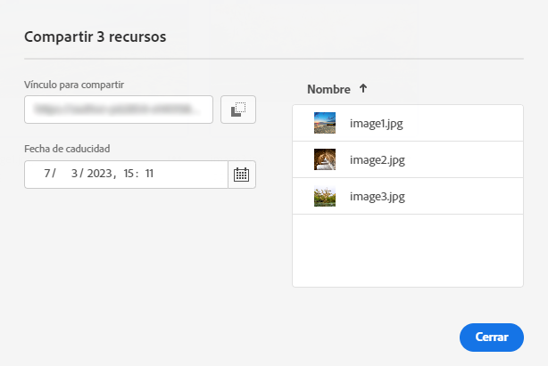
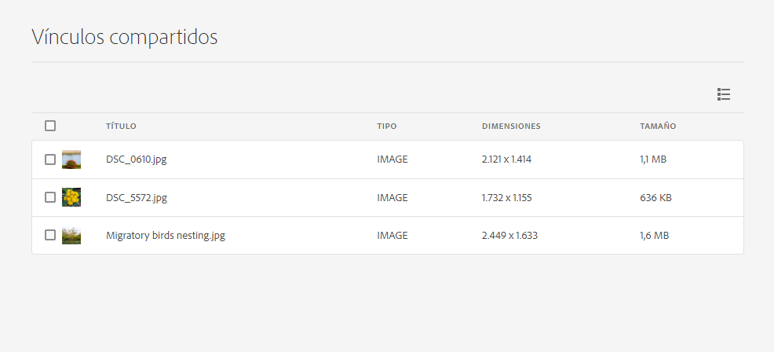

# Compartir vínculos con recursos {#share-links-assets}

[!DNL Assets Essentials] permite generar un vínculo y compartir recursos con partes interesadas externas que no tienen acceso al [!DNL Assets Essentials] aplicación. Puede definir una fecha de caducidad para el vínculo y luego compartirlo con otras personas mediante el método de comunicación que prefiera, como el correo electrónico o los servicios de mensajería. Los destinatarios del vínculo pueden obtener una vista previa de los recursos y descargarlos.

## Generación de un vínculo para los recursos {#generate-link-for-assets}

Para generar un vínculo para un recurso o una carpeta que contenga recursos:

1. Seleccione los recursos o las carpetas que contienen los recursos y haga clic en **[!UICONTROL Compartir vínculo]**.

1. Si desea ajustarlo, haga clic en el icono del calendario para definir una fecha de caducidad para el vínculo mediante la variable **[!UICONTROL Fecha de caducidad]** campo . También puede especificar una fecha directamente en la `yyyy-mm-dd` formato. De forma predeterminada, la fecha de caducidad de un vínculo se establece en 2 semanas a partir de la fecha de uso compartido.

1. Haga clic en **[!UICONTROL Generar vínculo]**.

1. Haga clic en **[!UICONTROL Copiar vínculo]** para copiar el vínculo. También puede copiar el vínculo desde el **[!UICONTROL Compartir vínculo]** campo .

   

1. Haga clic en **[!UICONTROL Cerrar]** y comparta el vínculo mediante correo electrónico u otras herramientas de colaboración.

## Acceso a los recursos compartidos {#access-shared-assets}

Después de compartir el vínculo público para los recursos, los destinatarios pueden hacer clic en el vínculo para obtener una vista previa de los recursos compartidos o descargarlos en un explorador web sin necesidad de iniciar sesión en [!DNL Assets Essentials].

Haga clic en el vínculo, en la carpeta para desplazarse hasta el recurso y, a continuación, haga clic en el recurso para previsualizarlo. Puede seleccionar ver los recursos compartidos en una vista de lista o de tarjeta.

Puede situar el ratón sobre el recurso compartido o la carpeta de recursos compartidos para seleccionarlo o descargarlo.

También puede seleccionar varios recursos y hacer clic en **[!UICONTROL Descargar]**. [!DNL Assets Essentials] descarga los recursos seleccionados como un archivo zip. [!DNL Assets Essentials] crea una subcarpeta en el archivo zip principal, con el mismo nombre que el del recurso, para cada recurso que seleccione descargar.

Para descargar todos los recursos a la vez, cambie a la **[!UICONTROL Vista de lista]**, haga clic en **[!UICONTROL Seleccionar todo]** y haga clic en **[!UICONTROL Descargar]**.

