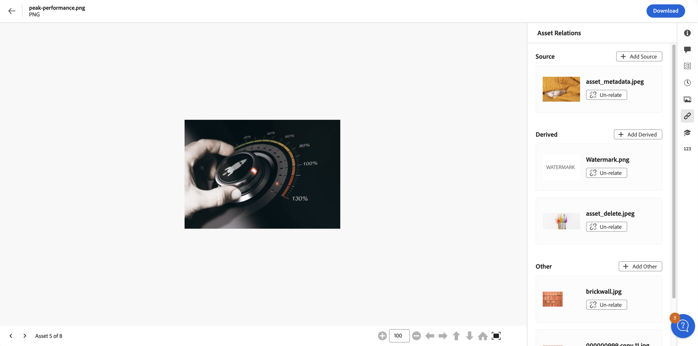

# Relaciones de recurso {#related-assets}

[!DNL Adobe Experience Manager Assets] le permite relacionar recursos manualmente según las necesidades de su organización mediante la función de recursos relacionados. Por ejemplo, puede relacionar un archivo de licencia con un recurso o una imagen/vídeo sobre un tema similar. Puede relacionar recursos que comparten ciertos atributos comunes. También puede utilizar la función para crear relaciones de origen/derivadas entre recursos. Por ejemplo, si tiene un archivo PDF generado a partir de un archivo INDD, puede relacionar el archivo PDF con su archivo INDD de origen.

Con esta función, tiene la flexibilidad de compartir un archivo PDF de baja resolución o un archivo JPG con proveedores u agencias y hacer que el archivo INDD de alta resolución solo esté disponible bajo petición.

>[!NOTE]
>
>Solo los usuarios con permisos de edición en los recursos pueden relacionarlos y desrelacionarlos.

## Pasos para relacionar recursos {#steps-to-relate-assets}

1. Desde la interfaz [!DNL Experience Manager], abra la página **[!UICONTROL Propiedades]** de un recurso que desee relacionar.

   

1. Para relacionar otro recurso con el que seleccionó, haga clic en **[!UICONTROL Relaciones de recurso]** .
1. Realice una de las siguientes acciones:

   * Para relacionar el archivo de origen del recurso, seleccione **[!UICONTROL Agregar Source]** de la lista. Solo puede asociar un único recurso como origen.
   * Para relacionar un archivo derivado, seleccione **[!UICONTROL Agregar derivado]** de la lista. Puede asociar varios recursos en esta categoría.
   * Para crear una relación bidireccional entre los recursos, seleccione **[!UICONTROL Agregar otros]** en la lista. Puede asociar varios recursos en esta categoría.

1. En la pantalla **[!UICONTROL Seleccionar Assets]**, vaya a la ubicación del recurso que desea relacionar y selecciónelo. Puede seleccionar uno o varios recursos a la vez manteniendo presionada la tecla Mayús mientras hace clic, lo que puede incluir cualquiera de los [formatos de archivo admitidos en la vista de Assets](supported-file-formats.md).

   

1. Haga clic en **[!UICONTROL Seleccionar]**. Según la relación que haya elegido en el paso 3, el recurso relacionado se enumerará en una categoría adecuada de la sección **[!UICONTROL Relaciones de recurso]**. Por ejemplo, si el recurso que ha relacionado es el archivo de origen del recurso actual, aparece en **[!UICONTROL Source]**.

   

1. Haga clic en **[!UICONTROL Desrelacionar]**  disponibles para todos los recursos relacionados en cada sección ([!UICONTROL Source], [!UICONTROL Derivado] y [!UICONTROL Otro]) para anular la relación de un recurso.

## Traducir recursos relacionados {#translating-related-assets}

La creación de relaciones de origen/derivadas entre recursos mediante la función de recursos relacionados también es útil en los flujos de trabajo de traducción. Cuando ejecuta un flujo de trabajo de traducción en un recurso derivado, [!DNL Experience Manager Assets] recupera automáticamente cualquier recurso al que haga referencia el archivo de origen y lo incluye para su traducción. De este modo, el recurso al que hace referencia el recurso de origen se traduce junto con los recursos de origen y derivados. Si el archivo de origen está relacionado con otro recurso, [!DNL Experience Manager Assets] recupera el recurso al que se hace referencia y lo incluye para su traducción.

Ver [Traducir recursos en AEM](https://experienceleague.adobe.com/en/docs/experience-manager-cloud-service/content/assets/admin/translate-assets).

## Siguientes pasos {#next-steps}

* Realice comentarios del producto mediante la opción [!UICONTROL Comentarios] disponible en la interfaz de usuario de la vista Recursos

* Proporcione comentarios sobre la documentación usando [!UICONTROL Editar esta página]  o [!UICONTROL Registrar una incidencia] , disponibles en la barra lateral derecha

* Contacto con el [Servicio de atención al cliente](https://experienceleague.adobe.com/es?support-solution=General#support)

>[!MORELIKETHIS]
>
>* [Visualización de versiones de un recurso](manage-organize.md#view-versions)
>* [Traducir recursos en AEM](https://experienceleague.adobe.com/en/docs/experience-manager-cloud-service/content/assets/admin/translate-assets)
>* [Formatos de archivo compatibles en la vista de Assets](supported-file-formats.md).
