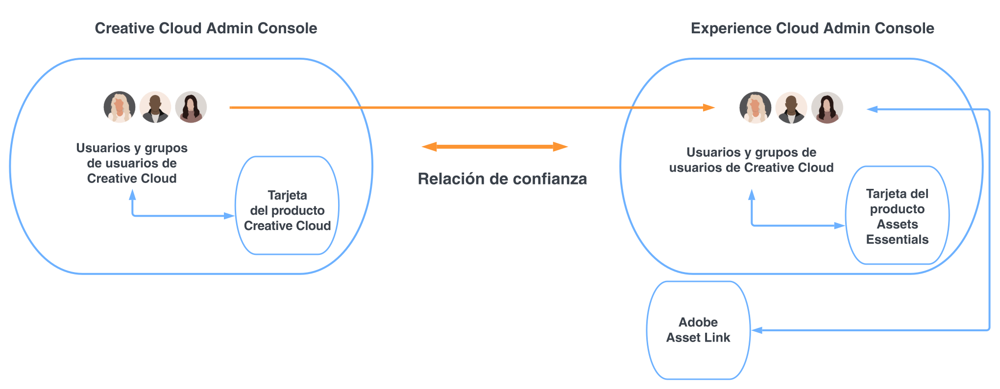

# Assets Essentials para Creative Cloud Pro con soluciones de administración de trabajo {#creative-cloud-enterprise-user-journeys}

## Introducción {#introduction}

Creative Cloud Pro para empresas con soluciones de administración de trabajo integra herramientas creativas, de contenido y de administración del trabajo para aumentar su capacidad de producir contenido creativo y lograr con rapidez los objetivos empresariales. La solución incluye los siguientes componentes:

* Creative Cloud Pro

* Adobe Workfront

* Experience Manager Assets Essentials

Este tutorial presenta un recorrido de administrador para permitir que la aplicación de Assets Essentials se integre con las aplicaciones de escritorio de Creative Cloud y con la aplicación de Adobe Workfront. Las aplicaciones de escritorio de Creative Cloud incluyen Adobe Photoshop, Adobe Illustrator, Adobe InDesign y Adobe XD.

## Tipos de implementación {#deployment-types}

Como la solución está formada por aplicaciones y servicios tanto de Creative Cloud como de Adobe Experience Cloud, se pueden implementar en uno o dos Admin Consoles de Adobe para su empresa.

En caso de implementación en dos Admin Console, se requiere un paso de configuración adicional:

* Los servicios y las aplicaciones de Creative Cloud (Creative Cloud para empresas Pro y módulos opcionales) se administran en [Adobe Admin Console para su implementación de Creative Cloud](https://helpx.adobe.com/es/enterprise/admin-guide.html).

* Adobe Workfront y Adobe Experience Manager Assets Essentials se administran en [Adobe Admin Console para soluciones de Experience Cloud](https://experienceleague.adobe.com/docs/core-services/interface/administration/admin-getting-started.html?lang=es).

Para integrar aplicaciones de Creative Cloud y Assets Essentials, los usuarios disponibles en la Admin Console para Creative Cloud deben estar disponibles en la Admin Console para Experience Cloud. Para que los usuarios estén disponibles en Admin Console de Experience Cloud, cree un directorio para establecer [confianza de directorios](https://helpx.adobe.com/es/enterprise/using/set-up-identity.html#directory-trusting) entre las dos consolas de administración.

Como se muestra en el diagrama, los usuarios de Creative Cloud están disponibles automáticamente en Admin Console de Experience Cloud, en función de una relación de confianza entre las dos consolas. A continuación, puede añadir los usuarios a los perfiles de producto de Assets Essentials. Como resultado, los usuarios de Creative Cloud pueden acceder a la aplicación de Adobe Asset Link, que puede interactuar con el repositorio de Assets Essentials. Para obtener más información, consulte [Integración de Assets Essentials con aplicaciones de Creative Cloud](integrate-with-creative-cloud.md).

## Recorridos de documentación de Experience Manager {#documentation-journeys}

Un recorrido de documentación une muchos temas y características diferentes y tal vez complicados. Proporciona una narrativa que ayuda al lector (que puede ser nuevo en Assets Essentials) a entender y resolver un problema empresarial de principio a fin, mientras asume un conocimiento previo mínimo de Assets Essentials.

Los recorridos de documentación están diseñados en torno a los principios de las prácticas recomendadas, basados en las últimas investigaciones de Adobe, la experiencia de implementación comprobada de los consultores de Adobe y los comentarios sobre los proyectos de los clientes.

## Requisitos previos

* [Acceso a Adobe Admin Console para soluciones de Experience Cloud](https://experienceleague.adobe.com/docs/core-services/interface/administration/admin-getting-started.html?lang=es)

* [Acceso a Adobe Admin Console para la implementación de Creative Cloud para empresas](https://helpx.adobe.com/es/enterprise/admin-guide.html)

## Administración de Experience Manager Assets Essentials {#administer-assets-essentials}

Adobe Experience Manager Assets Essentials es una nueva edición ligera de Adobe Experience Manager Assets. Assets Essentials proporciona una colaboración y administración de recursos unificadas con una interfaz de usuario simplificada y coherente. La facilidad de uso permite que equipos más creativos y de marketing almacenen, descubran y distribuyan recursos digitales.

Adobe aprovisiona Adobe Experience Manager Assets Essentials para sus clientes. Como parte del aprovisionamiento, Assets Essentials se añade a la organización de un cliente en Adobe Admin Console.

Los administradores utilizan la Admin Console para gestionar los derechos de usuario para el producto de Assets Essentials:

* Adición de grupos de usuarios

* Adición de usuarios a grupos de usuarios

* Añada usuarios a perfiles de producto de Assets Essentials

Después de administrar los derechos de usuario en la Admin Console, los administradores pueden utilizar la aplicación de Assets Essentials para lo siguiente:

* Crear una estructura de carpetas para satisfacer mejor las necesidades de la organización

* Administrar permisos para la estructura de carpetas

* Configuración de formularios de metadatos

Ahora que ha configurado y administrado la aplicación de Assets Essentials, [integre aplicaciones de Creative Cloud con la aplicación de Experience Manager Assets Essentials](integrate-with-creative-cloud.md).

## Integración de aplicaciones de Creative Cloud con Experience Manager Assets Essentials {#administer-creative-cloud-applications}

El [panel integrado de Adobe Asset Link](https://www.adobe.com/es/creativecloud/business/enterprise/adobe-asset-link.html) permite a los profesionales creativos conectarse al repositorio de [!DNL Assets Essentials] desde las aplicaciones de escritorio de [!DNL Adobe Creative Cloud] admitidas. El panel está disponible para [!DNL Adobe Photoshop], [!DNL Adobe Illustrator], [!DNL Adobe InDesign] y [!DNL Adobe XD]. Simplifica el acceso a los recursos, lo que a su vez aumenta la velocidad de contenido.

Este tutorial le guía para integrar las aplicaciones [!DNL Adobe Photoshop], [!DNL Adobe Illustrator], [!DNL Adobe InDesign] y [!DNL Adobe XD] con Experience Manager Assets Essentials.

Objetivos:

* Cree confianza de directorios entre Creative Cloud y Admin Consoles de Experience Cloud

* Añada usuarios de Creative Cloud a perfiles de producto de Assets Essentials

* Instale Adobe Asset Link

* Use Adobe Asset Link

Ahora que ha integrado las aplicaciones de Creative Cloud con Assets Essentials, [integre Adobe Workfront con Experience Manager Assets Essentials](integrate-with-workfront.md).

## Integración de Adobe Workfront con Experience Manager Assets Essentials {#administer-adobe-workfront}

[[!DNL Adobe Workfront]](https://www.workfront.com/) es una aplicación de administración de trabajo que le ayuda a administrar todo el ciclo de vida del trabajo en un solo lugar. La integración nativa entre [!DNL Adobe Workfront] y [!DNL Assets Essentials] permite a las organizaciones mejorar la velocidad del contenido y el tiempo de salida al mercado, conectando intrínsecamente el trabajo con la administración de recursos. En el contexto de la administración de su trabajo, los usuarios tienen acceso a los documentos e imágenes necesarios en la misma solución.

Este tutorial le guía para administrar Adobe Workfront y luego integrarlo con Experience Manager Assets Essentials.

Objetivos:

* Añada usuarios a perfiles de producto de Workfront

* Añada usuarios a perfiles de producto de Assets Essentials

* Configuración de la integración de Experience Manager Assets Essentials

