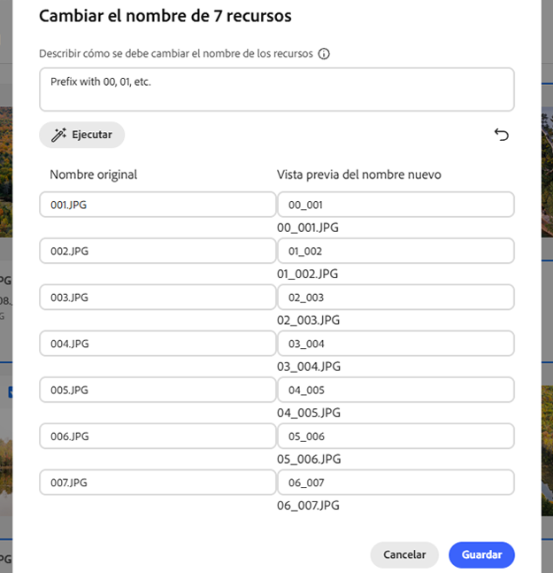

# Cambio de nombre de recurso o carpeta en [!DNL Assets Essentials] {#rename-single-asset-or-folder}

Cambiar el nombre puede ayudar a organizar, clasificar e identificar los recursos mejor, sin alterar su contenido o ubicación. [!DNL Assets Essentials] le permite cambiar el nombre del recurso o la carpeta seleccionados.

Siga estos pasos para cambiar el nombre de un recurso o una carpeta:

1. Busque el recurso o la carpeta cuyo nombre desea cambiar.

1. Utilice una de las siguientes formas de cambiar el nombre de un recurso o una carpeta:

   * Seleccione el recurso o la carpeta y haga clic en  **[!UICONTROL Cambiar nombre]** en el menú superior.
   * Haga clic en Más opciones `...` del recurso o la carpeta y seleccione **[!UICONTROL Cambiar nombre]**.
   * Haga clic en el título de un recurso o de una carpeta para cambiarle el nombre. Mencione el nuevo texto en el cuadro de texto **Cambiar nombre de recurso** y haga clic en **Guardar**. Esta funcionalidad está disponible en las vistas Cuadrícula, Galería, Cascada y Lista.

## Cambio de nombre masivo de recursos con tecnología de IA {#rename-bulk-assets-using-ai}

[!DNL Assets Essentials] permite cambiar el nombre de varios recursos a la vez mediante la IA. La funcionalidad Cambiar nombre de forma masiva con IA solo se puede aplicar a archivos, no a carpetas. Puede seleccionar varios archivos a la vez y cambiarles el nombre.

Siga los pasos a continuación para cambiar el nombre de la mayor parte de los recursos a la vez mediante indicaciones generadas por IA:

1. Seleccione varios recursos y haga clic en **[!UICONTROL Cambiar nombre de forma masiva]** en el menú superior.

1. Añada el mensaje que describe cómo desea cambiar el nombre de los recursos seleccionados. Consulte [algunos ejemplos que ilustran Cambiar nombre de forma masiva con IA](#examples-ai-bulk-rename).

1. Haga clic en **[!UICONTROL Ejecutar]** para permitir que la IA cambie el nombre de los recursos como se menciona en la indicación.

1. [Opcional] Haga clic en  para revertir o cancelar la última acción que realizó.

1. Compruebe sus cambios en la columna [!UICONTROL Nueva vista previa de nombre] y haga clic en **[!UICONTROL Guardar]**.

   

## Algunos ejemplos que ilustran Cambiar nombre de forma masiva con IA {#examples-ai-bulk-rename}

A continuación se muestran algunos ejemplos de cómo utilizar la IA para cambiar el nombre de los recursos de forma masiva en función de una indicación de IA:

* Prefijo con 00, 01, etc. y sufijo con la fecha de hoy.
* Cambiar todos los archivos a ‘mi-archivo’ y añadirle un número incremental.
* Quitar el prefijo y el sufijo, conservar solamente la parte central del nombre.
* Añadir a los archivos el prefijo 001, 002, etc. y traducir al inglés.

>[!VIDEO](https://video.tv.adobe.com/v/3440975)

>[!NOTE]
>
> * No puede convertir emojis en texto.
> * Utilice un nombre único para evitar mensajes de advertencia al cambiar el nombre de los recursos. Sin embargo, puede intentarlo otra vez con un nombre nuevo.
> * También puede convertir caracteres Unicode o no alfanuméricos en texto.

## Próximos pasos {#next-steps}

* [Vea un vídeo para administrar formularios de metadatos en Assets Essentials](https://experienceleague.adobe.com/docs/experience-manager-learn/assets-essentials/configuring/metadata-forms.html?lang=es)

* Proporcione comentarios de producto mediante la opción [!UICONTROL Comentarios] disponible en la interfaz de usuario de Assets Essentials

* Proporcione comentarios sobre la documentación usando [!UICONTROL Editar esta página]  o [!UICONTROL Registrar una incidencia] , disponibles en la barra lateral derecha

* Contacto con el [Servicio de atención al cliente](https://experienceleague.adobe.com/es/home?support-solution=General#support)

