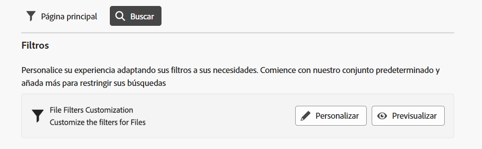
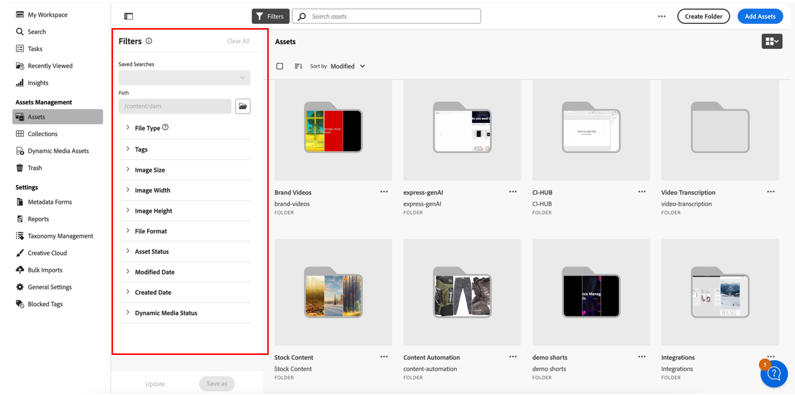

<table>
    <tr>
        <td>
            
            <a href="https://experienceleague.adobe.com/es/docs/experience-manager-cloud-service/content/assets/dynamicmedia/dm-prime-ultimate"><b>Dynamic Media Prime y Ultimate</b></a>
        </td>
        <td>
            
            <a href="https://experienceleague.adobe.com/es/docs/experience-manager-cloud-service/content/assets/assets-ultimate-overview"><b>AEM Assets Ultimate</b></a>
        </td>
        <td>
            
 <a href="http://experienceleague.adobe.com/es/docs/experience-manager-cloud-service/content/assets/integrate-aem-assets-edge-delivery-services"><b>Integración de AEM Assets con Edge Delivery Services</b></a>
        </td>
        <td>
            
            <a href="https://experienceleague.adobe.com/es/docs/experience-manager-cloud-service/content/assets/assets-view/aem-assets-view-ui-extensibility"><b>Extensibilidad de la IU</b></a>
        </td>
          <td>
            
            <a href="https://experienceleague.adobe.com/es/docs/experience-manager-cloud-service/content/assets/dynamicmedia/dm-prime-ultimate"><b>Habilitar Dynamic Media Prime y Ultimate</b></a>
        </td>
    </tr>
    <tr>
        <td>
            <a href="https://experienceleague.adobe.com/es/docs/experience-manager-cloud-service/content/assets/best-practices/search-best-practices"><b>Prácticas recomendadas de búsqueda</b></a>
        </td>
        <td>
            <a href="https://experienceleague.adobe.com/es/docs/experience-manager-cloud-service/content/assets/best-practices/metadata-best-practices"><b>Prácticas recomendadas de metadatos</b></a>
        </td>
        <td>
            <a href="https://experienceleague.adobe.com/es/docs/experience-manager-cloud-service/content/assets/content-hub/product-overview"><b>Centro de contenido</b></a>
        </td>
        <td>
            <a href="https://experienceleague.adobe.com/es/docs/experience-manager-assets-essentials/help/custom-search-filters"><b>Dynamic Media con funciones de OpenAPI</b></a>
        </td>
        <td>
            <a href="https://developer.adobe.com/experience-cloud/experience-manager-apis/"><b>Documentación de desarrollador de AEM Assets</b></a>
        </td>
    </tr>
</table>

# Personalización de los filtros de búsqueda {#customize-search-filters}

Los filtros de búsqueda le permiten detallar los resultados de la búsqueda en función de varios parámetros como la fecha, el tipo de archivo, las etiquetas y las relevancia, lo que mejora la precisión de las consultas de búsqueda. Al aplicar filtros, puede tamizar rápidamente los resultados más relevantes de forma eficaz. Esto no solo ahorra tiempo, sino que también mejora la experiencia de búsqueda general al adaptar los resultados a las preferencias y necesidades específicas.
Más información sobre [búsqueda](search.md).

Personalizar los filtros de búsqueda en AEM Assets solo se puede asignar a entradas del índice de propiedades con capacidad de búsqueda. Asegúrese de incluir los metadatos personalizados antes de configurar su experiencia de filtro personalizado. [!DNL Assets Essentials] ayuda a personalizar los filtros de búsqueda para agilizar el proceso de búsqueda. Para personalizar los filtros de búsqueda personalizados de AEM Assets, ejecute los siguientes pasos:

1. Vaya a **[!UICONTROL Configuración]** > **[!UICONTROL Configuración general]**.
1. Vaya a la pestaña **[!UICONTROL Búsqueda]**. Haga clic en **[!UICONTROL Personalizar]** para configurar el formulario de búsqueda.

   

1. Aparecerá el formulario [!UICONTROL Configurar filtros]. Asegúrese de que se encuentra en el modo de edición para poder realizar modificaciones en la plantilla. Puede cambiar al [!UICONTROL modo de vista previa] para ver la vista previa de un formulario de búsqueda existente.
1. Suelte los elementos de filtro de los [filtros personalizados](#available-custom-filters) del lienzo. Puede arrastrar y soltar el componente para reordenarlo si es necesario.

   >[!VIDEO](https://video.tv.adobe.com/v/3443080)

1. Haga clic en **[!UICONTROL Modo de vista previa]** para revisar los cambios.
1. Haga clic en **[!UICONTROL Confirmar]** para guardar.

## Filtros personalizados disponibles {#available-custom-filters}

Assets Essentials ofrece los siguientes filtros personalizados que se pueden reconfigurar según los requisitos:

* [Elementos de filtro](#filter-elements)
* [Filtros preconfigurados](#preconfigured-filters)

### Elementos de filtro {#filter-elements}

Los filtros personalizados en AEM Assets le permiten utilizar una colección de elementos de filtro en el lienzo de filtros de búsqueda personalizados. Estos elementos se pueden reconfigurar según la facilidad de uso de los atributos de propiedad de búsqueda. Sin embargo, puede personalizar las [propiedades del filtro](#filter-properties) según sus necesidades. Los siguientes elementos de filtro están disponibles en [!DNL Assets Essentials]:

<table>
    <tr>
        <th>Elementos de filtro</th>
        <th>Descripción</th>
        <th>Propiedades</th>
    </tr>
    <tr>
        <td>Texto</td>
        <td>Un campo de texto es un área de entrada en la que se puede escribir información relacionada con el filtro.</td>
        <td>
            <ul>
                <li>Etiqueta
                <li>Metadatos
                <li>Valores
                <li>Descripción
            </ul>
        </td>
    </tr>
    <tr>
        <td>Opciones</td>
        <td>Las opciones se refieren a las alternativas disponibles para seleccionar un elemento preferido de una lista.</td>
        <td>
            <ul>
                <li>Etiqueta
                <li>Metadatos
                <li>Valores
                <li>Opciones
                <li>Descripción
            </ul>
        </td>
    </tr>
    <tr>
        <td>Booleano</td>
        <td>Un booleano representa un valor verdadero. Se puede utilizar cuando se quiera ser específico para elegir una opción entre otras.</td>
        <td>
            <ul>
                <li>Etiqueta
                <li>Metadatos
                <li>Descripción
            </ul>
        </td>
    </tr>
    <tr>
        <td>Número</td>
        <td>Utilice este elemento de filtro para representar un valor numérico.</td>
        <td>
            <ul>
                <li>Etiqueta
                <li>Metadatos
                <li>Tipo de selección
                <li>Stepper
                <li>Valor de Stepper
                <li>Descripción
            </ul>
        </td>
    </tr>
    <tr>
        <td>Lista desplegable</td>
        <td>Para elegir entre las distintas opciones mostradas en una lista de opciones.</td>
        <td>
            <ul>
                <li>Etiqueta
                <li>Metadatos
                <li>Opciones
                <li>Valores
                <li>Descripción
            </ul>
        </td>
    </tr>
    <tr>
        <td>Fecha</td>
        <td>Se utiliza para especificar la fecha.</td>
        <td>
            <ul>
                <li>Etiqueta
                <li>Metadatos
                <li>Tipo de selección
                <li>Descripción
            </ul>
        </td>
    </tr>
    <tr>
        <td>Explorador de rutas</td>
        <td>Se utiliza para desplazarse por los archivos o carpetas del repositorio de Experience Manager.</td>
        <td>
            <ul>
                <li>Etiqueta
                <li>Metadatos
                <li>Explorador de rutas
                <li>Descripción
            </ul>
        </td>
    </tr>
    <tr>
        <td>Etiquetas</td>
        <td>Se utiliza para seleccionar etiquetas entre las opciones disponibles. Las etiquetas proporcionan información más específica sobre los recursos y mejoran su capacidad de detección. Las etiquetas ya aplicadas a los recursos seleccionados se muestran en el panel <b>Propiedades</b>. Si almacena etiquetas en una propiedad de metadatos personalizada y utiliza la ruta raíz para restringirla a una jerarquía, puede aprovechar la misma configuración en los filtros de búsqueda. Si no encuentra las etiquetas relevantes, créelas y asígnelas a los recursos seleccionados. Consulte <a href = "/help/using/tagging-management.md"> Administrar etiquetas en Assets Essentials </a> para obtener más información sobre la creación y asignación de etiquetas a los recursos.</td>
        <td>
            <ul>
                <li>Etiqueta
                <li>Metadatos
                <li>Selector de etiquetas
                <li>Descripción
            </ul>
        </td>
    </tr>
    <tr>
        <td>Usuario</td>
        <td>Se utiliza para especificar el tipo de usuario entre los usuarios administradores, normales y consumidores.</td>
        <td>
            <ul>
                <li>Etiqueta
                <li>Metadatos
                <li>Descripción
            </ul>
        </td>
    </tr>
</table>

### Filtros preconfigurados {#preconfigured-filters}

Los filtros preconfigurados son ajustes preestablecidos que le permiten utilizarlos directamente en el lienzo. Sin embargo, puede personalizar las [propiedades del filtro](#filter-properties) según sus necesidades. Los siguientes filtros están preconfigurados en [!DNL Assets Essentials]:

<table>
    <tr>
        <th>Filtros preconfigurados</th>
        <th>Descripción</th>
        <th>Propiedades</th>
    </tr>
    <tr>
        <td>Tipo de archivo</td>
        <td>Filtre los resultados de búsqueda según los tipos de archivos admitidos, es decir, “Imágenes”, “Documentos” y “Vídeos”.</td>
        <td>
            <ul>
                <li>Etiqueta
                <li>Metadatos
                <li>Tipo de selección
                <li>Opciones
                <li>Valores
                <li>Descripción
            </ul>
        </td>
    </tr>
    <tr>
        <td>Formato del archivo</td>
        <td>Assets Essentials es compatible con cualquier formato de archivo binario con servicios básicos como, por ejemplo, almacenamiento, carga, copiar, mover, eliminar y añadir metadatos.</td>
        <td>
            <ul>
                <li>Etiqueta
                <li>Metadatos
                <li>Tipo de selección
                <li>Descripción
            </ul>
        </td>
    </tr>
    <tr>
        <td>Tamaño de la imagen</td>
        <td>Proporcione una o más de las dimensiones mínimas y máximas para filtrar imágenes. El tamaño se proporciona en dimensiones en píxeles y no es el tamaño de archivo de las imágenes.</td>
        <td>
            <ul>
                <li>Etiqueta
                <li>Metadatos
                <li>Tipo de selección
                <li>Stepper
                <li>Valor de Stepper
                <li>Descripción
            </ul>
        </td>
    </tr>
    <tr>
        <td>Anchura de la imagen</td>
        <td>Dimensiones verticales de una imagen.</td>
        <td>
            <ul>
                <li>Etiqueta
                <li>Metadatos
                <li>Tipo de selección
                <li>Stepper
                <li>Valor de Stepper
                <li>Descripción
            </ul>
        </td>
    </tr>
    <tr>
        <td>Altura de la imagen</td>
        <td>Dimensiones horizontales de una imagen.</td>
        <td>
            <ul>
                <li>Etiqueta
                <li>Metadatos
                <li>Tipo de selección
                <li>Stepper
                <li>Valor de Stepper
                <li>Descripción
            </ul>
        </td>
    </tr>
    <tr>
        <td>Fecha de creación</td>
        <td>Intervalo de fecha en el que se crearon los recursos.</td>
        <td>
            <ul>
                <li>Etiqueta
                <li>Metadatos
                <li>Tipo de selección
                <li>Descripción
            </ul>
        </td>
    </tr>
    <tr>
        <td>Fecha de modificación</td>
        <td>Intervalo de fecha en el que se modificaron los recursos.</td>
        <td>
            <ul>
                <li>Etiqueta
                <li>Metadatos
                <li>Tipo de selección
                <li>Descripción
            </ul>
        </td>
    </tr>
    <tr>
        <td>Estado del recurso</td>
        <td>Assets Essentials le permite establecer el estado de los recursos disponibles en el repositorio. Establezca un estado de activo para gobernar y administrar mejor el consumo descendente de recursos digitales. Elija entre <b>Aprobado, Rechazado o Sin estado</b>.</td>
        <td>
            <ul>
                <li>Etiqueta
                <li>Metadatos
                <li>Tipo de selección
                <li>Descripción
            </ul>
        </td>
    </tr>
    <tr>
        <td>Etiquetas inteligentes</td>
        <td>Filtre los recursos mediante etiquetas inteligentes añadidas en el repositorio de Experience Manager.</td>
        <td>
            <ul>
                <li>Etiqueta
                <li>Metadatos
                <li>Tipo de selección
                <li>Compatibilidad con el delimitador
                <li>Descripción
            </ul>
        </td>
    </tr>
    <tr>
        <td>Estado de los medios dinámicos</td>
        <td>Elija el estado de un recurso entre publicado o no publicado.</td>
        <td>
            <ul>
                <li>Etiqueta
                <li>Metadatos
                <li>Tipo de selección
                <li>Opciones
                <li>Valores
                <li>Descripción
            </ul>
        </td>
    </tr>
    <tr>
        <td>Fecha de caducidad</td>
        <td>Filtre los recursos especificando un intervalo de fecha después del cual los recursos ya no son válidos o necesarios. </td>
        <td>
            <ul>
                <li>Etiqueta
                <li>Metadatos
                <li>Tipo de selección
                <li>Descripción
            </ul>
        </td>
    </tr>
    <tr>
        <td>Etiquetas (taxonomía)</td>
        <td>Se trata de un sistema de organización y clasificación de recursos digitales mediante etiquetas, que básicamente crea una estructura jerárquica de palabras clave que permite a los usuarios buscar y encontrar fácilmente contenido relevante mediante la aplicación de etiquetas específicas a cada recurso. </td>
        <td>
            <ul>
                <li>Etiqueta
                <li>Metadatos
                <li>Selector de etiquetas
                <li>Descripción
            </ul>
        </td>
    </tr>
</table>

#### Propiedades del filtro {#filter-properties}

Cada elemento de filtro está asociado a un conjunto de propiedades. AEM Assets personalizan los filtros de búsqueda y utilizan las siguientes propiedades en los elementos de filtro y preconfigurados:

<table>
    <tr>
        <th>Propiedades</th>
        <th>Valores</th>
        <th>Descripción</th>
    </tr>
    <tr>
        <td>Etiqueta</td>
        <td>Texto</td>
        <td>Es un identificador del filtro que está utilizando.</td>
    </tr>
    <tr>
        <td>Metadatos</td>
        <td>Desplegable</td>
        <td>La propiedad de metadatos se utiliza para asignar metadatos aprobados del repositorio de Adobe Experience Manager Assets. Puede elegir el valor de los metadatos en el menú desplegable que debe asignarse con el elemento de filtro. </td>
    </tr>
    <tr>
        <td>Tipo de selección</td> 
        <td>Único, Múltiple, Exacto o Intervalo </td>
        <td>
            <ul>
                <li><b>Selección única</b> permite elegir un elemento a la vez, lo cual es ideal para distintas opciones.
                <li><b>Selección múltiple</b> permite elegir varios elementos a la vez, lo que resulta útil para seleccionar varias opciones. 
                <li><b>Selección exacta</b> permite elegir un único elemento preciso entre varias opciones.
                <li><b>Selección de intervalo</b> permite elegir un conjunto continuo de valores dentro de un intervalo definido, lo cual resulta útil para seleccionar un intervalo de fechas o valores numéricos.
            </ul>
        </td>   
    </tr>
    <tr>
        <td>Opciones</td>
        <td>Carga manual, de ruta JSON o CSV</td>
        <td>
            <ul>
                <li>Seleccione <b>Manual</b> si desea añadir opciones manualmente. 
                <li>Seleccione <b>Ruta de JSON</b> para añadir opciones desde el archivo JSON. 
                <li>Seleccione <b>Carga de CSV</b> para importar un archivo CSV que contenga valores que se añadirán en las opciones.
            </ul>
        </td>
    </tr>
    <tr>
       <td>Valores</td>
        <td>Añadir o editar</td>
        <td>
        <ul>
        <li>Haga clic en <b>añadir</b> para añadir un nuevo valor. 
        <li>Haga clic en ✎ para editar la etiqueta. 
        <li>Haga clic en 🗑 para eliminar el valor de la opción. 
        <li>Haga clic en <b>Editar</b> para modificar las opciones de edición. 
        <li>También puede cambiar la secuencia de las opciones manteniéndolas pulsadas.
        </td>
    </tr>
    <tr>
        <td>Compatibilidad con el delimitador</td>
        <td>Habilitar o deshabilitar</td>
        <td>Un delimitador es un símbolo que se utiliza para separar distintos elementos en un texto. Por ejemplo, comas, espacios o puntos y comas.</td>
    </tr>
    <tr>
        <td>Stepper</td>
        <td>Valor</td>
        <td>Habilite el botón de control de incremento al campo de número para aumentar o disminuir el valor en cada clic. </td>
    </tr>
    <tr>
        <td>Valor de Stepper </td>
        <td>Número</td>
        <td>Indica el valor de incremento/disminución cuando se utiliza el botón de control de incremento. Aparece cuando el control de incremento está habilitado.</td>
    </tr>
    <tr>
        <td>Descripción</td>
        <td>Texto</td>
        <td>Añada una explicación detallada para ofrecer información adicional sobre el elemento de filtro.</td>
    </tr>
</table>

## Eliminación de un elemento de filtro {#delete-a-filter-element}

Para eliminar un filtro de búsqueda, siga estos pasos:

1. Vaya a **[!UICONTROL Configuración]** > **[!UICONTROL Configuración general]**.
1. Vaya a la pestaña **[!UICONTROL Búsqueda]**. Haga clic en **[!UICONTROL Personalizar]** para configurar el formulario de búsqueda.
1. Aparecerá el formulario [!UICONTROL Configurar filtros]. Asegúrese de que se encuentra en el modo de edición para poder realizar modificaciones en la plantilla.
1. Seleccione el elemento de filtro que desea eliminar. Por ejemplo, seleccione **[!UICONTROL Altura de la imagen]**.
1. Haga clic en **[!UICONTROL Eliminar categoría]** para eliminar el elemento de filtro. El elemento **[!UICONTROL Altura de la imagen]** se ha eliminado del lienzo.
1. Haga clic en **[!UICONTROL Confirmar]** para guardar el formulario.

## Uso de filtros de búsqueda personalizados{#using-custom-search-filters}

Después de configurar los filtros de búsqueda, puede utilizarlos para buscar recursos dentro del repositorio.

>[!MORELIKETHIS]
>
>* [Buscar recursos](/help/using/search.md)
