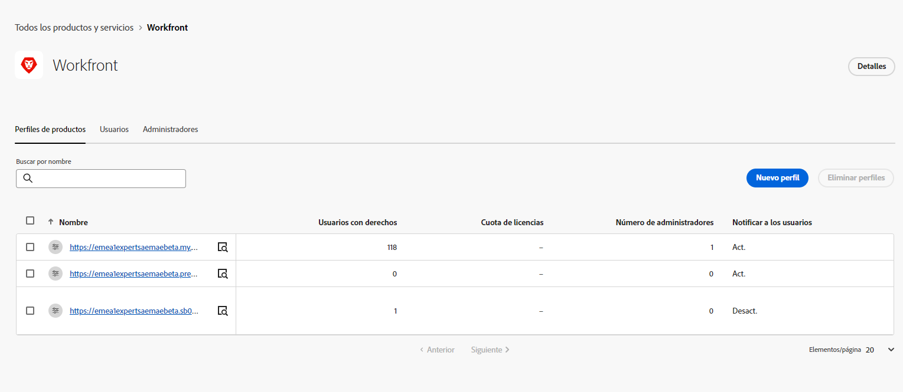
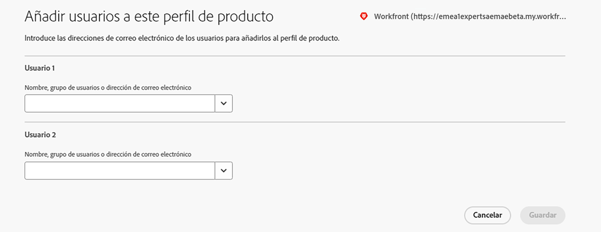

# Integración de Assets Essentials con Adobe Workfront {#integrate-assets-essentials-workfront}

[[!DNL Adobe Workfront]](https://www.workfront.com/) es una aplicación de administración de trabajo que le ayuda a administrar todo el ciclo de vida del trabajo en un solo lugar. La integración nativa entre [!DNL Adobe Workfront] y [!DNL Assets Essentials] permite a las organizaciones mejorar la velocidad del contenido y el tiempo de salida al mercado, conectando intrínsecamente el trabajo con la administración de recursos. En el contexto de la administración de su trabajo, los usuarios tienen acceso a los documentos e imágenes necesarios en la misma solución.

Ejecute las siguientes tareas para integrar Workfront con Experience Manager Assets Essentials:

* [Añada usuarios a perfiles de producto de Workfront](#add-users-to-product-profiles)

* [Añada usuarios a perfiles de producto de Assets Essentials](#add-workfront-users-assets-essentials-product-profiles)

* [Configure la integración de Experience Manager Assets Essentials](#configure-assets-essentials-integration)

## Añada usuarios a perfiles de producto de Workfront {#add-users-to-product-profiles}

Para añadir usuarios a perfiles de producto de Workfront:

1. Acceda a la [Admin Console](https://adminconsole.adobe.com) de su organización, haga clic en **[!UICONTROL Productos]** en la barra superior, en **[!UICONTROL Workfront]** y en la primera instancia de la lista. No haga clic en la segunda y tercera instancia de la lista.

   

   Admin Console muestra el único perfil de producto disponible.

1. Para añadir un usuario a un perfil de producto, haga clic en el perfil y en **[!UICONTROL Añadir usuario]**, proporcione sus detalles y haga clic en **[!UICONTROL Guardar]**.

   

   Cuando añade un usuario, este recibe una invitación por correo electrónico para comenzar. Puede desactivar las invitaciones por correo electrónico en la configuración del perfil de producto en [!DNL Admin Console].

1. Para quitar un usuario de un grupo, haga clic en el grupo, seleccione un usuario existente y seleccione **[!UICONTROL Eliminar usuario]**.

Para obtener más información sobre cómo crear usuarios y administradores de sistemas en Workfront con Adobe Admin Console, consulte [Administración de usuarios en Adobe Admin Console](https://one.workfront.com/s/document-item?bundleId=the-new-workfront-experience&amp;topicId=Content%2FAdministration_and_Setup%2FAdd_users%2FCreate_and_manage_users%2Fadmin-console.htm&amp;_LANG=enus).

## Añada usuarios a perfiles de producto de Assets Essentials {#add-workfront-users-assets-essentials-product-profiles}

Asigne los usuarios de Workfront a uno de los siguientes perfiles de producto de Assets Essentials:

* Los usuarios de **[!DNL Assets Essentials]** tienen acceso a la interfaz de usuario de Assets Essentials completa. Estos usuarios pueden cargar, organizar, etiquetar y encontrar recursos digitales en la aplicación de Assets Essentials. Además, los usuarios tienen acceso a la experiencia de selección de recursos incrustados en la aplicación [!DNL Adobe Workfront].
* Usuarios consumidores de **[!DNL Assets Essentials]**: tienen acceso a la experiencia de selección de recursos incrustada en la aplicación [!DNL Adobe Workfront].

Además, también está el perfil de producto de Administradores de **[!DNL Assets Essentials]**, que proporciona acceso administrativo a la aplicación.

Para obtener más información sobre cómo asignar usuarios a perfiles de producto de Assets Essentials, consulte [Asignación de usuarios a perfiles de producto de Assets Essentials](deploy-administer.md#add-users-to-product-profiles).

## Configure la integración de Experience Manager Assets Essentials {#configure-assets-essentials-integration}

Después de añadir usuarios a los perfiles de producto de Workfront y Assets Essentials mediante la Admin Console, puede [configurar la integración de Experience Manager Assets Essentials con Adobe Workfront](https://one.workfront.com/s/document-item?bundleId=the-new-workfront-experience&amp;topicId=Content%2FDocuments%2FAdobe_Workfront_for_Experience_Manager_Assets_Essentials%2F_workfront-for-aem-asset-essentials.htm).

Después de configurar la integración, puede hacer lo siguiente:

* [Vincular recursos y carpetas desde Experience Manager Assets Essentials](https://one.workfront.com/s/document-item?bundleId=the-new-workfront-experience&amp;topicId=Content%2FDocuments%2FAdobe_Workfront_for_Experience_Manager_Assets_Essentials%2Flink-to-aem.htm&amp;_LANG=enus)

* [Enviar un documento a Experience Manager Assets Essentials](https://one.workfront.com/s/document-item?bundleId=the-new-workfront-experience&amp;topicId=Content%2FDocuments%2FAdobe_Workfront_for_Experience_Manager_Assets_Essentials%2Fsend-to-aem.htm&amp;_LANG=enus)

* [Probar un recurso vinculado para Experience Manager Assets Essentials](https://one.workfront.com/s/document-item?bundleId=the-new-workfront-experience&amp;topicId=Content%2FDocuments%2FAdobe_Workfront_for_Experience_Manager_Assets_Essentials%2Fproof-linked-asset-aem.htm)

* [Ver o descargar un recurso vinculado desde Experience Manager Assets Essentials](https://one.workfront.com/s/document-item?bundleId=the-new-workfront-experience&amp;topicId=Content%2FDocuments%2FAdobe_Workfront_for_Experience_Manager_Assets_Essentials%2Fview-download-asset.htm)
