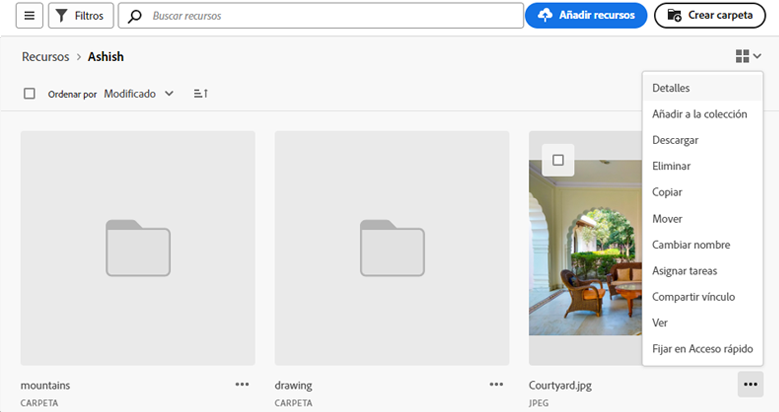
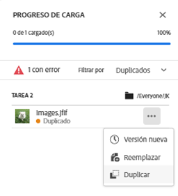
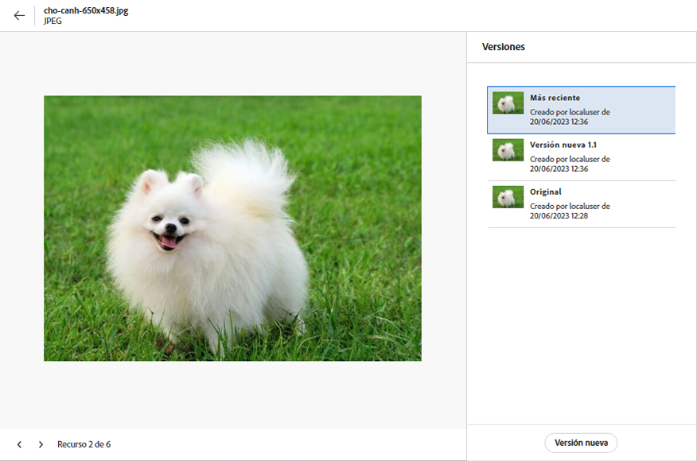

# Administración de recursos {#manage-assets}

Puede realizar varias tareas de administración de activos digitales (DAM) fácilmente mediante la interfaz de usuario sencilla de usar de [!DNL Assets Essentials]. Una vez añadidos los recursos, puede buscarlos, descargarlos, moverlos, copiarlos, cambiarles el nombre, eliminarlos, actualizarlos y editarlos.

Use [!DNL Assets Essentials] para llevar a cabo las siguientes tareas de administración de recursos. Al seleccionar un recurso, aparecen las siguientes opciones en la barra de herramientas de la parte superior.

*Imagen: opciones disponibles en la barra de herramientas de una imagen seleccionada.*

*  Anule la selección.
*  Haga clic para previsualizar un recurso y ver los metadatos detallados. Al previsualizar, puede ver las versiones y editar una imagen.
*  Descargue el recurso seleccionado en el sistema de archivos local.
*  Elimine el recurso o la carpeta seleccionados.
*  Cierre el recurso seleccionado.
*  Copie el archivo o la carpeta seleccionados.
*  Mueva el recurso o la carpeta seleccionados a una ubicación diferente en la jerarquía del repositorio.
*  Cambie el nombre del recurso o la carpeta seleccionados. Utilice un nombre único, si no, el cambio de nombre producirá un error con una advertencia. Puede intentarlo de nuevo con un nombre nuevo.
*  Asigne tareas a otros usuarios para colaborar en un recurso.

Puede ver las mismas opciones en las miniaturas de recursos.

[!DNL Assets Essentials] muestra únicamente las opciones relevantes de la barra de herramientas que dependen del tipo de recurso seleccionado.

*Imagen: opciones disponibles en la barra de herramientas de una carpeta seleccionada.*

*Imagen: opciones disponibles en la barra de herramientas de un archivo PDF seleccionado.*

## Descarga y distribución de recursos {#download}

Puede seleccionar uno o varios recursos, carpetas o una combinación de ambos y descargar la selección en el sistema de archivos local. Puede editar los recursos y volver a cargarlos o distribuirlos fuera de [!DNL Assets Essentials]. Además, puede [descargar las representaciones](/help/using/add-delete.md#renditions) de un recurso.

## Creación de versiones de recursos {#versions-of-assets}

<!-- 
TBD: query for engineering: How many versions are maintained. What happens when we reach that limit? Are old versions automatically removed? -->

[!DNL Assets Essentials] crea versiones de los recursos cuando se cargan de nuevo y se actualizan o editan. Puede ver el historial de versiones actuales y anteriores, así como restaurar una versión anterior de los recursos como la última versión, que se revierte a una anterior si es necesario. Las versiones de los recursos se crean en los siguientes casos:

* Cargue un nuevo recurso con el mismo nombre de archivo que uno existente y en la misma carpeta que este. [!DNL Assets Essentials] le solicita que sobrescriba el recurso anterior o que guarde el nuevo como una versión. Consulte [Carga de recursos duplicados](/help/using/add-delete.md#resolve-upload-fails).

  

  *Imagen: al cargar un recurso con el mismo nombre que uno existente, puede crear una versión de este.*

* Edite una imagen y haga clic en **[!UICONTROL Guardar como versión]**. Consulte [Edición de imágenes](/help/using/edit-images.md).

  

  *Imagen: guardar imagen editada como versión.*

* Abra las versiones de un recurso existente. Haga clic en **[!UICONTROL Nueva versión]** y cargue una versión más reciente del recurso en el repositorio.

  

### Visualización de versiones de un recurso {#view-versions}

Al cargar una copia duplicada o modificada de un recurso, puede crear sus versiones. Las versiones le permiten revisar los recursos históricos y revertirlos a una versión anterior si es necesario.

Para ver las versiones, abra la previsualización de un recurso y haga clic en **[!UICONTROL Versiones]**  en la barra lateral derecha. Para previsualizar una versión específica, selecciónela. Para volver a ella, haga clic en **[!UICONTROL Crear más reciente]**.

También puede crear versiones a partir de la cronología de las versiones. Seleccione la última versión, haga clic en **[!UICONTROL Nueva versión]** y cargue una copia nueva del recurso desde el sistema de archivos local.

*Imagen: visualización de versiones de un recurso, reversión a una versión anterior o carga de otra versión nueva.*

## Administrar el estado de los activos {#manage-asset-status}

**Permisos necesarios:**  `Can Edit`, `Owner` o permisos de administrador en un recurso.

Assets Essentials le permite establecer el estado en los recursos disponibles en el repositorio. Establezca un estado de activo para gobernar y administrar mejor el consumo descendente de recursos digitales.

Puede establecer el siguiente estado en los recursos:

* Aprobados

* Rechazado

* Sin estado

### Definir estado del activo {#set-asset-status}

Para establecer el estado del activo:

1. Seleccione el recurso y haga clic en **[!UICONTROL Detalles]** en la barra de herramientas.

1. En la pestaña **[!UICONTROL Básico]**, seleccione el estado del activo en la lista desplegable **[!UICONTROL Estado]**. Los valores posibles incluyen Aprobado, Rechazado y Sin estado (predeterminado).

   >[!VIDEO](https://video.tv.adobe.com/v/342495)

### Configuración de la fecha de caducidad del recurso {#set-asset-expiration-date}

Assets Essentials le permite establecer una fecha de expiración en los recursos disponibles en el repositorio. Entonces puede [filtrar los resultados de búsqueda](search.md#refine-search-results) basados en un `Expired` estado del activo. Además, puede especificar un intervalo de fechas de caducidad para los recursos para filtrar aún más los resultados de búsqueda.

Para establecer la fecha de caducidad del recurso, haga lo siguiente:

1. Seleccione el recurso y haga clic en **[!UICONTROL Detalles]** en la barra de herramientas.

1. En la pestaña **[!UICONTROL Básico]**, defina la fecha de caducidad del recurso mediante el campo **[!UICONTROL Fecha de caducidad]**.

El indicador de la tarjeta de recursos `Expired` anula los indicadores `Approved` o `Rejected` definidos para un recurso.

También puede filtrar recursos en función de un estado de activo. Para obtener más información, consulte [Buscar recursos en Assets Essentials](search.md).

## Personalización de formularios de metadatos para incluir el campo de estado del activo {#customize-asset-status-metadata-form}

**Permisos necesarios:** Administrador

Assets Essentials proporciona muchos campos de metadatos estándar de forma predeterminada. Las organizaciones tienen requisitos de metadatos adicionales y necesitan más campos para agregar los específicos de su empresa. Los formularios de metadatos permiten a las empresas añadir campos de metadatos personalizados a la página [!UICONTROL Detalles] de un recurso. Los metadatos específicos de la empresa mejoran el control y el descubrimiento de sus recursos.

Para obtener más información sobre cómo agregar campos de metadatos adicionales al formulario de metadatos, consulte [Formularios de metadatos](metadata.md##metadata-forms).

**Agregar el campo de metadatos Estado del activo al formulario**

Para agregar el campo de metadatos Estado del activo al formulario, arrastre **[!UICONTROL Estado del activo]** del carril izquierdo al formulario. La propiedad de asignación se rellena automáticamente previamente. Guarde el formulario para confirmar los cambios.

**Adición del campo de metadatos Fecha de caducidad al formulario**

Para añadir el campo de metadatos Fecha de caducidad al formulario, arrastre el componente **[!UICONTROL Fecha]** del carril izquierdo al formulario. Especifique la **Fecha de caducidad** como etiqueta y `pur:expirationDate` como propiedad de asignación. Guarde el formulario para confirmar los cambios.

## Siguientes pasos {#next-steps}

* [Vea un vídeo para administrar recursos en Assets Essentials](https://experienceleague.adobe.com/docs/experience-manager-learn/assets-essentials/basics/managing.html?lang=es)

* Proporcione comentarios de producto mediante la opción [!UICONTROL Comentarios] disponible en la interfaz de usuario de Assets Essentials

* Proporcione comentarios sobre la documentación usando [!UICONTROL Editar esta página]  o [!UICONTROL Registrar una incidencia] , disponibles en la barra lateral derecha

* Contacto con el [Servicio de atención al cliente](https://experienceleague.adobe.com/?support-solution=General&amp;lang=es#support)

