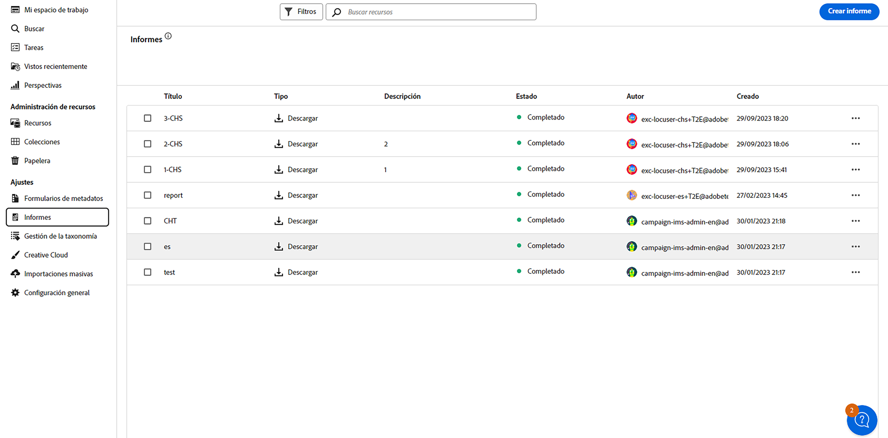
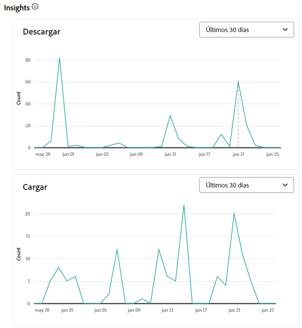
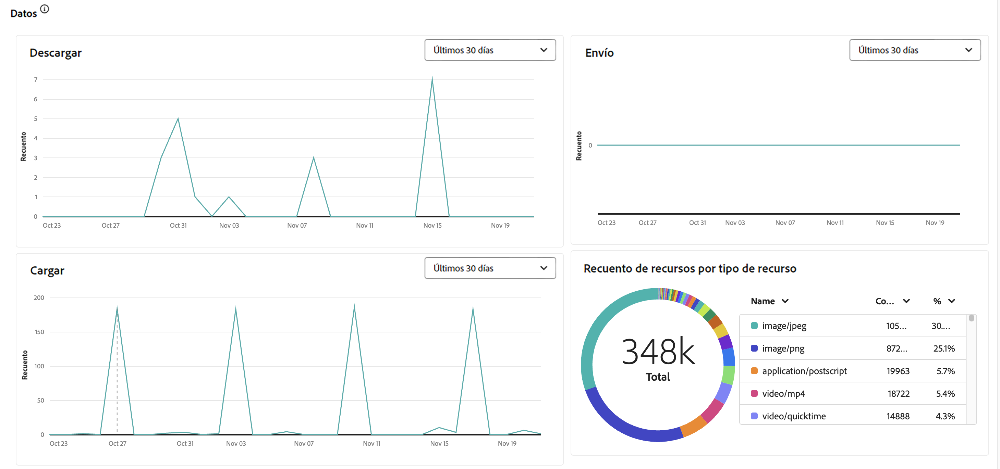
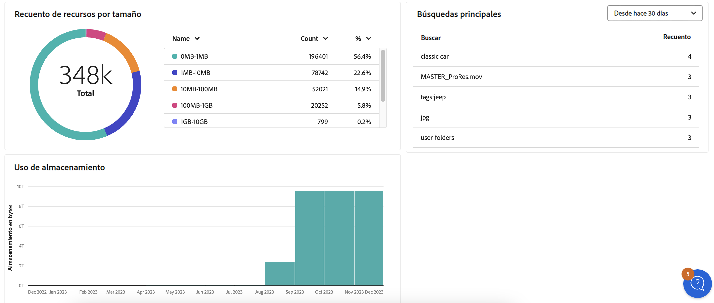

# Administrar informes {#manage-reports}

Los informes de recursos proporcionan a los administradores visibilidad de la actividad del entorno de Adobe Experience Manager Assets Essentials. Estos datos proporcionan información útil sobre cómo los usuarios interactúan con el contenido y el producto. Cualquier persona usuaria puede acceder al panel de Insights. Además, las personas asignadas al perfil de producto del rol de administrador pueden crear informes definidos por el usuario.

## Acceso a los informes {#access-reports}

Todos los usuarios asignados al [Perfil de producto de los administradores de Assets Essentials](deploy-administer.md) pueden acceder al tablero de Insights activas o crear informes definidos por el usuario en Assets Essentials.

Para acceder a los informes, vaya a **[!UICONTROL Informes]** debajo de **[!UICONTROL Configuración]**.

<!--
In the **[!UICONTROL Reports]** screen, various components are shown in the tabular format which includes the following:

* **Title**: Title of the report
* **Type**: Determines whether the report is uploaded or downloaded to the repository
* **Description**: Provide details of the report that was given during uploading/downloading the report
* **Status**: Determines whether the report is completed, under progress, or deleted.
* **Author**: Provides email of the author who has uploaded/downloaded the report.
* **Created**: Gives information of the date when the report was generated.
-->

## Creación de un informe {#create-report}

El entorno de AEM Assets Essentials ofrece funcionalidades completas para la creación de informes a través del panel Informes. Esta función permite a los usuarios generar y descargar informes CSV en los que se detallan las cargas y descargas de recursos en intervalos de tiempo especificados, desde intervalos únicos hasta intervalos diarios, semanales, mensuales o anuales.

**Para crear un informe:**

1. Vaya a **Informes** y haga clic en **Crear informe** (en la parte superior derecha). El cuadro de diálogo **crear informe** muestra los siguientes campos:
   

   **En pestaña Configuración:**

   1. **Tipo de informe:** seleccione entre el tipo de carga y descarga.
   1. **Título:** añada un título al informe.
   1. **Descripción:** añada una descripción opcional al informe.
   1. **Seleccionar ruta de la carpeta:** seleccione una ruta de la carpeta para generar el informe de los recursos cargados y descargados dentro de esa carpeta específica. Por ejemplo, si necesita que el informe de recursos se cargue en una carpeta, especifique la ruta a esa carpeta.
   1. **Seleccionar intervalo de fechas:** seleccione el intervalo de fechas para ver la actividad de carga o descarga dentro de la carpeta.
    

   >[!NOTE]
   >
   > Assets Essentials convierte todas las zonas horarias locales a la hora universal coordinada (UTC).

   **Pestaña En las columnas:** seleccione los nombres de columna que se mostrarán en el informe. En la tabla siguiente se explica el uso de todas las columnas:

   <table>
    <tbody>
     <tr>
      <th><strong>El nombre de la columna</strong></th>
      <th><strong>Descripción</strong></th>
      <th><strong>Tipo de informe</strong></th>
     </tr>
     <tr>
      <td>Título</td>
      <td>El título del recurso.</td>
      <td>Cargar y descargar</td>
     </tr>
     <tr>
      <td>Ruta</td>
      <td>Ruta de la carpeta en la que el recurso está disponible en Assets Essentials.</td>
      <td>Cargar y descargar</td>
     </tr>
     <tr>
      <td>Tipo MIME</td>
      <td>Tipo MIME del recurso.</td>
      <td>Cargar y descargar</td>
     </tr>
     <tr>
      <td>Tamaño</td>
      <td>El tamaño del recurso en bytes.</td>
      <td>Cargar y descargar</td>
     </tr>
     <tr>
      <td>Descargado por</td>
      <td>ID de correo electrónico del usuario que descargó el recurso.</td>
      <td>Descargar</td>
     </tr>
     <tr>
      <td>Fecha de descarga</td>
      <td>La fecha en la que se realiza la acción de descarga de recursos.</td>
      <td>Descargar</td>
     </tr>
     <tr>
      <td>Autor</td>
      <td>El autor del recurso.</td>
      <td>Cargar y descargar</td>
     </tr>
     <tr>
      <td>Fecha de creación</td>
      <td>La fecha en la que el recurso se carga en Assets Essentials.</td>
      <td>Cargar y descargar</td>
     </tr>
     <tr>
      <td>Fecha de modificación</td>
      <td>La fecha de la última modificación del recurso.</td>
      <td>Cargar y descargar</td>
     </tr>
     <tr>
      <td>Caducado</td>
      <td>Estado de caducidad del recurso.</td>
      <td>Cargar y descargar</td>
     </tr>
     <tr>
      <td>Descargado por (nombre de usuario)</td>
      <td>Nombre del usuario que descargó el recurso.</td>
      <td>Descargar</td>
     </tr>           
    </tbody>
   </table>

## Visualización y descarga de un informe existente {#View-and-download-existing-report}

Los informes existentes se muestran en la pestaña **Informes ejecutados**. Haga clic en **Informes** y seleccione **Informes ejecutados** para ver todos los informes creados con el estado **completado**, lo que indica que están listos para descargarse. Para descargar el informe en formato CSV o eliminarlo, seleccione la fila del informe. A continuación, seleccione **Descargar CSV** o **Eliminar**.

## Programación de un informe {#schedule-report}

En la interfaz de usuario de AEM Essentials, **Programar informe** configura una generación automática de informes en intervalos futuros especificados, como diario, semanal, mensual o anual. Esta función ayuda a optimizar las necesidades recurrentes de creación de informes y garantiza actualizaciones de datos puntuales. En **Crear informe** se generan informes para fechas pasadas. Los informes completados se indican en **Informes ejecutados** y los próximos informes se encuentran en **Informes programados**.

Para programar un informe, siga los pasos que se indican a continuación:

1. Haga clic en Informes en el panel izquierdo y, a continuación, haga clic en Crear informe (desde la parte superior derecha).
1. El cuadro de diálogo del informe muestra la siguiente información:
   1. **Tipo de informe:** seleccione entre el tipo de carga y descarga.
   1. **Título:** añada un título al informe.
   1. **Descripción**: añada una descripción opcional al informe.
   1. **Seleccionar ruta de carpeta:** seleccione una ruta de la carpeta para generar un informe para los recursos que se cargarán o descargarán de esa carpeta específica en el futuro.
   1. Marque **Programar informe:** marque para programar el informe para un momento posterior o para que se repita.
      

   1. **Elegir frecuencia:** especifique el intervalo de generación del informe (por ejemplo, diario, semanal, mensual, anual o una vez) y establezca la fecha y la hora para ejecutar el informe junto con la fecha de finalización para la periodicidad. Para un informe único, seleccione el intervalo de fechas para el informe sobre el tipo de actividad seleccionado en el entorno de AEM. Por ejemplo, si necesita un informe sobre los recursos descargados del 10 al 29 (fechas futuras) de un mes específico, seleccione estas fechas en el campo **Seleccionar intervalo de fechas**.

   >[!NOTE]
   >
   > Assets Essentials convierte todas las zonas horarias locales a la hora universal coordinada (UTC).

## Visualización de informes programados {#view-scheduled-reports}

Los informes programados se muestran en la ficha **Informes programados** de una manera organizada de manera sistemática. Todos los informes completados de cada informe programado se almacenan en una sola carpeta de informes. Haga clic en  para ver los informes completados. Por ejemplo, si ha programado un informe diario, todos los informes completados se agrupan conjuntamente en una carpeta. Esta organización simplifica tanto la navegación como la capacidad de detección de informes. Para ver los informes programados, haga clic en **Informes** y luego haga clic en **Informes programados**. Se muestran todos los informes programados con su estado en curso o completado. Los informes completados están listos para descargarse.

## Edición y cancelación de informes programados {#edit-cancel-scheduled-reports}

1. Vaya a la pestaña **Informes programados**.
1. Seleccione la fila del informe.
1. Haga clic en **Editar**.
1. Haga clic en **Cancelar programación** y, a continuación, haga clic en **Confirmar** para cancelar el informe programado. Para los informes cancelados, el siguiente tiempo de ejecución pasa a estar vacío y el estado se muestra cancelado.
   

### Reanudar programación {#resume-schedule}

Para reanudar la programación cancelada, seleccione la fila del informe y haga clic en **Reanudar programación**. Cuando se reanuda, las siguientes entradas en tiempo de ejecución se muestran de nuevo y el estado se muestra en curso.

>[!NOTE]
>
> Si reanuda un informe cancelado antes de la fecha de finalización programada, los informes desde la fecha de cancelación hasta la fecha de reanudación se generan automáticamente.

## Vista Insights {#view-live-statistics}

>[!CONTEXTUALHELP]
>id="assets_reports"
>title="Informes"
>abstract="El panel de información le permite ver las métricas de eventos en tiempo real de su entorno de Experience Manager Assets durante los últimos 30 días o 12 meses. La lista de eventos incluye el número de descargas, cargas, búsquedas principales, etc."

Assets Essentials le permite ver datos en tiempo real de su entorno de Assets Essentials con el tablero de Insights. Puede ver las métricas de eventos en tiempo real durante los últimos 30 días o 12 meses.

<!---->

Haga clic en **[!UICONTROL Insights]** en el panel de navegación izquierdo para ver los siguientes gráficos generados automáticamente:

* **Descargas**: el número de activos descargados del entorno de Assets Essentials en los últimos 30 días o 12 meses representados mediante un gráfico de líneas.
  

* **Cargas**: el número de recursos cargados en el entorno de Assets Essentials en los últimos 30 días o 12 meses representados mediante un gráfico de líneas.
  

<!--* **Asset Count by Size**: The division of count of assets based on their range of various sizes from 0 MB to 100 GB.-->

* **Uso de almacenamiento**: el uso de almacenamiento, en bytes, para el entorno Assets Essentials representado mediante un gráfico de barras.
  
  <!--* **Delivery**: The graph depicts the count of assets as the delivery dates.-->

<!--* **Asset Count by Asset Type**: Represents count of various MIME types of the available assets. For example, application/zip, image/png, video/mp4, application/postscripte.-->

* **Búsquedas principales**: vea los términos más buscados junto con el número de veces que se buscan en su entorno de Assets Essentials en los últimos 30 días o 12 meses representados en un formato tabular.
  

  <!--
   
   
   -->

* **Recuento de recursos por tamaño:** segmenta el número total de recursos dentro del entorno de Assets Essentials en diferentes intervalos de tamaño, destacando el recuento y el porcentaje de recursos en cada intervalo de tamaño, representados por un gráfico circular.
  

* **Recuento de recursos por tipo de recurso:** segmenta el número total de recursos en el entorno de Assets View, destacando el recuento y el porcentaje de recursos en función de sus tipos de archivo, representados por un gráfico circular.
  

