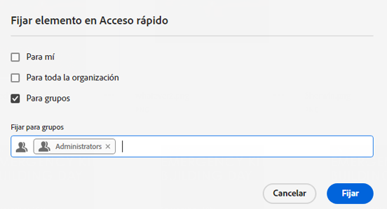
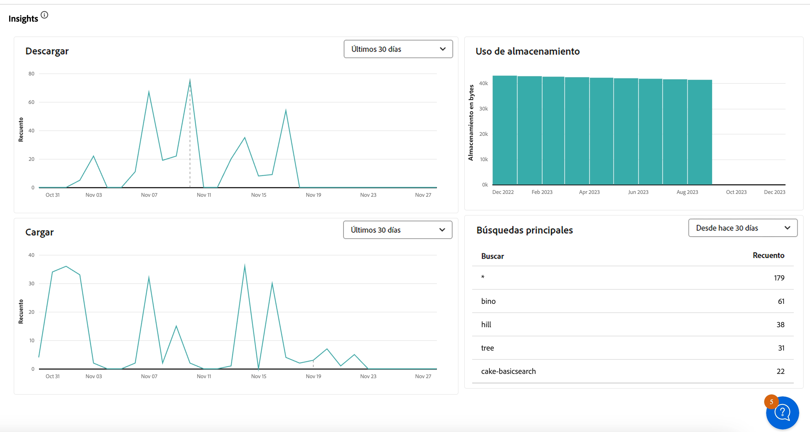
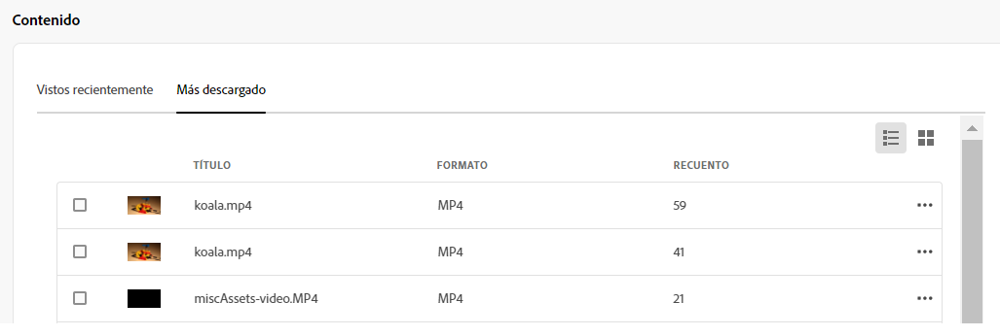
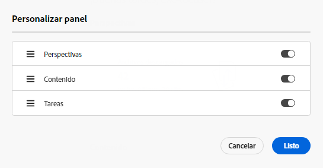

# Mi espacio de trabajo de Assets {#my-workspace}

>[!CONTEXTUALHELP]
>id="assets_my_workspace"
>title="Mi espacio de trabajo"
>abstract="Assets incluye un espacio de trabajo personalizable que proporciona widgets para un acceso cómodo a áreas clave de la interfaz de usuario de Assets y a la información que le resulte más relevante. Esta página sirve como solución integral para proporcionar información general sobre los elementos de trabajo y un acceso rápido a los flujos de trabajo clave."

Assets ahora incluye un espacio de trabajo personalizable que proporciona utilidades para acceder fácilmente a las áreas clave de la interfaz de usuario de Assets y a la información más relevante para usted. Esta página sirve como solución integral para proporcionar información general sobre los elementos de trabajo y un acceso rápido a los flujos de trabajo clave. Un acceso más práctico a estas opciones aumenta su eficacia y velocidad de contenido.

Puede acceder a mi espacio de trabajo haciendo clic en **[!UICONTROL mi espacio de trabajo]** de los elementos disponibles en el panel de navegación izquierdo. Mi Espacio de trabajo incluye una serie de widgets, entre los que se muestran Acceso rápido, Insights, Tareas y Contenido. Puede configurar cómo se muestran estos widgets en el espacio de trabajo en función de sus preferencias.

>[!NOTE]
>
>La utilidad de perspectivas solo está visible para los administradores.

<!--

**New features coming soon**

Highlights upcoming features for Assets.

-->

**Acceso rápido**

Fije archivos, carpetas y colecciones para acceder más rápidamente a estos elementos cuando los necesite más adelante. Todos los elementos fijados se muestran en la sección **Acceso rápido** de Mi espacio de trabajo. Puede acceder a ellos mediante Mi espacio de trabajo en lugar de desplazarse a la ubicación en la que se guardan en el repositorio.

Para fijar un recurso, una carpeta o una colección, haga lo siguiente:

1. Seleccione el elemento y haga clic en **[!UICONTROL fijar a Acceso rápido]**.

1. Seleccione si necesita fijar el elemento solo para usted, para toda la organización o para los grupos seleccionados. Si selecciona **[!UICONTROL Para grupos]**, defina los nombres de grupo en el campo **[!UICONTROL Fijar para grupos]**.

   
1. Haga clic en **[!UICONTROL Fijar]**.

   Los elementos seleccionados se muestran en la sección **[!UICONTROL Acceso rápido]** de Mi espacio de trabajo.
   

**Perspectivas**

Los administradores pueden ver un resumen del número de descargas y cargas realizadas en el entorno de Assets durante los últimos 30 días. Puede hacer clic en **[!UICONTROL Ver todo]** para acceder rápidamente a la página de perspectivas para ver paneles más detallados.

También puede ver los términos más buscados junto con el número de veces que se consultan en la implementación de Assets Essentials utilizando **Insights** de Mi espacio de trabajo. También puede navegar hasta Insights detallados para ver las búsquedas principales durante los últimos 30 días o 12 meses.

**Tareas**

Muestra la lista de tareas que le han asignado en la pestaña **[!UICONTROL Mis tareas]**, creado por usted en la pestaña **[!UICONTROL Tareas asignadas]**, y las tareas que ya ha completado, en la pestaña **[!UICONTROL Completado]**. Puede seleccionar una tarea y hacer clic en **[!UICONTROL Completar tarea]** para aprobar o rechazar una tarea. También puede seleccionar una tarea y hacer clic en **[!UICONTROL Abrir detalles de tarea]** para ver la tarea y aprobarla, rechazarla, editarla o eliminarla.

>[!NOTE]
>
> La opción **[!UICONTROL Asignar tareas]** para asignar una tarea en un recurso a otro usuario está disponible al seleccionar un recurso o al abrir la vista de información de recursos.

**Contenido**

Muestra una serie de vistas de los archivos, incluida la lista de archivos que ha visto recientemente. Puede seleccionar mostrar los archivos en el widget en una vista de lista, vista de cuadrícula, vista de galería o vista de cascada, y ordenarlos por nombre, tamaño y fecha de modificación. También puede seleccionar un recurso para ver los detalles del recurso o eliminarlo de la lista de archivos visualizados recientemente.

La pestaña **[!UICONTROL Descargas principales]** muestra los diez recursos más descargados disponibles en el entorno de Assets Essentials. Puede seleccionar mostrar los recursos en la vista de lista o en la vista de cuadrícula. Ambas vistas muestran el tipo de formato y el número de descargas de cada recurso. También puede seleccionar un recurso y hacer clic en **[!UICONTROL Detalles]** para ver sus propiedades.

## Personalizar mi espacio de trabajo {#configure-widgets}

Todos los widgets se muestran de forma predeterminada, pero puede activar o desactivar los widgets que se muestran en mi espacio de trabajo. Las preferencias son específicas de cada usuario.

1. Haga clic en **[!UICONTROL mi espacio de trabajo]** disponible en el panel de navegación izquierdo y haga clic en **[!UICONTROL Personalizar]**.

1. Desactive la opción del widget que no necesita mostrar en el espacio de trabajo. También puede arrastrar un widget a una ubicación adecuada para actualizar su orden de visualización en el espacio de trabajo.

1. Haga clic en **[!UICONTROL Listo]** para guardar los cambios.

   
