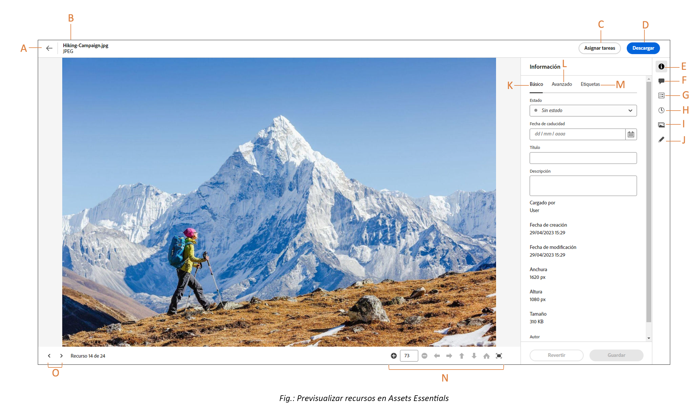

# Navegación a archivos y carpetas y visualización de recursos {#view-assets-and-details}

<!-- TBD: Give screenshots of all views with many assets. Zoom out to showcase how the thumbnails/tiles flow on the UI in different views. -->

<!-- TBD: The options in left sidebar may change. Shared with me and Shared by me are missing for now. Update this section as UI is updated. -->

## Comprenda la interfaz de usuario de [!DNL Assets Essentials] {#understand-interface-navigation}

[!DNL Assets Essentials] ofrece una interfaz de usuario intuitiva y fácil de usar. La interfaz limpia hace que los recursos y la información relacionada sean fáciles de encontrar y recordar.

Al iniciar sesión en [!DNL Assets Essentials], verá la siguiente interfaz.

![[!DNL Assets Essentials]Interfaz de usuario](assets/essentials-interface.png)

    *A: Barra lateral izquierda para examinar el repositorio y proporciona acceso a algunas otras opciones*
    *B: Mostrar o contraer la barra lateral izquierda para aumentar el área de visualización de recursos*
    *C: Filtrar resultados de búsqueda*
    *D: Seleccionar todo el contenido de la carpeta seleccionada*
    *E: Opciones para ordenar archivos*
    *F: Cuadro de búsqueda*
    *G: Cargar o arrastrar y soltar archivos mediante `Add Assets` botón*
    *H: Crear una carpeta nueva*
    *I: Cambiar entre diferentes vistas*

<!-- TBD: Need an embedded video here with narration. It has to be hosted on MPC to be embeddable. -->

## Examen y visualización de recursos y carpetas {#browse-repository}

Puede examinar las carpetas desde la interfaz de usuario principal o desde la barra lateral izquierda. Al hacerlo, puede utilizar la interfaz para ver las miniaturas de los recursos y examinar visualmente el repositorio o ver los detalles de los recursos para encontrar rápidamente el que desee. Las opciones disponibles en la barra lateral izquierda son las siguientes:

* [Mi espacio de trabajo](https://experienceleague.adobe.com/docs/experience-manager-assets-essentials/help/my-workspace.html?lang=es): Assets ahora incluye un espacio de trabajo personalizable que proporciona utilidades para acceder fácilmente a las áreas clave de la interfaz de usuario de Assets y a la información más relevante para usted. Esta página sirve como solución integral para proporcionar información general sobre los elementos de trabajo y un acceso rápido a los flujos de trabajo clave. Un acceso más práctico a estas opciones aumenta su eficacia y velocidad de contenido.
* [Tareas](https://experienceleague.adobe.com/docs/experience-manager-assets-essentials/help/my-workspace.html?lang=es): Puede ver las tareas asignadas en la pestaña de **Mis tareas**. Por su parte, las tareas que crea puede verse en la pestaña de **Tareas asignadas**. Además, las tareas que complete se encuentran en la pestaña de **Tareas completadas**.
* [Recursos](https://experienceleague.adobe.com/docs/experience-manager-assets-essentials/help/manage-organize.html?lang=es): lista de todas las carpetas en una vista de árbol, a las que tiene acceso.
* **Vistos recientemente**: lista de recursos que ha previsualizado recientemente. [!DNL Assets Essentials] muestra solo los recursos que previsualiza. No muestra los recursos por los que pasa de largo al examinar los archivos o carpetas del repositorio.
* [Colecciones](https://experienceleague.adobe.com/docs/experience-manager-assets-essentials/help/manage-collections.html?lang=es): Una colección es un conjunto de archivos, carpetas u otras colecciones dentro de Adobe Experience Manager Assets Essentials. Utilice las colecciones para compartir recursos entre los usuarios. A diferencia de las carpetas, una colección puede incluir recursos de distintas ubicaciones. Puede compartir varias colecciones con un usuario. Cada colección contiene referencias a recursos. La integridad referencial de los recursos se mantiene entre colecciones.

* [Perspectivas](https://experienceleague.adobe.com/docs/experience-manager-assets-essentials/help/manage-reports.html?lang=es#view-live-statistics): En [!DNL Assets Essentials], puede ver perspectivas en tiempo real en su panel. Assets Essentials le permite ver datos en tiempo real de su entorno de Assets Essentials con el tablero de Insights. Puede ver las métricas de eventos en tiempo real durante los últimos 30 días o 12 meses.
* **Papelera**: Enumere los recursos eliminados de la carpeta raíz **[!UICONTROL Assets]**. Puede seleccionar un recurso en la carpeta Papelera para restaurarlo a la ubicación original o eliminarlo permanentemente. También puede especificar una palabra clave o aplicar filtros estándar o personalizados para buscar los recursos adecuados en la carpeta Papelera. Para obtener más información sobre el uso de filtros estándar y personalizados, consulte [Búsqueda de recursos en Assets Essentials](search.md).
* **Ajustes**: Puede configurar varias opciones de Assets Essentials usando **Ajustes**, como formularios de metadatos, informes y gestión de taxonomía.

<!-- TBD: Not sure if we want to publish these right now. CC Libs are beta as per Greg.
* **Libraries**: Access to [!DNL Adobe Creative Cloud Team] (CCT) Libraries view. This view is visible only if the user is entitled to CCT Libraries.
-->

<!-- TBD: My Work Space shows task inbox and it is not visible on AEM Cloud Demos as of now. It is the source of truth server hence not documenting My Work Space option for now.
-->

Puede abrir o contraer la barra lateral izquierda para aumentar el área de visualización de recursos disponible.

En [!DNL Assets Essentials], puede ver recursos, carpetas y resultados de búsqueda con cuatro tipos diferentes de diseños.

*  [!UICONTROL Vista de lista]
*  [!UICONTROL Vista de cuadrícula]
*  [!UICONTROL Vista de galería]
*  [!UICONTROL Vista de cascada]

Para localizar recursos, puede ordenarlos en orden de subida o de bajada de `Name`, `Relevancy`, `Size`, `Modified` y `Created`.

Para desplazarse a una carpeta, haga doble clic en las miniaturas de la carpeta o selecciónela en la barra lateral izquierda. Para ver los detalles de una carpeta, selecciónela y haga clic en Detalles en la barra de herramientas de la parte superior. Para desplazarse hacia arriba y abajo en la jerarquía, utilice la barra lateral izquierda o las rutas de exploración de la parte superior.

*Imagen: para examinar la jerarquía, utilice las rutas de exploración en la parte superior o en la barra lateral izquierda.*

## Previsualización de recursos {#preview-assets}

Antes de usar, compartir o descargar un recurso, puede verlo más de cerca. La función de previsualización permite ver no solo las imágenes, sino también algunos otros tipos de recursos admitidos.

Para previsualizar un recurso, selecciónelo y haga clic en el  de [!UICONTROL Detalles] en la barra de herramientas de la parte superior. No solo puede ver el recurso, sino también ver sus metadatos detallados y realizar otras acciones.

*A: Volver a la carpeta actual o al resultado de búsqueda actual en el repositorio*
*B: Nombre y formato del archivo que está previsualizando*
*C: Asignar tareas*
*D: Descargar recurso*
*E: Previsualizar recurso y ver información de metadatos*
*D: Metadatos avanzados*
*E: Palabras clave y etiquetas inteligentes*
*F: Comentar y anotar*
*G: Ver tareas relacionadas con el recurso seleccionado*
*H: Ver y administrar versiones*
*I: Ver representaciones de la imagen*
*J: Editar imagen*
*K: Metadatos básicos*
*L: Metadatos avanzados*
*M: Palabras clave y etiquetas inteligentes*
*N: Previsualice más de cerca. Zoom, pantalla completa y otras opciones*
*O: Continúe con el recurso anterior o siguiente de la carpeta actual sin volver a la carpeta*

También puede previsualizar los vídeos.

Si previsualiza de forma explícita un recurso, [!DNL Assets Essentials] lo muestra como un recurso visualizado recientemente.

<!-- TBD: Describe the options.

Explicitly previewed assets are displayed as recently viewed assets. Give screenshot of this.
Other use cases after previewing.
-->

## Configurar la visualización de columnas para la vista Lista de recursos {#configure-columns-list-view}

Puede seleccionar las columnas que se muestran en la vista Lista de recursos, como Estado, Formato, Dimension, Tamaño, etc.:

1. Seleccionar **[!UICONTROL Assets]** en el panel de navegación izquierdo, cambie a la vista Lista de recursos y haga clic en .

1. Seleccione las columnas que debe mostrar en la vista Lista y haga clic en **[!UICONTROL Confirmar]**.

   

## Siguientes pasos {#next-steps}

* Proporcione comentarios de producto mediante la opción [!UICONTROL Comentarios] disponible en la interfaz de usuario de Assets Essentials

* Proporcione comentarios sobre la documentación usando [!UICONTROL Editar esta página]  o [!UICONTROL Registrar una incidencia] , disponibles en la barra lateral derecha

* Contacto con el [Servicio de atención al cliente](https://experienceleague.adobe.com/?support-solution=General&amp;lang=es#support)

>[!MORELIKETHIS]
>
>* [Vea las versiones de un recurso](/help/using/manage-organize.md#view-versions).
