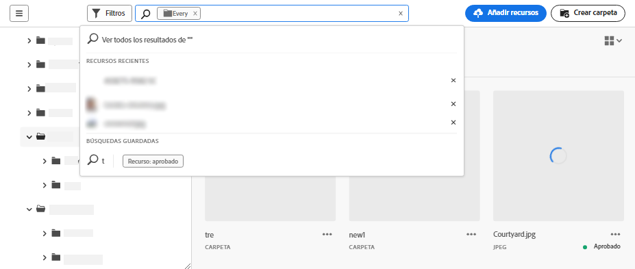
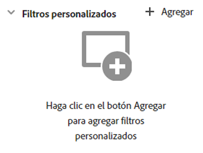

# Búsqueda de recursos en [!DNL Assets Essentials] {#search-assets}

>[!CONTEXTUALHELP]
>id="assets_search"
>title="Buscar archivos"
>abstract="Busque los archivos especificando una palabra clave en la barra de búsqueda o filtrando los archivos en función de su estado, tipo de archivo, tipo MIME, tamaño, creación, modificación y fechas de caducidad. También puede aplicar filtros personalizados, además de los filtros estándar. Los resultados filtrados se pueden guardar como una búsqueda guardada o una colección inteligente."
>additional-url="https://experienceleague.adobe.com/docs/experience-manager-assets-essentials/help/manage-collections.html?lang=es#manage-smart-collection" text="Crear colecciones inteligentes"

[!DNL Assets Essentials] proporciona una búsqueda efectiva que funciona de forma predeterminada. La búsqueda es exhaustiva, ya que es de texto completo. La potente funcionalidad de búsqueda le permite descubrir rápidamente el recurso adecuado y ayudarle a mejorar la velocidad del contenido. [!DNL Assets Essentials] proporciona búsquedas de texto completo e incluso búsquedas mediante metadatos como etiquetas inteligentes, título, fecha de creación y copyright.

Para buscar recursos, haga lo siguiente:

* Haga clic en el cuadro de búsqueda que hay en la parte superior de la página. De forma predeterminada, busca dentro de la carpeta que está explorando actualmente. Realice una de las acciones siguientes:

  

   * Busque con una palabra clave y, si quiere, cambie la carpeta. Pulse Intro.

   * Empiece a trabajar con un recurso visualizado hace poco directamente buscándolo. Haga clic en el cuadro de búsqueda y seleccione un recurso visualizado recientemente en las sugerencias.

## Filtrado de los resultados de búsqueda {#refine-search-results}

Puede filtrar los resultados de búsqueda según los parámetros siguientes.

*Imagen: filtre los recursos buscados según varios parámetros.*

* Estado de los activos: filtre los resultados de búsqueda mediante un estado del activo `Approved`, `Rejected` o `No Status`.

* Tipo de archivo: filtre los resultados de búsqueda según los tipos de archivos admitidos, es decir, `Images`, `Documents` y `Videos`.
* Tipo de MIME: filtre uno o varios formatos de archivo compatibles. <!-- TBD:  [supported file formats](/help/using/supported-file-formats.md). -->
* Tamaño de imagen: proporcione una o más de las dimensiones mínimas y máximas para filtrar imágenes. El tamaño se proporciona en dimensiones en píxeles y no es el tamaño de archivo de las imágenes.
* Fecha de creación: la fecha de creación del recurso tal como se indica en los metadatos. El formato de fecha estándar utilizado es `yyyy-mm-dd`.
* Fecha de modificación: fecha de la última modificación de los recursos. El formato de fecha estándar utilizado es `yyyy-mm-dd`.

* Fecha de caducidad: filtre los resultados de búsqueda en función de un `Expired` estado del activo. Además, puede especificar un intervalo de fechas de caducidad para los recursos para filtrar aún más los resultados de búsqueda.

* Filtros personalizados: [Agregar filtros personalizados](#custom-filters) a la interfaz de usuario de Assets Essentials. Aplique esos filtros personalizados además de los filtros estándar para restringir los resultados de búsqueda.

Puede ordenar los recursos buscados en orden creciente o descendente de `Name`, `Relevancy`, `Size`, `Modified` y `Created`.

## Administrar filtros personalizados {#custom-filters}

**Permisos necesarios:**  `Can Edit`, `Owner` o Administrador.

Assets Essentials también permite agregar filtros personalizados a la interfaz de usuario. A continuación, puede aplicar esos filtros personalizados además de los [filtros estándar](#refine-search-results) para restringir los resultados de búsqueda.

Assets Essentials proporciona los siguientes filtros personalizados:

<table>
    <tbody>
     <tr>
      <th><strong>Nombre de filtro personalizado</strong></th>
      <th><strong>Descripción</strong></th>
     </tr>
     <tr>
      <td>Título</td>
      <td>Filtre los recursos mediante el título del recurso. El título que especifique en los criterios de búsqueda que distinguen entre mayúsculas y minúsculas debe coincidir con el título exacto del recurso para mostrarlo en los resultados.</td>
     </tr>
     <tr>
      <td>Nombre</td>
      <td>Filtre los recursos con el nombre del archivo del recurso. El nombre que especifique en los criterios de búsqueda que distinguen entre mayúsculas y minúsculas debe coincidir con el nombre de archivo exacto del recurso para mostrarlo en los resultados.</td>
     </tr>
     <tr>
      <td>Tamaño del recurso</td>
      <td>Filtre los recursos definiendo un intervalo de tamaño, en bytes, en los criterios de búsqueda para que un recurso se muestre en los resultados.</td>
     </tr>
     <tr>
      <td>Etiquetas previstas</td>
      <td>Filtre recursos con la etiqueta inteligente de recursos. El nombre de la etiqueta inteligente que especifique en los criterios de búsqueda que distinguen entre mayúsculas y minúsculas debe coincidir con el nombre exacto de la etiqueta inteligente del recurso que se mostrará en los resultados. No se pueden especificar varias etiquetas inteligentes en los criterios de búsqueda.</td>
     </tr>    
    </tbody>
   </table>

<!--
   You can use a wildcard operator (*) to enable Assets Essentials to display assets in the results that partially match the search criteria. For example, if you define <b>ma*</b> as the search criteria, Assets Essentials displays assets with title, such as, market, marketing, man, manchester, and so on in the results.

   You can use a wildcard operator (*) to enable Assets Essentials to display assets in the results that partially match the search criteria.

   You can use a wildcard operator (*) to enable Assets Essentials to display assets in the results that partially match the search criteria. You can specify multiple smart tags separated by a comma in the search criteria.

   -->

### Añadir filtros personalizados {#add-custom-filters}

Para añadir filtros personalizados:

1. Haga clic en **[!UICONTROL Filtros]**.

1. En la sección **[!UICONTROL Filtros personalizados]**, haga clic en **[!UICONTROL Editar]** o **[!UICONTROL Añadir filtros]**.

   

1. En el cuadro de diálogo **[!UICONTROL Administración de filtros personalizados]**, seleccione los filtros que debe agregar a la lista de filtros existente. Seleccione **[!UICONTROL Filtros personalizados]** para seleccionar todos los filtros.

1. Haga clic en **[!UICONTROL Confirmar]** para agregar los filtros a la interfaz de usuario.

### Eliminar filtros personalizados {#remove-custom-filters}

Para eliminar filtros personalizados:

1. Haga clic en **[!UICONTROL Filtros]**.

1. En la sección **[!UICONTROL Filtros personalizados]**, haga clic en **[!UICONTROL Editar]**.

1. En el cuadro de diálogo **[!UICONTROL Administración de filtros personalizados]**, anule la selección de los filtros que debe eliminar de la lista de filtros existente.

1. Haga clic en **[!UICONTROL Confirmar]** para eliminar los filtros de la interfaz de usuario.

## Búsquedas guardadas {#saved-search}

La funcionalidad de búsqueda es bastante fácil de usar en [!DNL Assets Essentials]. Desde el cuadro de búsqueda, no solo puede escribir una palabra clave y pulsar la tecla Intro para ver los resultados, sino que también puede buscar rápidamente de nuevo las palabras clave consultadas recientemente con un solo clic.

También puede filtrar los resultados de búsqueda según criterios específicos en torno a los metadatos y el tipo de recursos. Para los filtros utilizados con frecuencia, a fin de mejorar la experiencia de búsqueda, [!DNL Assets Essentials] permite guardar los parámetros de búsqueda. A continuación, puede seleccionar la búsqueda guardada para buscar y aplicar el filtro con un solo clic.

Para crear una búsqueda guardada, busque algún recurso, aplique uno o varios filtros y haga clic en **[!UICONTROL Guardar como]** > **[!UICONTROL Búsqueda guardada]** en el panel de [!UICONTROL Filtros]. También puede hacer clic en **[!UICONTROL Guardar como]** y seleccionar **[!UICONTROL Colección inteligente]** para guardar los resultados como una Colección inteligente. Consulte [Crear una Colección inteligente](manage-collections.md#create-a-smart-collection) para obtener más información.

<!-- TBD: Search behavior. Full-text search. Ranking and rank boosts. Hidden assets.
Report poor UX that users can only save a filtered search and not a simple search.
.
Are other supported files fully indexed and support full-text search? Eg. audio/videos files can at best have metadata indexed.
Anything about ranking of assets displayed in search results?

What about temporarily hiding an asset (suspending search on it) from the search results? If an asset is undergoing review collaboration, should it be used by others? Should it be hidden in search?

When userA is searching and userB add an asset that matches search results, will the asset display in search as soon as userA refreshes the page? Assuming indexing is near real-time. May not be so for bulk uploads.
-->

## Siguientes pasos {#next-steps}

* [Vea un vídeo para buscar recursos en Assets Essentials](https://experienceleague.adobe.com/docs/experience-manager-learn/assets-essentials/basics/using.html?lang=es)

* Proporcione comentarios de producto mediante la opción [!UICONTROL Comentarios] disponible en la interfaz de usuario de Assets Essentials

* Proporcione comentarios sobre la documentación usando [!UICONTROL Editar esta página]  o [!UICONTROL Registrar una incidencia] , disponibles en la barra lateral derecha

* Contacto con el [Servicio de atención al cliente](https://experienceleague.adobe.com/?support-solution=General&amp;lang=es#support)
