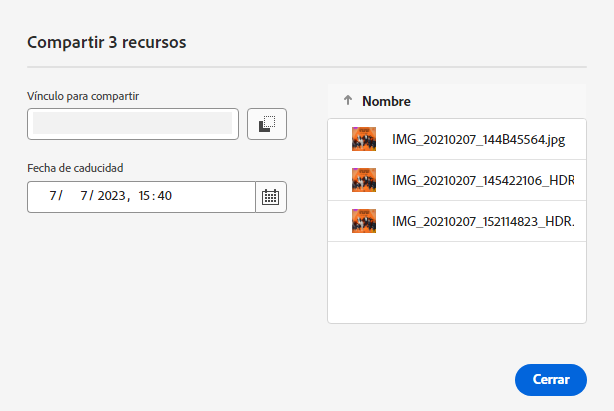
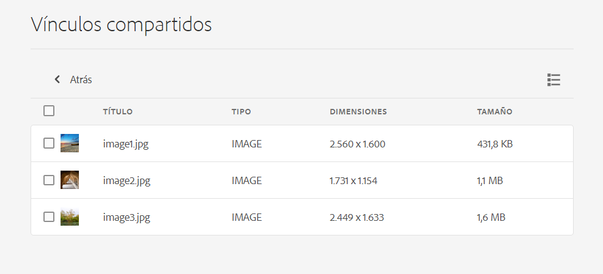

# Compartir vínculos con recursos {#share-links-assets}

[!DNL Assets Essentials] permite generar un vínculo y compartir recursos con partes interesadas externas que no tienen acceso a la aplicación de [!DNL Assets Essentials]. Puede definir una fecha de caducidad para el vínculo y luego compartirlo con otras personas mediante el método de comunicación que prefiera, como el correo electrónico o los servicios de mensajería. Los destinatarios del vínculo pueden obtener una vista previa de los recursos y descargarlos.

## Generación de un vínculo para los recursos {#generate-link-for-assets}

Para generar un vínculo para un recurso o una carpeta que contenga recursos:

1. Seleccione los recursos o las carpetas que contienen los recursos y haga clic en **[!UICONTROL Compartir vínculo]**.

1. Si desea ajustarlo, haga clic en el icono del calendario para definir una fecha de caducidad para el vínculo mediante el campo **[!UICONTROL Fecha de caducidad]**. También puede especificar una fecha directamente, en formato `yyyy-mm-dd`. De forma predeterminada, la fecha de caducidad de un vínculo se establece en dos semanas a partir de la fecha en que se compartió.

>[!NOTE]
> El formato de fecha cambia según la configuración regional elegida.
> Por ejemplo, `de-DE` utiliza `dd-mm-yyyy`, `ja-JA` utiliza `yyyy-mm-dd`, mientras que, `en-EN` utiliza `mm-dd-yyyy`.
>

1. Copie el vínculo desde el campo **[!UICONTROL Compartir vínculo]**.

   

1. Haga clic en **[!UICONTROL Cerrar]** y comparta el vínculo por correo electrónico u otras herramientas de colaboración.

## Acceso a los recursos compartidos {#access-shared-assets}

Después de compartir el vínculo público de los recursos, los destinatarios pueden hacer clic en él para obtener una vista previa de los recursos compartidos o descargarlos en un explorador web sin necesidad de iniciar sesión en [!DNL Assets Essentials].

Haga clic en el vínculo, en la carpeta para desplazarse hasta el recurso y, a continuación, en el recurso para previsualizarlo. Puede seleccionar ver los recursos compartidos en una vista de lista o de tarjeta.

Puede situar el ratón sobre el recurso compartido o la carpeta de recursos compartidos para seleccionarlo o descargarlo.

También puede seleccionar varios recursos y hacer clic en **[!UICONTROL Descargar]**. [!DNL Assets Essentials] descarga los recursos seleccionados como un archivo zip. [!DNL Assets Essentials] crea una subcarpeta en el archivo zip principal, con el mismo nombre que la del recurso, para cada recurso que descargue.

Para descargar todos los recursos a la vez, cambie a la **[!UICONTROL Vista de lista]** y haga clic en **[!UICONTROL Seleccionar todo]** y en **[!UICONTROL Descargar]**.

## Siguientes pasos {#next-steps}

* [Vea un vídeo para compartir vínculos para los recursos de Assets Essentials](https://experienceleague.adobe.com/docs/experience-manager-learn/assets-essentials/basics/link-sharing.html?lang=es).

* Facilite comentarios del producto mediante la opción [!UICONTROL Comentarios] disponible en la interfaz de usuario de Assets Essentials.

* Facilite comentarios sobre la documentación usando [!UICONTROL Editar esta página]  o [!UICONTROL Registrar un problema] , disponibles en la barra lateral derecha.

* Contacte con el [Servicio de atención al cliente](https://experienceleague.adobe.com/es?support-solution=General&amp;lang=es#support).
